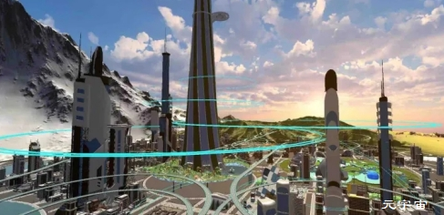

# 元宇宙场景搭建优势，虚拟人制作

新兴事物的兴起，必然会引起大家的好奇和期待，尤其是元宇宙概念在市场已激起资本的浪花，大家对元宇宙的落地和应用兴趣更加炽热，力图将自身业务与元宇宙的三维虚拟场景结合，实现企业更高价值。

　　3D数字空间是元宇宙运行的基础，我们提出的虚拟办公、游戏、健身等虚拟交互都需要有3D数字空间作为载体，仿真三维模型以供呈现和交互。这些均由元宇宙场景搭建公司来提供和完成。

北京华锐视点属于其中一家元宇宙场景搭建公司，以满足实际生活和工作需要为目的，提供的元宇宙场景包括工作场景、生活社区和个性商店，包含150多个可以交互实用的三维场景，类型涵盖不同的行业和用途，满足人们办公、学习、运动、娱乐、游戏和社交等丰富多彩的体验。

　　不脱离现实场景的元宇宙才具有实际意义，北京华锐视点在元宇宙场景搭建中，避免好高骛远，空喊口号，基于对自身技术和经验能力优势的认知，以此为突破点，正在为更多企业客户提供元宇宙场景搭建服务，属于为大家合作元宇宙场景搭建公司的优选，共同推动元宇宙概念及其产业逐渐走向成熟。