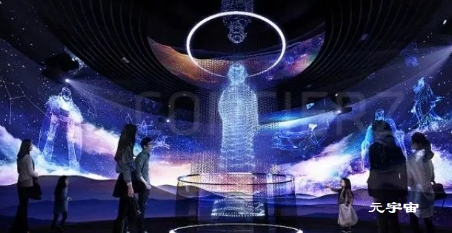

# 元宇宙就是VR场景？不，你想得太简单了。

风口确实又来了，大家都在跑步入场。

随着元宇宙概念的兴起，VR（虚拟现实）与AR（现实增强）行业又迎来一波热潮。

虽然元宇宙很新，但VR与AR却早已不是什么新鲜技术了。

VR（Virtual Reality，虚拟现实技术）诞生于20世纪早期，最早用于模拟飞行训练

AR（Augmented Reality，增强现实技术）诞生于20世界中期，最早用于影视行业增强观影感

维基百科对元宇宙的描述是：通过虚拟增强的物理现实，呈现收敛性和物理持久性特征的，基于未来互联网，具有链接感知和共享特征的 3D 虚拟空间。

有人肯定不屑一顾：这不就是一个大型的VR场景嘛

事实上，元宇宙虽然离不开VR场景，但二者却相差甚远。

**元宇宙与VR场景区别**

简而言之，VR就是通过佩戴VR头显和设备加强视觉和听觉的体验沉浸感，增强对虚拟场景的现实拟真化。

而元宇宙企图构建的是一个完全数字化的世界，人类未来的意识、感官、交易等等都以数据形式存在，只不过在发展初期，基于现有的技术发展水平，逐步加强现实和虚拟的“链接”，而目前的链接方式则是加强人体对于虚拟世界的感官体验，VR场景仅只是迈入元宇宙的过程中的技术支撑。

二者如同今天发达的移动互联网生活和手机的关系。

**当下元宇宙带给企业的商业增长点**

伴随元宇宙概念的爆发以及VR技术的大众化，也促进了企业对于消费场景体验的升级。

除了商场里肉眼可见增加的VR体验馆，越来越多的博物馆、主题乐园以及线下服饰、餐饮推出了自己的VR线上体验场景，以打造服务体验的差异化。

针对于目前的技术发展现状和市场趋势，**领育科技提出“元宇宙私域”的概念。**

**元宇宙私域，体验升级+私有流量促进**

元宇宙私域，并不是简单打造一个VR场景店铺那么简单。

元宇宙私域则是成为企业营销强有力的工具载体。利用VR+AR结合的技术为企业主还原实体店铺升级服务体验，通过增加VR交互点、AR实时试穿营造身临其境的沉浸感，同时为企业打造虚拟直播、AI客服、虚拟IP形象甚至举办线上虚拟场景活动构建多元化交互方式，全方位加强客户的体验感与参与感，促进客户在“元宇宙私域”中流连忘返，直接达到转化，成为企业与客户之间的“粘合剂”。

目前，元宇宙正在瞄向教育、互联网直播、餐饮、服饰等多个领域。“元宇宙私域”也将会在未来短时间内迎来爆发式增长。