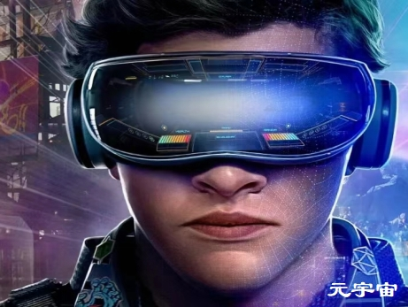

# 文化旅游“元宇宙”场景文化——现实体验世界锻造全球城市新坐标

随着“元宇宙”时代的到来，文化旅游“元宇宙”场景文化——现实体验世界城市建设将重新锻造全球城市的新坐标。随着文化旅游“元宇宙”场景文化——现实体检世界城市建设步伐的加快，全球城市的坐标正在发生变化。

以文化旅游“元宇宙”场景文化高度开放格局重塑新全球城市的坐标。文化旅游“元宇宙”场景文化——现实体验世界城市建设成为衡量新全球城市的一个全新维度。

以文化旅游“元宇宙”场景文化的影响力，聚集力，吸引了，号召力为标志的新全球城市业态将把新一轮全球城市建设推向一个史无前例的新坐标，将把新一轮全球城市建设推向一个“元宇宙”场景文化——现实体验世界城市建设的新高度，将把新一轮全球城市建设推向一个“元宇宙”场景文化——新技术驱动，新经济形态的新纪元。

在这种文化旅游“元宇宙”场景文化迅猛发展的大时代背景下，“元宇宙”场景文化对重新塑造新全球城市提供了全新的坐标思想，提供了全新的新技术驱动动能，提供了全新的新经济概念势能，提供了全新的新格局维度。

从而使我们城市新全球城市建设找到了新的坐标，从而使我们城市新全球城市建设找到了全新的发展态势，全新的发展格局。

文化旅游“元宇宙”场景文化——现实体验世界城市建设，为城市成为新全球城市获得了“元宇宙”新技术驱动，新经济资源的海量资本。新全球城市建设因为有了“元宇宙”场景文化丰富的资源，海量的资源。

从而形成了新全球城市的“元宇宙”独特新技术驱动业态，独特新经济形态。这种新全球城市建设的“元宇宙”新技术驱动业态，独特的新经济形态，在我们传统的全球城市建设过程中是从未有过的。

这种全新的文化旅游“元宇宙”场景文化新技术驱动业态，独特的新经济形态，以颠覆性，战略性，开创性，创造性，裂变性，引爆了城市“元宇宙”场景文化的一场大裂变，引爆了城市“元宇宙”场景文化的一场大爆炸。

这种大裂变，这种大爆炸，把世界第六次长波经济的新业态，新形态引爆开来。使世界第六次长波经济的放大经济，叠加经济，倍增经济，基数经济，杠杆经济，撬动经济，乘数经济，盘活经济，激活经济，变现经济，套现经济，变异经济，变量经济，裂变经济，爆炸性增长经济得以无以复加的体现出来，呈现出来。

从而形成了新全球城市的新聚集力量，新聚集功能，新引爆力量，新引爆功能。这些新全球城市新聚集力量的形成，新聚集功能的形成，可以说没有文化旅游“元宇宙”新技术驱动力，新长波经济业态和形态的构成，这种新全球城市的发展态势和格局是不会形成的。

随着文化旅游“元宇宙”场景文化——现实体验世界城市建设的蓬勃发展，城市场景文化被赋予了“元宇宙”高速泛在，天地一体，云网融合，端云渲染，云化分发，云天传播，云际传送的超级功能，强大功能。

城市场景文化被赋予了“元宇宙”时空凝聚，时空凝结，时空交互，时空渲染，时空映射，时空投射，时空折射的超级功能，强大功能。城市场景文化被赋予了“元宇宙”高度开放空间无限放大，城市物理空间尺度无限延伸的超级属性，超级功能。

城市场景文化被赋予了放大经济，叠加经济，倍增经济，基数经济，杠杆经济，撬动经济，乘数经济，盘活经济，激活经济，变现经济，套现经济，变异经济，变量经济，裂变经济，爆炸性增长经济的超级属性，超级功能，超级业态，超级形态。

在这种“元宇宙”场景文化超级功能的赋能下，在这种“元宇宙”场景文化超级功能的驱动下，在这种“元宇宙”场景文化超级功能的引爆下，在这种“元宇宙”场景文化超级功能的裂变下。会形成一种“元宇宙”超强的新流量经济向城市涌来，从而为新全球城市建设创造了“元宇宙”新流量经济的战略高地，战略制高点。

从而使新全球城市的影响力、凝聚力，聚集力，号召力，进一步扩大。从而使“元宇宙”场景文化新经济的人流，物流，资金流的极化能力进一步增强。从而使“元宇宙”场景文化的体验流，交互流，消费流，集聚流，时空流的极化能力进一步增强。从而呈现出新全球城市新流量经济的新发展态势，新发展格局。

这种文化旅游“元宇宙”场景文化——现实体验世界城市建设的新赋能场景，让传统全球城市建设形态和属性发生了根本性的变化，让传统全球城市建设迈向了文化旅游“元宇宙”场景文化——现实体检世界城市建设新全球城市的新时代。

文化旅游“元宇宙”场景文化——现实体验世界城市建设，极大的拓展了城市场景文化的空间边界，使城市物理空间得以无限的放大和延伸，使城市空间容量得以无限的放大和延伸。使城市物理空间功能被无限的放大，使城市成为聚集“元宇宙”场景文化新技术驱动力，新长波经济功能的主导力量**。**

这种文化旅游“元宇宙”场景文化——现实体验世界城市建设的新场景，将让城市“元宇宙”场景文化建设出现一种井喷的现象，将获得城市与城市在“元宇宙”场景文化建设上“赢者通吃”的现象极。

这种文化旅游“元宇宙”场景文化——现实体验世界城市建设的新场景，将让城市“元宇宙”场景文化建设实现时空交互，时空渲染，时空整合，时空拓展，时空延伸，时空放大的大目标。

这种文化旅游“元宇宙”场景文化——现实体验世界城市的大建设，将让城市实现“元宇宙”场景文化全球叙事的大战略目标，将让城市实现“元宇宙”旅游城市世界版图地位重塑的大战略目标，将让城市实现“元宇宙”旅游目的地城市的大战略目标实现，将让城市实现“元宇宙”新全球城市建设的大战略目标！