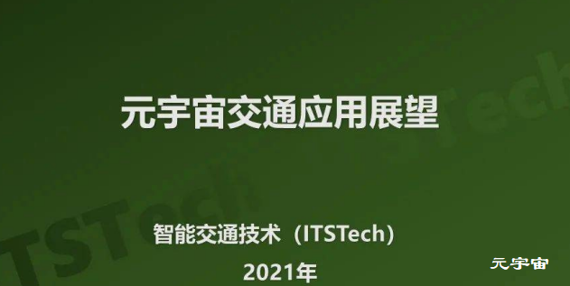

# 交通场景下的元宇宙

**什么是元宇宙？**

元宇宙Metaverse这个词源于1992年尼尔·斯蒂芬森的《雪崩》，这本书描述了一个平行于现实世界的虚拟世界，Metaverse，所有现实生活中的人都有一个网络分身Avatar。维基百科对元宇宙定义是通过虚拟增强的物理现实，呈现收敛性和物理持久性特征的，基于未来互联网，具有链接感知和共享特征的3D虚拟空间。

**元宇宙的主要特征**

元宇宙有一些特征是大家公认的。Roblox提出了元宇宙的八个关键特征：

- 身份(Identity)
- 朋友(Frieds)
- 沉浸感(Immersive)
- 低延迟(LowFriction)
- 多样性(Variety)
- 随地(Anywhere)
- 经济(Economy)
- 文明(Civility)。

**元宇宙下的交通世界**

元宇宙可以划分为现实和虚拟两个部分，元宇宙下的交通也可以分为现实交通和虚拟交通两部分。

**现实交通**

是现实存在的物理交通部分，方式包括陆、海、空、管道等，体系包括监管、运营等，用户包括管理单位、企业和个人等，形态上包括物理交通及其对应的数字孪生交通（实时映射）两部分。

**虚拟交通**

存在于虚拟元宇宙，如游戏、作品中，可以任意想像，存在于元宇宙虚拟人的心灵世界。每个人都可以创作自己交通体系，是并行的和多版本的。可以说每一个元宇宙（游戏）空间都有自己的交通体系。是现实交通的主观延伸。虚拟交通可能是：

- 超光速的飞船，用于星际旅行
- 奇妙的时空穿梭机，可以穿越，瞬间可以达到任何时间和空间
- 任何人或AI可以想象出来的人和物体的移动本文是交通应用展望

超光速的飞船，用于星际旅行

奇妙的时空穿梭机，可以穿越，瞬间可以达到任何时间和空间

任何人或AI可以想象出来的人和物体的移动本文是交通应用展望

**本文只讨论元宇宙中的现实交通场景。**

**元宇宙的主要技术**

- 区块链技术，去中心化的交易所，分布式存储等区块链技术是支撑元宇宙经济体中重要的技术。
- 交互技术，不断深化感知交互，为元宇宙用户提供沉浸式虚拟现实体验阶梯。
- 电子游戏技术，是元宇宙的最直观呈现方式，不仅可以为元宇宙提供创作平台，还可以实现交互内容和社交场景并实现流量聚合。
- 网络及运算技术，通信网络和云计算的成熟，必将为元宇宙打下最坚实的网络基础。
- 物联网技术，为元宇宙的万物互联及虚实共生提供可靠的技术保障。
- 人工智能技术，为元宇宙提供大量的应用场景技术。

区块链技术，去中心化的交易所，分布式存储等区块链技术是支撑元宇宙经济体中重要的技术。
交互技术，不断深化感知交互，为元宇宙用户提供沉浸式虚拟现实体验阶梯。
电子游戏技术，是元宇宙的最直观呈现方式，不仅可以为元宇宙提供创作平台，还可以实现交互内容和社交场景并实现流量聚合。
网络及运算技术，通信网络和云计算的成熟，必将为元宇宙打下最坚实的网络基础。
物联网技术，为元宇宙的万物互联及虚实共生提供可靠的技术保障。
人工智能技术，为元宇宙提供大量的应用场景技术。
**元宇宙交通应用展望**
综合分析元宇宙交通有以下几个方面的应用：

- 元宇宙中的数字孪生交通
- 元宇宙的出行即服务
- 元宇宙交通基础设施建设
- 元宇宙下的自动驾驶仿真
- 宣传、教育与培训

元宇宙中的数字孪生交通
元宇宙的出行即服务
元宇宙交通基础设施建设
元宇宙下的自动驾驶仿真
宣传、教育与培训

