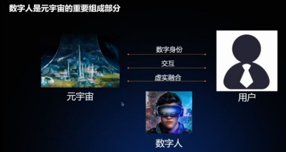

# 企业专家深入探讨元宇宙技术及应用场景 

元宇宙在商业应用角度大放光芒的同时，在科学研究和产业应用中也取得了快速的进展。本次活动由CCF TF智能设备交互SIG主席、联想集团副总裁王茜莺博士担任主持，CCF TF智能设备与交互SIG主席、英特尔中国研究院院长宋继强博士致开场词，北京亮亮视野科技有限公司创始人兼CEO吴斐先生及百度智能座舱研发负责人、主任架构师周华先生作为联席主席，在互动环节与参会者进行深度讨论并进行总结。

在开场致辞中，宋继强提到元宇宙的出现对算力挑战巨大，其终极形态不止于虚拟社交，还会拓展到工作与实际生活。从底层的算力资源到中层的操作资源，再到上层的解决方案，元宇宙技术需要层层支撑递进，就好比万丈高楼平地起，技术的基石要稳扎稳打，逐步升级。

英特尔中国研究院首席研究员、英特尔中国研究院视觉与人工智能实验室总监陈玉荣博士介绍了英特尔面向元宇宙的视觉智能前沿研究工作，以及英特尔赋能元宇宙的计算技术创新。核心思想包括元宇宙可能是继万维网和移动互联网之后的下一个主要计算平台，其对交互体验、数字内容和基础设施提出了更高要求（多模态、实时自然交互、沉浸式互联体验；高保真、可交互性的数字内容；始终可用、低时延、连续计算、安全可信的基础设施）。英特尔正在进行的一系列视觉理解与合成研究创新可以助力元宇宙交互体验与视觉内容生成。另外，元宇宙正在驱动整个互联体验的基础技术进行重大升级，英特尔软硬件计算技术创新，包括超异构计算XPU平台、oneAPI、Endgame项目等将赋能元宇宙基础设施建设。

百度增强现实技术部杰出架构师、增强现实技术负责人刘经拓介绍了不同类型数字人的制作流程，以及AI技术如何在其中发挥降本增效的作用。对于真人类数字人，AI技术已经使得建模和使用成本已经较低，但在肢体表达的丰富度上有明显的不足；对于卡通和超写实数字人，AI技术也在3D形象建模、形象驱动、渲染等多个环节达到了可用状态，可以显著降低对专业硬件设备和人工制作3D素材的依赖。在未来，AI技术打造的数字人将越来越多的在元宇宙中被大家使用。

UINO优锘科技合伙人、UINO优锘科技ThingJS PaaS平台负责人沈祎岗分享了UINO优锘探索元宇宙的低零代码实践——ThingJS。UINO优锘认为元宇宙就是数字化进程到了更深度的阶段，基于此，UINO优锘自主研发了一个数字孪生引擎ThingJS，并且基于ThingJS引擎打造了一系列数字孪生工具链，以低零代码的方式，助力降低数字孪生应用的成本。沈祎岗先生介绍了ThingJS发展历程，同时从API进化、架构进化、引擎进化3个角度介绍了ThingJS的升级迭代。未来UINO优锘将利用ThingJS引擎升级版架构，快速支持最新的技术WebGPU，让ThingJS开发者们不需要做任何的修改操作，就可以体验WebGPU带来的新的能力提升。

在互动环节，吴斐与线上观众就虚拟人技术的动作迁移、边缘设备的算力提升对元宇宙发展的推动及元宇宙的未来商用场景等话题展开热烈讨论。

最后，周华做了活动总结。他认为本次活动建立了元宇宙的技术及商用的桥梁，希望未来元宇宙有更广阔的应用领域，继续搭建数字化万丈高楼。