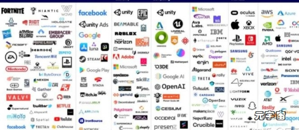
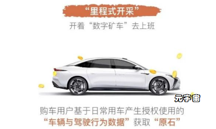

# 元宇宙更大的应用场景开始落地——元宇宙在汽车产业的实践

当前元宇宙的应用还主要集中于游戏、内容创作、艺术、教育、沉浸式体验等与人们生活息息相关的方面，同时，元宇宙在生产方面的实践也开始落地，元宇宙更大的应用场景已开始萌芽。

## **一、元宇宙产业价值链现状**

### **（一）布局于元宇宙的产业相对集中**

在前面的文章中，我们认为元宇宙将现实世界运行逻辑引入了数字世界。可以说**元宇宙运行 = 数字个体 + 社会逻辑 + 经济逻辑**，元宇宙的本质是嵌有情感需求以及自由市场的数字世界。

元宇宙是人们生活数字化的镜像世界，当前元宇宙的布局与人们的游戏、社交、创作等需求紧密相关。

根据 Beamable 公司创始人 Jon Radoff 提出的“元宇宙”价值链的七个层面：**体验、发现、创作者经济、空间计算、去中心化、人机交互、基础设施。**与这些方面息息相关的企业，布局于元宇宙具有天然的优势。因此，当前元宇宙领域的企业也主要集中于这几个方面。

### **（二）布局于元宇宙产业价值链中的企业**

Jon Radoff 根据上述七层价值链绘制了元宇宙的市场地图，每一层价值链中都有不同的代表项目和企业。

**体验：**是用户实际参与的内容，包括游戏、社交体验、现场音乐等。典型的企业有推特、腾讯、奈飞、Facebook 等；

**发现：**是人们发现或获取体验存在的方式。包括在线广告、社交、策展、应用商店、代理商等。典型的企业有 Facebook、谷歌、EPIC 等；

**创作者经济：**是帮助创作者为元宇宙制作产品并从中获利的一切：设计工具、动画系统、图形工具、货币化技术等。 典型的企业包括 ROBLOX、Decentraland、微软、Somnium Space 等；

**空间计算：**包括 3D 引擎、手势识别、空间映射和支持它的 AI 等。典型企业包括Unity、Occipital、Google AI、Open AI 等；

**去中心化：**是实现分散式和更民主化结构等的方式和技术，包括边缘计算、区块链等。典型的企业或项目包括微软、IBM、以太坊、Opensea、波卡等；

**人机交互：**是指帮助用户访问虚拟世界的软硬件——从移动设备到 VR 耳机，再到高级触觉和智能眼镜等未来技术。典型的企业包括苹果、Xbox、Play Station、华为等；

**基础设施：**是半导体、材料科学、云计算和电信网络等，典型的企业包括英伟达、AMD、英特尔、AT&T、Verizon 等。

部分科技巨头尤为重视对元宇宙的布局。比如，Facebook 打造最全面的元宇宙。据中信证券研究发现，Facebook 在元宇宙的布局目前是最全面的，包括 Creator 内容创作社区、VR/AR Oculus Quest、数字货币 diem 及商业、以及 Workplace 虚拟办公空间。

## **二、元宇宙更大应用场景——传统工业**

上述围绕元宇宙价值链七个层面布局的企业都是数字产业中的代表企业。这些企业或项目都以使用数据资源为关键生产要素、以现代信息网络为重要载体，依赖于数字技术、数据要素而开展业务。

根据中国信息通信研究院发布的数据，2020 年中国数字经济规模达到 39.2 万亿元人民币，占 GDP 比重达 到 38.6%。传统产业在 GDP 所占比重更大，在数字化转型过程中，对元宇宙的应用将是一个更大的应用场景。

**元宇宙是动态演进的，**其边界和囊括范围不断扩大。当数字孪生不仅仅运用于物理实体产品的全生命周期过程，进而在比特的世界中构建物质世界的运行框架和体系，构建人类社会大规模协作新体系。无数个数字孪生个体以开放、体验、实时、沉浸式的方式进行交互，元宇宙的边界也将从人的生活数字化场景扩展至生产分工等更广泛的场景了。

现实中，一些传统产业中的企业开始推出“工业元宇宙”，事实上，部分企业的元宇宙概念更类似于数字孪生的使用。这些产品并没有涉及人与人的交互，更没有社交网络和经济体系，因此严格来说很难被称为是元宇宙的产品。

工业元宇宙究竟是什么？在《元宇宙通证》一书中，对工业元宇宙进行过较为全面的阐释。

工业元宇宙有三个重要特点，包括：

### **1. 全生命周期虚实共生**

**首先，是研发阶段的集成化虚实共生；其次，是生产制造阶段的虚实共生。**通过高度物联网化的数字孪生系统，实现高沉浸感、全实时数据仿真的生产制造管理。

**再次，是消费端的虚实共生。**未来购买主流品牌产品时，还可能有一个一模一样活的元宇宙虚拟数字孪生产品。

**最后，就是企业内部经营管理上的虚实共生。**包括 ERP、SCM、CRM、OA、远程会议系统等，一切都将共生于元宇宙的虚拟数字世界和物理现实世界之中。

### **2. 工业元宇宙的全息智能制造**

**息智能制造首先要解决的是造正确的东西、其次才是正确的造东西。**

在工业元宇宙时代，消费者购买的大部分物理产品自带实时永续连接物联网的数字孪生体。产品使用过程中的各种物理信息和消费者意见和建议，可以通过这个“活的”数字孪生体实时反馈给品牌商、研发机构、制造厂等利益相关方，并按照智能合约获取相关数字激励。

在工业元宇宙时代，消费者购买的大部分物理产品自带实时永续连接物联网的数字孪生体。

### **3. 工业元宇宙的智能经济体系**

这个智能经济体系可以通过工业元宇宙底层区块链体系上的智能合约来高效自动运转，各方交易的信任成本将极大降低。按主体分为四类智能经济体系：

**一是企业内部：**涵盖企业内部价值链的各部门各岗位，不同企业会定义不同的价值链分配系数；

**二是企业与供应商：**包括研发、生产、行政、仓储物流、营销、售后等所需的一切原材料、零部件、办公用品、物料、外包合作方等；

**三是企业与下游各级渠道和客户：**打通渠道 KPI、库存、销量返点、促销福利等各类经济事务；

**四是企业与外部合作伙伴：**如金融机构、中介机构、公益慈善机构、政府、商协会等。

## **三、工业元宇宙萌芽：智己汽车**

比起数字产业中的各企业，传统产业的工业元宇宙之路，需要做更多的工作：既需要对企业生产全流程进行数字化转型，还需要在企业经济体系中各主体之间在元宇宙场景下的深入互动。比之数字产业直接以数据为关键生产要素相比，传统产业的元宇宙之路似乎存在更多的挑战：数据确权、数字孪生、社区建设、元宇宙场景构建等等。

挑战的存在又何尝不是弯道超车的机遇呢？汽车科创公司智己汽车，开始了前所未有的尝试，传统产业的工业元宇宙之路，开始落地。

### **（一）元宇宙之路从数据确权开始**

智己汽车成立于 2020 年 12 月 25 日，注册资本 100 亿人民币。智己汽车致力于成为“智能时代出行变革的实现者”，认为用户是企业价值链的核心驱动者，同时也是企业价值增长的主要塑造者。

智己汽车提出“用户数据权益计划”即“原石谷”， “原石谷”首度构建起用户数据的价值确权体系和未来形态的社区秩序。在原石谷的规划中，社区有三个递进的阶段：第一阶段是内核阶段，进行用户价值的确权。第二阶段是用户价值社区。第三阶段是打造真实车和虚拟车激荡在一起的元宇宙空间。

### **1. 原石谷的数据确权**

原石谷是全球汽车行业首个将区块链技术引入用户数据价值确权的企业。数据确权和收益分享为汽车产业中最核心的供需双方主体深入交互奠定了基础。

将用户数据资产化，首度构建起用户数据的价值确权体系和未来形态的社区秩序。该计划目的在于回馈用户数据的贡献，和用户一起拥抱时代红利。

智己汽车通过 3 亿枚“原石”，对应智己汽车创始价值的增长权益，用数据权益的方式回馈用户数据的贡献。

### **2. 数据确权的安全保障**

智己汽车专属的区块链平台“原石链”，让原石的路径记录在链，使其可追溯、不能被篡改，以确保每一位用户均公平、公正获取数据权益。用户获得原石、消耗原石的路径以及每日行车里程等数据均上链存证。

在里程开采的数据确权当中，智己汽车提前考虑了建设元宇宙中的两个关键问题：一是以极高标准自主研发了里程开采时的共识算法，打足提前量，以满足未来国密标准可能出台的更高要求。二是通过算法只筛选脱敏数据，以比法规更高的标准保护用户隐私，确保用户的隐私不被泄露。

### **（二）原石谷的经济系统**

**在原石谷中，原石代表着用户的数据贡献。**用户通过两种方式获取“原石”，并依据原石进行数据权益分享，进一步激励用户的用车行为和社区互动，形成经济系统闭环。

### **1. “原石”开采的两种方式**

随着“原石谷”上线，用户数据为企业价值链成长做出的贡献，将通过“原石”实实在在的落实在用户权益上。智己汽车的用户将通过“里程式开采”和“养成式开采”两大方式获取“原石”。

里程式开采是指购车用户根据授权使用的“车辆与驾驶行为数据”，基于日常用车获取原石，车主仅需开车上路，就能开启里程式开采，坐享原石的开采收益。用户的每一公里行驶里程所贡献的行驶数据，都会计入参与里程开采的数据池中。用户行驶里程越多，贡献的数据越多，用户的数据权益和收获的“原石”也就越多。里程式开采的原石占据原石总量的 70%。

养成式开采是用户参与智己汽车官方组织的社区共建活动，或者完成APP的互动任务，用户无需开车，就能赢取积分水晶，再通过水晶来抽取盲盒，购车用户有机会抽取到原石或原石碎片。养成式开采的原石占据原石总量的 30%。

### **2. 原石谷的数据价值分享**

数据确权为数据价值分享提供了基础和依据，数据价值分享实现了原石谷经济系统闭环。

在现实世界中，“原石”可被用于兑换各类硬件或软件空中升级服务。比如，智己汽车的“天使轮用户”在车辆交付后每年正常行驶超过 5,000 公里，所获得的“原石”将可选择兑换下一代激光雷达融合智驾系统；或在正常行驶三年后，升级一块不低于 120 度电的下一代高阶能量电池。

### **（三）用户价值社区与社区互动**

“原石谷”将构建起用户数据的价值确权体系和未来形态的社区秩序。

在用户价值社区中，智己汽车用户在这里集结，拓荒原石、积攒积分、升级装备、进化车辆。“原石谷”源源不断地汇流用户数据、创造数据价值，让用户收获真实的数据权益，构建起用户的共同的价值社区和精神家园。

随着“原石谷”运营体系的逐步完善，“原石”还将推出更加丰富的应用场景，为出行创造更多便利和乐趣。

### **（四）孪生纠缠的元宇宙空间**

原石谷的第三个阶段将打造真实车和虚拟车激荡在一起的元宇宙空间。

智己汽车定义了一个密境时空，即“Crypto Horizon”，将基于加密技术开展场景化的体验，成为一个元宇宙空间。

原石谷将会形成消费端的虚实共生，成为虚拟和现实的交汇点，即智己汽车是真实世界的车，未来车主可以有一部作为数字孪生的虚拟车。虚拟车作为孪生的伴随，养成和能力各方面指标会有提升。反过来，虚拟车在养成过程当中将推动现实车技术的进化，即“孪生纠缠”。