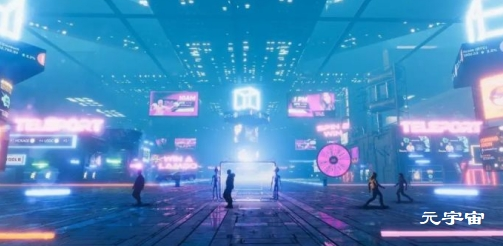
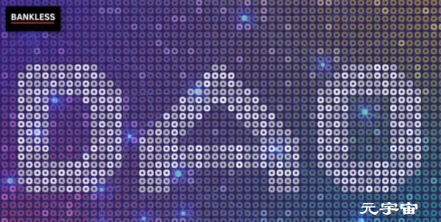

# 三分钟速览元宇宙项目 Bloktopia 应用场景与代币经济模型

「元宇宙」Metaverse 无疑是 2021 年最火爆的概念，社交媒体巨头 Facebook 创始人马克·扎克伯格也已经雄心勃勃地表示将在五年内完成元宇宙转型。

对于许多还不太了解「元宇宙 Metaverse」的人来说，我们先做一个简单解释：Metaverse 一词由 Meta 和 Verse 组成，Meta 表示超越，Verse 代表宇宙 Universe，而沉浸感、参与度都达到峰值的元宇宙则被认为是互联网的「终极形态」。

尤其在最近两年里，随着新冠病毒疫情导致全球各国「封城」次数越来越多，在家办公的人数显著增加，基于互联网的交互已成为各行各业常态，也推动元宇宙概念获得了巨大增长和新的采用，其中最值得关注的项目之一就是刚刚完成 420 万美元融资的 Bloktopia。

------

**Bloktopia 是什么？**

Bloktopia 是一个基于 Polygon 区块链构建和支持的虚拟现实元宇宙项目，该项目利用全球最先进的 3D 创建引擎在虚拟现实世界里搭出了一座总计有 21 层的摩天大楼，可视化效果大幅提升了用户体验，人们可以在不同楼层中体验沉浸式内容，比如沟通交流、买卖房产、以及赚取广告收入等——Bloktopia 选择「21」这个数字是有特殊意义的，旨在纪念「2100 万枚 BTC」。

Polygon 是当今市场上最活跃的 Layer 2 以太坊扩展解决方案，具有高速、低成本交易和 EVM 网络兼容性等优势，因此 Bloktopia 团队决定在该网络上构建。

从「摩天大楼」的架构设计可以看出，Bloktopia 希望打造各一个终极虚拟现实中心和「加密之家」，将用户聚焦在一个身临其境和引人入胜的环境里——有史以来第一次，用户可以在一个地方访问加密信息和沉浸式内容，并获取不同层级的区块链教育资源、虚拟办公室、游戏、以及通过虚拟现实体验想象出的任何其他事物。

在Bloktopia 元宇宙里，用户被称为「Blocktopians」（如下图所示），他们可以是该项目原生通证 BLOK 的持有人，也可以是社区参与者。

第一次登录 Bloktopia 钱包时，用户需要设置自己的 ID 名称并创建个性化形象，比如外观、衣服、身材等，Bloktopia 提供了多种自定义设置服务，可以让你找到最适合自己感觉的外观形象（所有形象物品都能通过 Bloktopia 市场购买，用户因此可以不断美化更新自我形象）。完成形象设置和起名之后，就可以获得「Bloktopia Passport」——进入 Bloktopia 元宇宙摩天大楼的通行证。

接下来，用户就可以正式入驻 Bloktopia 摩天大楼啦！

Bloktopia 摩天大楼的每一层都有不同的内容，目前最重要的三个楼层分别是第一层、第六层和顶部第二十一层：

Bloktopia 摩天大楼的第一层拥有最高人流量，也是每个访客进入大楼的入口点，其中包含了许多有价值的信息（比如加密货币定价）和资源（比如帮助台、导航、以及当天事件概览议程等）。第一层还包括优质且高价值的虚拟房地产。

Bloktopia 摩天大楼的第六层是一个礼堂，其中有加密领域一些最重要的人进行沉浸式和互动式主题演讲，用户也可以参加该楼层的活动并获得 BLOK 奖励。

Bloktopia 摩天大楼的第二十一层是一个豪华顶层公寓区域，仅用于游戏场景，其中已经营造出令人兴奋的比赛氛围，玩家通过参与多人游戏竞争来赢取 BLOK 奖励。

------

**四大场景让 Bloktopia 元宇宙独一无二**

在 Bloktopia 中，用户有机会体验到的不仅仅是玩游戏，与使用手机或笔记本电脑等传统电子设备访问元宇宙不同，Bloktopians 用虚拟现实提供的场景更为丰富，主要包括：学习教育、赚钱获利、游戏、以及内容创建。

学习教育（LEARN）

对于许多参与者来说，加密可能是一个具有挑战性的行业，需要对许多领域有深入的了解和知识储备。Bloktopia 以「在加密世界中进行自我教育」为口号，与 Youtube、Telegram 和 Twitter 等各种平台建立关联，成为用户了解有关加密行业更多信息的开放中心。

不仅如此，借助 Bloktopia 的元宇宙里，远程会话可以变成交互式的、虚拟的「亲身体验」，同事们可以在 Bloktopia 摩天大楼的虚拟会议室（或办公室）里「开会」，而不用在 Zoom 电话里连接。想象一下，你不是在屏幕前看着一张张「脸」，而是走进一个会场，在大厅里遇到 Vitalik Buterin 或其他行业大咖，甚至可能比你想象的更加现实。

赚钱获利（EARN）

Bloktopia 将成为给用户提供赚钱获利机会之地，所有用户（也就是 Bloktopians）都可以在元宇宙世界里购买虚拟房地产 (Reblok) 并从质押、广告（ADBLOCK）、以及其他被动收入中获利。用户可以交易和租赁虚拟房地产，这会「刺激」他们对虚拟房地产进行投机，然后转售获利或出租以获得被动收入。

此外，当一些合作伙伴在 Bloktopia 内投放广告时，Bloktopia 通证持有者也可以获得部分广告费用。

（1）在虚拟房地产方面，BLOK 通证持有者可以在 IDO 后通过 NFT 机制购买 REBLOK，他们可以独立购买，也可以合伙购买：

独立拥有的虚拟房地产以单一 NFT 为代表，多人拥有的虚拟房地产则会拥有多个 NFT，NFT 所有者可以在 Bloktopia 市场上出售已开发或未开发的 REBLOK，或将其出租给需要此虚拟世界空间的第三方。

（2）在广告方面，Bloktopia 元宇宙的 ADBLOCK 拥有 21 个大图腾（即广告位）和 84 个小图腾，这也是另一个创收引擎（广告收入的 50% 将分配给 ADBLOCK 所有者）。

Bloktopia 利用其高流量和参与度来提供可出租的广告空间，为其广告合作伙伴赢得巨大的曝光率和知名度，广告定价则取决于图腾位置。举个例子，Bloktopia 摩天大楼的第一层因为用户量肯定比其他楼层多，因此用户在第一层拥有一块 ADBLOCK 所付出的成本肯定比在其他不活跃楼层更加昂贵。

游戏（PLAY）

游戏是用户体验的一个重要部分，通过 Bloktopia 虚拟现实元宇宙，用户可以真正身临其境的第一人称视角来玩游戏、招待朋友和建立网络。顶层会邀请玩家用户参与游戏并争夺 BLOK 通证奖励，目前支持的游戏类别包括多人游戏、亲子游戏、扑克等。

内容创建（CREAT）

Bloktopia 用户能够获得构建器工具来创建自己的场景、艺术品、以及能够赢得通证奖励的挑战赛活动。对于更有经验的创作者，软件开发工具包还可以支持构建社交游戏和应用程序。

Bloktopia 的通证经济：

Bloktopia 原生通证是 BLOK，总供应量为 2000 亿枚，初始流通供应量为 20 亿枚，初始市值为 50 万美元。当然，即便你没有持有 BLOK 同样可以免费访问 Bloktopia，但持有的 BLOK 的数量越多，就能获得更多独家特权。据最新消息显示，Bloktopia 将通过 10 月 5 日、6 日进行的 IDO 融资 70 万美元，IDO 将在 Seedify、Red Kite、OxBull 和 TrustPad 上进行。BLOK 通证将在 IDO 期间出售给用户并允许他们购买基于 NFT 机制的 Bloktopia 摩天大楼虚拟房地产（初始购买虚拟房地产和广告空间的 BLOK 通证最终会被销毁）， 「业主」可以使用 BLOK 通证进行交易、出租或抛售虚拟房地产。

Bloktopia 致力于社区治理，虚拟房地产 NFT 持有者将会成为治理委员会委员，每个 NFT 将通过 DAO 进行投票，向 DAO 提交提案，然后获得多数票投票的提案将会被执行。在产生 BLOK 通证收入方面，赞助和广告将发挥关键作用，此外质押 BLOK 通证也能获得非常有吸引力的年化收益率。