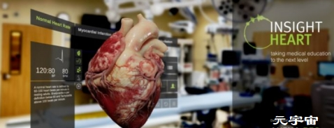
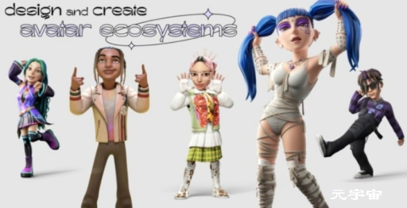

# 七大元宇宙主题馆、30个元宇宙项目落地无锡影都；宏碁创始人：元宇宙并非未来，而是已发生的技术进步的产物

**滨湖元宇宙产业轮廓初现！七大元宇宙主题馆、30个元宇宙项目落地无锡影都**

4月16日，滨湖区举行元宇宙产业重大项目云签约仪式，发布“华莱坞元宇宙世界”项目，七大元宇宙主题馆（项目）和30个元宇宙项目集中签约落地无锡影都。

此次签约落地的“华莱坞元宇宙世界”七大主题馆（项目），主要依托数字影视IP进行内容开发，围绕武侠、演艺、光影、恐龙等七大主题，涉及旅游、展览、演出、直播、购物以及剧本杀等多种应用场景。

作为滨湖元宇宙产业发展的先行园区，七大元宇宙主题馆（项目）全部落户无锡影都。这也是该园区继年初成功挂牌“无锡元宇宙创新产业园”后，充分利用数字影视发展优势，大力集聚元宇宙优质企业项目，加快推进主题场馆规划建设的生动体现。@无锡滨湖

**宏碁创始人：元宇宙并非未来，而是已发生的技术进步的产物**

据中国台湾地区经济日报报道，宏碁创始人施振荣在接受《彭博商业周刊》采访时表示，元宇宙并非是未来，而是已经发生的技术进步的产物，是我们对于下一代互联网的探索和实践。

施振荣认为，元宇宙由两个主要部分构成，一个是看得见的硬件，另一个是软件。其中，硬件包括以电子为主的半导体和信息设备，广义的软件则涵盖各种内容。@IT之家

## **国际AR资讯**

**GigXR 和 ANIMA RES 合作为医疗保健学习者扩展混合现实解剖学内容**

医疗培训扩展现实 (XR) 解决方案提供商GigXR和3D 医学动画和交互式虚拟现实 (VR)、混合现实 (MR) 和增强现实 (AR) 专家ANIMA RES近日宣布，他们已合作为高等教育和医疗机构提供 XR 培训。

该合作伙伴关系将 ANIMA RES 的 Insight 系列整合到 GigXR 沉浸式学习平台中，让学习者能够在混合现实中看到高质量的心脏、肺和肾脏的 3D 全息图。学习者还将能够查看不同的疾病状态及其对器官的影响。由 GigXR 提供支持的 Insight Heart、Insight Lung 和 Insight Kidney 将于 2022 年夏季开始推出。

ANIMA RES 的全息图具有超逼真的外观和准确的结构运动，让学习者可以看到心肌如何受到心脏病发作等影响的准确版本，这是 2D 训练方法甚至尸体都无法实现的实验室。

“混合现实解剖全息图结合了模拟和数字医疗培训的‘两全其美’，”ANIMA RES 的首席信息官兼联合创始人 Rodrigo Olmos 说。“在训练时使用对活体的准确、高保真模拟，而不是尸体或模拟木偶，有助于学习者了解人体的复杂性和魅力，并使他们的学习体验变得更有价值。我们从研究中知道细节是多么重要：栩栩如生的器官的细节水平越高，学习体验就越好。”

GigXR 创始人 David King Lassman 评论说：“我们很高兴与 ANIMA RES 合作，以实现我们的学习解决方案的无缝和用户友好的实施，并扩展我们强大的内容库，继续与合作伙伴的质量和标准相匹配。与我们一起建立医疗保健培训的未来。”

GigXR 和 ANIMA RES 计划在 2022 年夏季推出由 ANIMA RES 提供的 Insight Heart，由 GigXR 提供支持。随后将应用 Insight Lung 和 Insight Kidney。

**Avatar 生态系统公司 Genies 宣布获得 1.5 亿美元的 C 轮融资**

Genies是一家由 3D 化身、时尚和收藏品、空间和场所以及社交体验组成的“化身生态系统”提供商，近日宣布已筹集 1.5 亿美元的 C 轮融资，由 Silver 领投Lake，以推动其赋予人类创造自己的化身生态系统的使命。

据该公司称，其“化身生态系统的四大支柱”包括化身、时尚、空间和体验。该公司的目标是，这些支柱中的每一个都可以由所有者使用 Genies 提供的工具进行定制设计和创建。

**Meta 计划发布 Horizon Worlds 的 Web 版本**

Meta CTO Andrew Bosworth 表示将推出“Horizon 的 Web 版本”。Horizon 是 Meta 的元宇宙 VR 社交应用系列总称，旗下产品包括 Horizon Worlds、 Horizon Workrooms、 Horizon Venues 和即将推出的 Horizon Home。在 Horizon 创建的虚拟空间里，每个人都可以使用您的 Meta Avatar（Meta虚拟化身）。Bosworth 日前向外媒证实，他表示即将推出 Web 版本指的是 Horizon Worlds，并为 Meta 在平台上设置的高达 47% 的虚拟物品销售抽成在社交平台上进行辩护。Worlds 的工作原理与 Rec Room 类似，允许用户通过使用控制器放置物品以及进行其他互动操作，还能使用可视化脚本系统添加动态功能，在 VR 中创建自己的社交游戏。