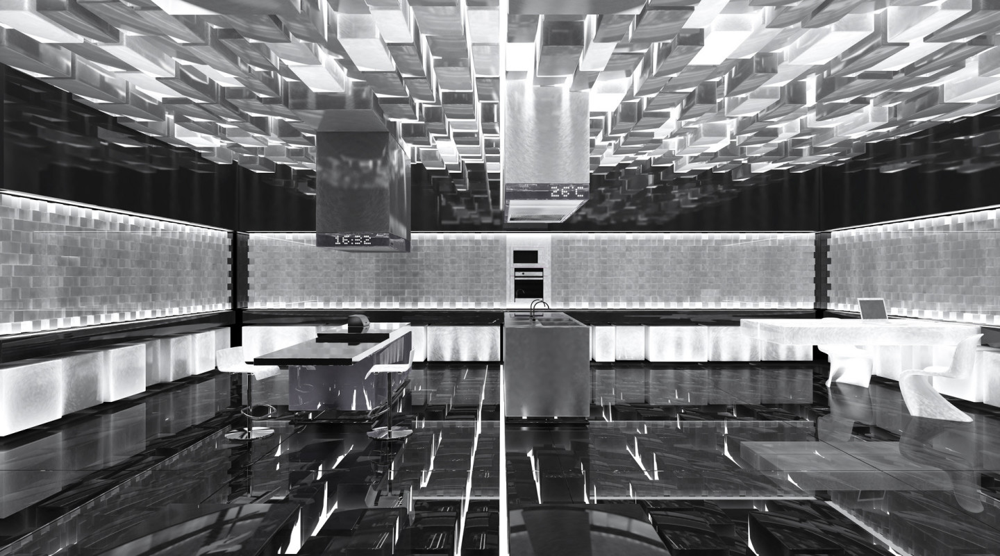

这个由科幻小说衍生而来的概念风靡海内外，有人在开“元宇宙”研讨会，有人因“元宇宙”概念而收获百亿市值，也有人在担忧与感慨：“元宇宙”真的不是自嗨吗？

似乎谁也说不清“元宇宙”究竟是什么，但谁也无法否认“元宇宙”的确给陷入瓶颈的互联网展现了一条新路径。**唯一的问题是，“元宇宙”不应该只是一个概念，而需要找到它与现实世界连接的方式，一点一滴构建这个虚拟世界。**

当我们以“元宇宙”的视角重新思考现实，将“元宇宙”这个虚拟概念与现实世界中的家装家居相碰撞，将会发生怎样的化学反应？

**家装之“痛”**

我们先把目光投向现实。

当下年轻人越来越关心自我，重视自己的生活空间。在某社交平台上，近40万人聚集在一个名为“请来参观我的房间”的小组。在这里，无论是租房一族还是有房一族，都在以文字和图片的形式展示自己的家，“参观者”们也会留下或夸赞或建设性的话语。

在“装修记录”栏目下，一位网友分享了她的经历：前期大量看装修案例和家装元素，之后通过朋友介绍、家装平台推荐前前后后接触了5位设计师，确定设计师之后又经过了三个月的设计阶段，最后才开始买材料、施工。

在这里，像她这样的“装修人”还有很多，一个环节一个环节找人，将五六个月的时间耗在上面。**对想要理想家居生活的年轻人来说，装修是人生大事，苦并快乐着，“装修真的太熬人了”，有人感慨道。**

其实，很早开始，就有人试图用互联网和科技这样的“虚拟”方式去解决这一现实问题，并由此诞生了土巴兔、齐家网等互联网家装企业以及酷家乐等家装设计软件。如今，距离“互联网家装元年”（2015年）已有六年，**但老问题仍然大量遗留，没有实现用户体验上的根本迭代。**

原因何在？掀开行业内唯一一家上市公司齐家网（齐屹科技，HK01739）财报来看，今年上半年其营收为5.24亿元，其中SaaS及延伸服务业务收入3.09亿元，占比59%。

如《一点财经》在此前的文章《互联网家装是伪命题？》所分析的那样，“齐家网、土巴兔的商业模式根植于一个核心逻辑，即流量贩卖”，虽然用户（C）、装修公司（B）是服务的两端，但其更倾向于B，而非C。

这无可厚非，毕竟与从C端开始的上下游产业链改造难度大、盈利难，时间久，从B端开始更简单，更赚钱，从B端一点点渗透改造整个产业链也是可能的选项。

那么，是否存在从C端开始的直线改造路径呢？

近两年，新一批参与者入场，引领这个行业进入“互联网家居2.0时代”。与第一波相比，它们普遍来头更大，起点更高，“野心”也更大，或从C端，或直接B、C两端同时切入。

互联网家居1.0之所以逐渐偏向B端，原因在于它们受困于流量。而当有着巨大流量池的互联网巨头们入场，它们天然就有了更宽的路。

就像阿里旗下每平每屋，它除了有单独的APP外，还在淘宝上有自己的频道；双十一期间，消费者从主会场设计、好货、智造、佳装等4大分会场中的3D样板间、AI客服、评价上墙、营销互动、装修我的家等多个内容展示入口进入，都可以链接到每平每屋。

与第一波参与者相比，这些大有来头的参与者们，将为这个行业带来什么改变？将把这个行业引导向什么新方向？

**除了更多涉足C端，第二波参与者们还有一个特点，即要么C端切入一个此前不被重视的领域，比如家装家居内容，要么走全链条渗透路线，将用户、设计师、家装公司、家居企业等都纳入了改造链条。**

**随着全链条的数字化渗透，家装家居可以跃向虚拟世界，进入一个全新的空间。**

**“元宇宙”之火**

“元宇宙”已经烧到了家居家装。

游戏被认为是离“元宇宙”最近的行业。《头号玩家》里，男主角和朋友们拼搏的世界“绿洲”，就存在于游戏里；《夏日大作战》里，人工智能系统就是想从虚拟世界“OZ”走进现实世界。（OZ指虚拟网络，它涵盖电子邮件、电子钱包、情报搜索之类的公共服务，一个与现实一样、被普及到世界各个角落的假想都市。）

游戏与“元宇宙”绑定的原因在于：一，大量地运用了VR、3D、虚拟现实等技术；二，有一定的世界观和场景设定；三，有大量人与物品……

实际上，这些因素同样可能存在于家居家装行业。《梦幻花园》等房屋与庭院布置游戏的火爆，意味着人们很乐于在虚拟世界中拥有自己理想的家。那么，凭借3D、VR、AI等技术，人们是否可能实现这一梦想呢？

**答案是肯定的。**

打开每平每屋APP，定位自己的小区，锁定自己家的户型，选择自己喜欢的装修风格，利用3D渲染，几秒后看到设计方案。点开设计方案，可以像《梦幻花园》里那样换自己喜欢的家居产品，不过游戏里选择只有两三个，这里一款搭配日式风格设计的床却可能有上百种。

依靠3D、AI、渲染等技术，这种类“游戏”体验无处不在。从商品搜索、主流商品链路到店铺、详情页和售后，基于“我的家”，几乎70%以上的家居家装商品转向3D互动场景，在手淘家居家装商品的3D样板间中，一句评价可以“上墙”，犹如游戏世界里的文字广播。

商家、设计师、消费者只需围绕自己喜欢的一件家具，用手机拍摄一个短视频，AI智能设计基于AI深度学习技术、3D技术、实时渲染技术，就能完成对该件家具的3D建模。有了3D模型之后，通过利用深度序列生成技术，可进行全屋的软硬装室内搭配设计。

“世界”如何才能真实？当然是完整复制现实世界。**一个完整的家居家装“元宇宙”，必然需要囊括所有产业链条，链条上的所有个体都有进入“世界”的“钥匙”，这也正是互联网家居2.0时代To B+C模式所展现出来的最大可能性，即走向“元宇宙”。**

除了向下有C端的流量优势，背靠互联网巨头的新一波入局者们还有着巨大的资源优势。背靠阿里，每平每屋的服务范围贯穿产业链条上下，包括消费者、家居家装商家、设计师、装企、MCN机构、家居达人、楼盘服务商等产业上下游玩家。

通过与淘宝、天猫打通数字商品供应链，它可以链接海量家居、家装供应商，目前合作商家突破5万家，有超100万全品类商品的真实3D模型；接入1000万全球注册设计师。

**更重要的是，这个“世界”又是现实的。一个设计师的图纸，可以存在于虚拟空间，也可以直接落地到现实世界；商家的商品可以上传虚拟模型，也可以直接进入消费者的家中。**

**“虚拟”与“现实”**

“元宇宙”带来的不只是C端体验的改变，它与现实还有更多触点。

**同消费者一样，设计师、装修公司、家居企业也一样“苦”，一是找客户难，二是“合作”难。**家居家装行业高度离散，链条又长，所以各环节学会了“抱团”，比如设计师会自带装修公司，比如装修公司会和家居企业合作。

上述网友接触过的5位设计师中，4位就是带装修公司的。此外，还有人因为信任工长，选择了他合作的设计师。

这种合作有利有弊，利的当然是只要一个客户进来，合作方就可以有订单；弊端在于合作方也可能出现不匹配，比如有的设计客户很满意，但对装修、家居有意见。

**家居家装行业上下皆“苦”的原因是什么？随着每平每屋等新参与者的入场，我们重新反思这个行业，可以发现问题集中在“人”和“货”上：**“人”，一个是用户与流量，另一个是服务标准化；“货”指的是家居、家装产品和材料。

曾经，网络上流传着一个名为《装修环节的118道工序和标准》的小册子，可见服务标准化难度之大。齐家网、土巴兔等平台过去几年间最重要的工作之一就是将流程标准化，规范监理、陪签，设立评价体系规范服务商。但从消费者体验看，它还有很大的提升空间。

至于“货”，更是一个大难题。大致来看，家装会囊括建材、家具、家电、家居等商品，其中除家电外都呈现“大而散”的特征，尤其是建材，消费者了解有限。近两年，齐家网、土巴兔等都在上游建材、家居产品上有所布局，正是希望能解决这一问题。

“人”和“货”恰好是互联网的擅长。过去十年，中国基本实现了人人触网，其中阿里这样的互联网头部平台更是沉淀了近10亿用户与需求，链接起千万SKU，并且从商品评价体系、七天无理由退换到店铺评分，建立起一套完善的服务标准和体系。

这让互联网家居2.0时代的参赛者们具备了天然优势。背靠阿里，每平每屋有了流量池，也有了商品供应链：设计师和装修公司、家居企业可以依托阿里流量池，获取订单；依托阿里数字商品供应链下的真实3D模型，设计师设计与现实呈现之间可以零差异，让消费者“所见即所得”，甚至还能提前知道精确的预算数字。

“从合作到现在，根据我的估计，线上下单至少提升了20%的转化效率” “从这里过来的用户质量上也会高一点”，总部位于德国的博世热力是体会到阿里流量池能量的企业之一，今年8月它开始与每平每屋合作。

信息不透明是家居家装行业最大的痛点，“一般装修公司整装价格在10-15万，就算前期报价5、6万，最后也得10万以上”，一位非常有经验的“装修人”分享道。其中的出入，很大就在“货”上。

每平每屋上有一个“装修清单”，可以分环节选择建材和商品，比如旧房改造被分为结构改造、装前预定、水电阶段等11个环节，每一个环节下都有确定价格的商品选择。

**通过对“人”、“货”的流程分解和透明化，全链条走上云端，这个行业才会真正摆脱原本的阴影：一，终端消费者的消费体验提升；二，上游设计师、服务商、建材家居家具厂商不再无序“内卷”，可以专心高质量发展。**

无论线上还是线下，设计师大多都背着销售任务，即给装修、家居家具公司“带单”，而在阿里等巨大流量池里，他们纯粹很多，可以只考虑怎么做出更好、消费者更满意的设计。同样的，家具、家居公司，通过数字化反馈，可以生产更符合消费者喜好的产品。

下游集成，上游分散，从“人”开始，以“货”重构，通过为消费者、设计师、装修、建材、家居、家具等各环节提供数字化入口，家装家居进入了一个平权，所有人都能自由游走于现实与虚拟世界的2.0时代。