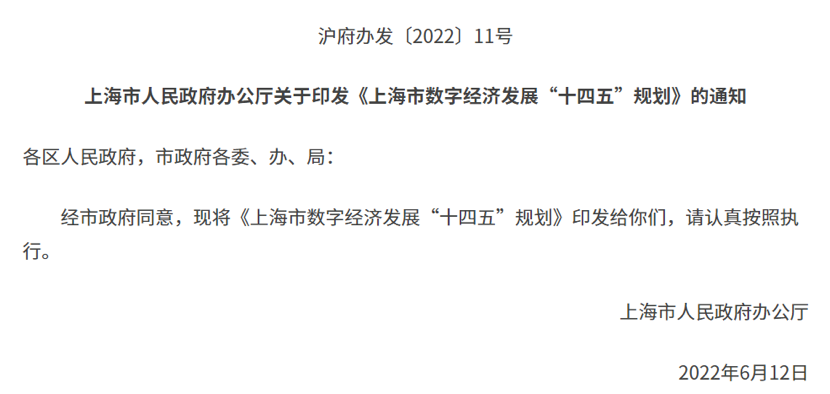

7月12日，上海市人民政府办公厅印发了《上海市数字经济发展“十四五”规划》（ “下称规划”）的通知。在重点任务方面，规划称，围绕数字新产业、数据新要素、数字新基建、智能新终端等重点领域，加强数据、技术、企业、空间载体等关键要素协同联动，加快进行数字经济发展布局。

关于当下前沿的元宇宙、NFT、区块链等领域，规划也有具体涉及。其中元宇宙和区块链的规划专门设立了段落进行具体阐述。

在规划中，三次提及NFT，具体包括：

在“培育数据新要素”部分的“数字贸易”方面，**规划提出要支持龙头企业探索NFT（非同质化代币）交易平台建设，研究推动NFT等资产数字化、数字IP全球化流通、数字确权保护等相关业态在上海先行先试。**

在“提升数字新基建”部分的“区块链”方面，规划提成要创建区块链与前沿技术多学科交叉的组合型科学技术创新体系，推动“区块链+”技术研发和应用落地，构建具有较强创新能力和自主可控的区块链发展生态。推动数字可信交易，支持推进基于区块链、电子身份确权认证等技术的可信交易。推动大数据可信交易，运用共识算法实现信任和交易确权，重点发展智能合约管理与运营平台。发展区块链商业模式，**着力发展区块链开源平台、NFT等商业模式**，加速探索虚拟数字资产、艺术品、知识产权、游戏等领域的数字化转型与数字科技应用。支持组建跨机构和行业的区块链联盟，研究制定重点领域区块链行业标准和协议框架。

关于“元宇宙”，在“提升数字新基建”部分中，规划称要加快研究部署未来虚拟世界与现实社会相交互的平台，加强从底层到应用全链条布局。发展人机交互技术，加快智能人机交互、虚拟数字人等核心技术攻关，开展XR（扩展现实）、脑机接口等更具沉浸式体验的终端技术研制，鼓励打造更加丰富多元内容场景新平台，培育虚拟演唱会、虚拟偶像、虚拟体育等数字娱乐消费新业态。加快虚拟现实生态布局，突破低时延快速渲染、虚拟仿真引擎等关键技术，发展软硬一体新型VR（虚拟现实）/AR（增强现实）、3D扫描等产品。打造行业标杆应用，在网络文娱、智能制造、数字内容、交通出行、在线教育、医疗健康等领域，打造具有影响力的元宇宙标杆示范应用。

