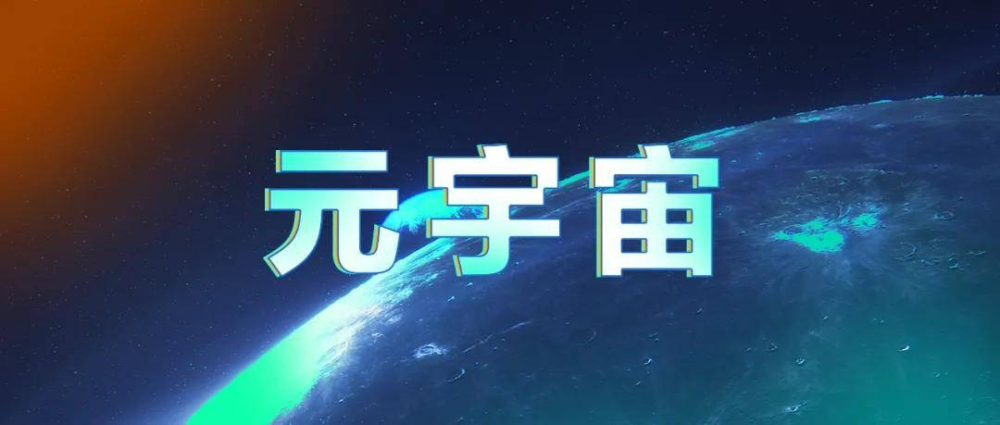

“元宇宙”概念无孔不入。Facebook创始人马克·扎克伯格all in元宇宙，将Facebook改名Meta，将元宇宙热度推向高点。而后，微软宣布以687亿美元的价格收购动视暴雪，并将这一收购视为向元宇宙进发的第一站。

在社交、游戏以及AI设备之外的更广泛领域，元宇宙也在发挥其影响力，渗透到各个领域，出现了一些不一样的形态。在保险行业亟须创新想法的推动之下，毫不意外的是，元宇宙这股势力也渗透到了保险领域，和保险结合，衍生出各种产品、概念和想法。

虽然元宇宙仍然保持着火热的发展势头，但是这一产业究竟机遇还是泡沫，能否真正发展起来，仍然没有定论。当然，当这一概念融入各个行业的时候，能否真正给这个行业提供价值，也是不确定的。对于保险业来说，情况也是如此。

## **国内：元宇宙与数字藏品**

元宇宙概念出来之后，在保险行业衍生出了一些不同的形态。从国内外将元宇宙融入保险的一些提议和想法来看，可以看出，国内有几家公司进入了元宇宙，但更广阔的图景是，元宇宙+保险目前更多存在于讨论层面，业内人士想要利用元宇宙为当前已有的保险业务赋能，通过元宇宙教育保险客户。而相比之下，国外则是更加多样化——发展数字藏品，进行营销，并从元宇宙的发展中看到了发展新险种的机会。

从国内的情况来看，有险企推出了NFT数字藏品。在去年12月的中国人寿财险公司第二届“财宝节”上，中国人寿财险公司线上财宝节开启了元宇宙大门，推出十五周年限量数字纪念藏品和数字家庭两大数字板块内容。

同样，今年1月份，泰康在线发布以旗下自有IP TKer为原型的NFT数字藏品——“福虎开泰”，这也是泰康在线发布的首例NFT艺术品。同期发布的还有一支元宇宙概念短片，泰康在线希望通过元宇宙将无形的保险产品变为有形的体验，让用户切身感受到保险的价值。泰康在线认为，从保险行业角度而言，元宇宙是保险从互联网时代升级到物联网时代的一个寻求突破的端口。

除了推出数字藏品的这两家公司，国内保险业对元宇宙+保险的讨论思路是为现有保险业务赋能，即利用元宇宙的纯虚拟交互方式，赋能保险销售、营销、用户教育等环节，从而推动业务发展。

有业界人士认为，在销售环节，保险行业的参与者可以利用元宇宙的交互方式，将各种科技能力运用到保险销售的各个环节，逐项破解保险销售的痛点，实现无接触、纯线上、不借助线下熟人社交信任关系的保险销售全流程体验。另一方面，险企可以利用元宇宙中的虚拟元素，提供及时的解决方案，有效改善与保险客户的互动，从而提升体验。

## **国外：元宇宙保险、数字藏品与营销并行**

相比之下，国外在将保险与元宇宙方面的探索更加多样化一点，不仅涵盖了元宇宙保险，更是发行数字藏品，并利用元宇宙进行营销。

目前，国外保险行业一个普遍的思路是为元宇宙中的虚拟资产提供保险产品，一些大型的保险公司和中介公司已经布局了元宇宙保险或者有计划布局，例如Liberty Mutual、State Farm以及Sompo Japan等。

以Sompo Japan为例，该公司前不久宣布与虚拟数字生活和移动游戏平台ANA NEO（日本一家元宇宙公司）签订协议，扩大元宇宙合作伙伴关系。双方将进行概念验证，开发产品和服务，满足ANA NEO的新元宇宙服务和Sompo Japan在保险产品开发方面的专业知识。这也是日本保险公司在虚拟世界的第一次涉足。通过合作，Sompo Japan将参与ANA NEO的元宇宙项目，验证以保险和风险管理为中心的各种商业案例，包括验证保险产品开发的适销性和商业可行性、验证保险产品和相关业务的交易和兼容性的风险以及分析ANA NEO元宇宙中各种数据并验证其有用性和适用性。

而从目前已有的保险产品和框架出发，国外提出了一些较为实际的观点，其中一个观点是从网络安全险延伸到元宇宙保险。从保障标的来看，网络安全险和元宇宙的标的有着共同的属性，即并非实体但又能引致巨额损失的东西。其实从存在形式来看，元宇宙本身就是互联网和社交媒体活动的一种独特衍生形式，因此两者引致的一般损失和责任可能包括黑客攻击、业务中断、隐私泄露和勒索软件攻击。

为元宇宙提供保险背后是市场需求的推动。相比之下，元宇宙里充斥着各种数字资产，由此产生了许多骗局，因此对保险的需求显而易见。数据显示，截至2021年，与其他企业相比，元宇宙面临的机器人攻击多出80%，人类攻击多出40%。

站在参与者的角度，产生这一思路的原因很简单，即在元宇宙异常火热、但是结果并不确定的背景下，做那个“卖水人”。Hylink的美国董事总经理表示，在一个重大投资正在进行、而几乎没有消费者保护措施的环境下，元宇宙的下一部分将是保险。

## **元宇宙保险：尚未进入推向市场阶段**

从结合保险与元宇宙的思路来看，国内外完全是不同的路子。

对于国内而言，由险企推出了相关数字藏品。在这之外的讨论层面，保险业内人士想要利用元宇宙提升用户教育、营销等环节，本质是乘着元宇宙这股东风，改善现有流程。而从国外的思路来看，则更加多样化，不仅利用元宇宙进行营销，提升用户体验，更是从元宇宙的发展中预见了风险，并决心想要为这一风险提供保障。

在目前阶段，这两条路子都有局限性。国内想要利用元宇宙赋能现有保险业务，提升保险流程、进行营销、并达到用户教育的目的。但是从现实的发展来看，可能存在几个问题，包括元宇宙能否达到提升保险流程的作用、元宇宙中的营销覆盖的传播面以及元宇宙中的用户与保险用户的匹配度问题。

从本质上来讲，元宇宙其实就是互联网的一种极致形式，因此通过元宇宙提升保险流程无非就是利用现有的各类新型互联网技术，对保险业务做一个赋能。这一点在现在的互联网阶段就已经进行应用了，例如实现保险各流程的线上化。但是不得不说的是，这些流程仅仅通过现在的技术就可以实现了，而在元宇宙中，并没有太多的可改善地方。

再者，利用元宇宙教育客户的概念更显得不切实际。在元宇宙尚处于发展初期的背景下，元宇宙中的客户群体有多少是个未知数，目前的群体仍然占总人群的一小部分。因此，在这种情况下，利用元宇宙对用户进行教育其实效果不大。而且，从更广泛的互联网来看，在当初保险从线下转到线上的时候，也有提议表明保险可以利用互联网实现用户教育，且不论效果如何，单单在用户教育方面，可能有时候保险行业并不需要那么多噱头。

国外想要为元宇宙中的风险提供保障的路子也面临着定价困难、风险不确定等各种挑战。目前有计划推出元宇宙保险的公司，要么还处于概念验证阶段，要么仍然处于提出想法但是没有进入实际的保险产品设计阶段，因此，前路仍然漫漫。

从国内外在元宇宙与保险方面的探索来看，元宇宙加保险仍然属于概念先行，目前缺少实质性的内容。因此可以说，元宇宙与保险的未来仍然比较远。