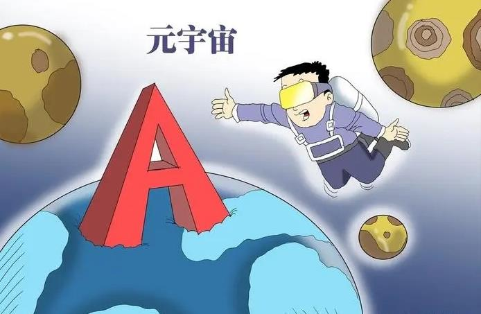

“‘风口’‘元年’这些说法，可能科技圈里的大多数人都已经免疫了。很多技术，从高峰到低谷，起起落落，要经历几波周期，高峰甚至不止一个。但真正有价值的技术，即使经历炒作之后的低谷，也迟早会迎来市场的真正认可。我们希望这一次元宇宙之风，经过几年的沉淀之后，技术和市场都能进一步成熟。但要说元宇宙这次会不会又是虚火，一两年之后又沉寂下去？我认为不会。”

 

这是袁昱对当下爆火的元宇宙概念的判断。

 

袁昱告诉记者，“元宇宙是一个‘慢牛’。目前，市场上很多所谓元宇宙产品都处于初级阶段，用户体验很粗糙、很原始。我个人反对把现有产品称作元宇宙或打上元宇宙的标签，这会大大降低用户对元宇宙的期望，从而抑制技术和市场的发展。”在他看来，元宇宙应该是一个目标，一个愿景。当前的各种号称元宇宙的产品形态都是通向元宇宙的必经之路，必须的探索和迭代过程，但距离元宇宙还太远。

 

袁昱，IEEE最高董事会历史上第一位中国籍的董事、IEEE标准协会历史上第一位来自美国以外的主席，同时也是在消费科技、智能物联、数字化转型、VR/AR领域深耕实践多年的科学家、发明人和创业者。

 

谈到IEEE（Institute of Electrical and Electronics Engineers），科技狂人们并不陌生。这是总部位于纽约的国际电气电子工程师学会，在160多个国家拥有40多万名会员，是全球最大的专业技术组织，并在2020年和2021年蝉联由中国科协发布的世界一流科技社团排行首位。2021年是IEEE标准协会主席的选举年，袁昱在与三位美国候选人的激烈竞争中胜出，创下科技协会历史。

 

从科研到实践，对于众说纷纭的元宇宙，袁昱有着另一面理解。

 

不得不说的秘密：“两类半技术”

 

2021年，中国科技圈热闹非凡。除了硬科技，元宇宙成为当仁不让的第二热词。打开手机，元宇宙的信息跃然“屏”上，各行各业对于元宇宙的讨论此起彼伏，乃至于有人笑称“万物皆可元宇宙”。

 

纵观市面上各种元宇宙报告，基本上把近几年所有科技词汇都一网打尽。袁昱告诉记者，“元宇宙本身是很宏大的概念，涉及非常多的技术，影响行业众多，但最核心的就是VR。”

 

此次热潮起来后，作为多年的VR从业者，袁昱也在反思元宇宙最本质的特征究竟是什么？“一个持久存在的虚拟世界。只有持久存在，用户参与创造才有意义，才能存留下价值。”

 

袁昱将元宇宙技术划分为核心技术和外围技术。其中，核心技术包括两类半，即感知与交互、持久存在的虚拟世界（“持久计算”）、区块链与数字资产。而外围技术属于普惠的支撑型技术，比如算力、存储、通信、数据、智能等，是广泛用到的数字基础设施，远远不限于支撑元宇宙。如果对核心技术与外围技术不加区分，则会让人觉得‘元宇宙’概念无非又是一个什么都能装的大筐，反而不利于进一步发展。”袁昱对记者说道。

 

元宇宙核心技术中的第一类，感知与交互，从用户体验角度看，未来脑机接口技术将会占据主导位置，全面取代人体的感知和交互，让虚拟世界的体验更加真实。

 

早些年，科幻小说《真名实姓》构想了一个可以通过脑机接口进入并拥有感官体验的虚拟世界。而著名电影《阿凡达》中，主人翁通过意念控制阿凡达，让自己在另一个世界获得自由，也让我们找到了对元宇宙最初的认知。

 

要实现元宇宙，很重要的一项核心技术就是重定向人的感知，和元宇宙形成交互。但目前，大部分感知是通过置于人体感官之外的VR/AR设备实现，主要提供视觉、听觉、部分触觉和嗅觉，更丰富的感觉却无法提供。很多问题并没有解决，更谈不上以假乱真。

 

作为人机交互关键技术之一，脑机接口绕过了人体感官的光线、声音、气味等外界信号输入，直接通过脑电信号输入，并让使用者以意念进行各种反馈，实现虚拟世界里的一切交互行为，让人们对未来元宇宙的人机交互与沉浸式体验充满想象。

 

“未来5-10年，感知与交互技术必然会有重大突破。”袁昱说道，“脑机接口的成熟，对于元宇宙的实现将起到十分关键的推动作用。想要达到元宇宙虚实交融的沉浸式交互体验，脑机接口是必不可少的技术。”

 

元宇宙核心技术中的第二类：元宇宙将拥有人类历史上最大的持久计算需求。

 

程序员几乎都会同意，元宇宙意味着要在计算机中运行巨大的共享虚拟世界。但构造一个持久存在的虚拟世界，并不容易。

 

“现在很多研究都在重点讲引擎，尤其关注对于运动、光照、声场等的模拟是否逼真。这些固然很重要，但更重要的是，虚拟世界要遵循自洽的物理规律，构成虚拟世界的零件要能够灵活地被打散重组，用户的行为可以对虚拟世界造成持久的改变，用户也可以自己构建持久存在的虚拟物体。”袁昱解释，“虚拟世界本身就应该像现实世界那样，由不断细化、高度可分的基本零件构成，大到砖块，小到沙尘，未来甚至细到粒子级别。要把虚拟世界构造得细腻精美，需要被我归类为‘持久计算’的一系列从底层架构到实现优化的技术来支撑庞大的、物理上自洽的世界模型。”

 

元宇宙核心技术的最后半类：区块链与数字资产。在元宇宙中，活跃的经济系统会为元宇宙大规模持久运行提供动力。而经济系统要为广大用户所接受，需要一系列被广泛认可的标准和协议，作为基础保障经济活动中的信任和安全。区块链技术由于天然的去中心化的信任和安全机制和对原生数字资产的支持，非常适合元宇宙中的数字经济。

 

“之所以称为‘半类’技术，是因为区块链与数字资产并不是元宇宙的必要条件。”袁昱解释，“一方面，大众对元宇宙的憧憬并不都是奔着在里面赚钱去的，更多的还是向往一种‘生活在别处’的体验，好比现在主流的游戏用户与所谓‘链游’的用户基本是两个完全不同的群体，前者远大于后者。另一方面，从公认为元宇宙雏形的一些产品例如Second Life和Roblox看，其中被当作元宇宙重要特征的数字经济也并不是基于区块链，而是完全中心化的。大家在Second Life里买卖虚拟房地产那会儿，比特币都还没有被发明出来，根本还没有区块链的概念。我们承认区块链与数字资产将有助于发展元宇宙，但应该认识到这只是为元宇宙锦上添花，而不要喧宾夺主地认为元宇宙就是围绕区块链与数字资产而生的。”

 

同时，袁昱也指出，要将区块链的发展历程作为前车之鉴，元宇宙相关的数字经济也会像当年区块链被迅速分成链圈和币圈那样，一部分属于政策允许和支持的，另一部分则必然遭遇强监管。换句话说，（元宇宙）技术本身没错，在全球范围内都是大势所趋，但市场上带有欺骗性割韭菜的“泡沫”，一定程度上会抑制元宇宙生态的发展，并在更大范围内造成负面影响。因此，对于元宇宙，需要监管层更早的介入。

 

每家企业都有技术变现的最优路径

 

元宇宙，无疑是颠覆式创新的集大成者。作为信息形态与载体的全新升级，元宇宙以“新物种”的姿态进入经济社会各领域。可以预见，各行各业只要把握住元宇宙的发展机遇，充分做好衔接工作，就将有可能实现产业的重大转型升级。

 

谈到元宇宙最先爆发的场景，袁昱将时针拨回到了六年前。

 

元宇宙并非无源之水无本之木，其发展历程始终立足于过去的技术演进及文化积累。在不久前的2016年，VR就曾为大众关注，大量公司和资本涌入VR行业，以至于那一年被称为“VR元年”。那一年，袁昱创办了一家从事虚拟现实的跨国科技公司0xSenses，致力于发展大型多人超逼真虚拟现实体验所需的技术、基础设施、生态系统等。

 

“盛景是当时国内极少数看懂我们，也是最早投资我们的机构。”袁昱对记者回忆，“我早在念书的时候，就对VR有很深的情怀，坚信VR是未来改变生活方式的重大技术。2016年，VR掀起创业热潮，但我并不认同当时很多企业的切入方式。无论To C还是To B，硬件还是软件，风险都太高，因为我们预判VR的市场没有那么快成熟。我们布局的是长线，希望成为‘VR界的高通’，做技术积累和技术输出。通过技术标准，占据行业话语权和领导地位，通过技术授权获取收入。VR技术知识产权变现，这是我们的初心。”

 

任何技术的商业化路径都会几经周折，在产业尚未发酵成熟之前，能以确信的心态坚守行业未来的机构和企业都是勇士。盛景对于0xSenses这类初创企业，带来的也不仅仅只是投资，更多还有对企业的价值赋能。

 

“我们也庆幸当时没有撸起袖子直接做产品，而是选择在技术标准上提前布局。虽然看起来，我们不是直接的VR淘金者，但选择这条路让我们坚持到了元宇宙时代的来临。”袁昱如是说。

 

毕竟不是所有人都能幸运地踩准风口，并能准确找到适合自己的路径。那么，元宇宙时代，科技企业们究竟如何才能更好地存活和发展？

 

袁昱表示，“现阶段，元宇宙的雏形主要落地在文娱行业，但这一定不是元宇宙的最终形态。未来，所有企业都有机会找到自己独特的发力点。不管是技术、应用还是内容，都有非常多可以发掘的增长点，尤其不同行业的结合会产生很大想象空间。不同类型的企业都有一席之地。”

 

中国有机会做元宇宙的标准制定者

 

元宇宙，本身是一个愿景，而且是长期愿景。袁昱透露，正在依托IEEE筹备发起全球的Open Metaverse Initiative（开放元宇宙计划），希望集结元宇宙产业生态中所有参与者、利益方，共同开发、建设、运营、使用和获利。“我们看到越来越多的中国企业，在不同技术领域已经占据领先地位。对于技术综合体的‘元宇宙’，我们同样希望，中国企业能够有机会参与乃至主导各项技术标准的制定。”

 

事实上，技术标准，与产业利益距离最近。尤其在国际市场中，通过标准来占领产业的技术要地，取得话语权，通过技术标准培育和促进产业生态，越来越受到各国重视。作为将在2023年正式上任的IEEE标准协会一把手，袁昱站在全球技术发展的角度，领导协会战略和导向。这是一种荣耀，更是一种责任。

 

基于认知上的共识以及为中国创新技术赋能的共同愿景，袁昱与盛景联合创办了元创盛景（VerseMaker）产业创新生态平台，着手启动全球开放数实融合计划，基于专利、标准和数实融合，为科技型初创企业连接专业的知识产权增值与标准赋能服务，并将全球专家资源对接给中小企业与上市公司，加速中国数字技术与实体经济的进一步融合发展。

 

同时，基于VerseMaker所构建的元宇宙产业创新生态，结合盛景在母基金和直投领域的专业的投资管理能力，将共同发起设立一只元宇宙主题投资基金，重点投资于产业元宇宙、工业元宇宙，以及能够给元宇宙生态提供赋能的技术和服务的创新企业。 、