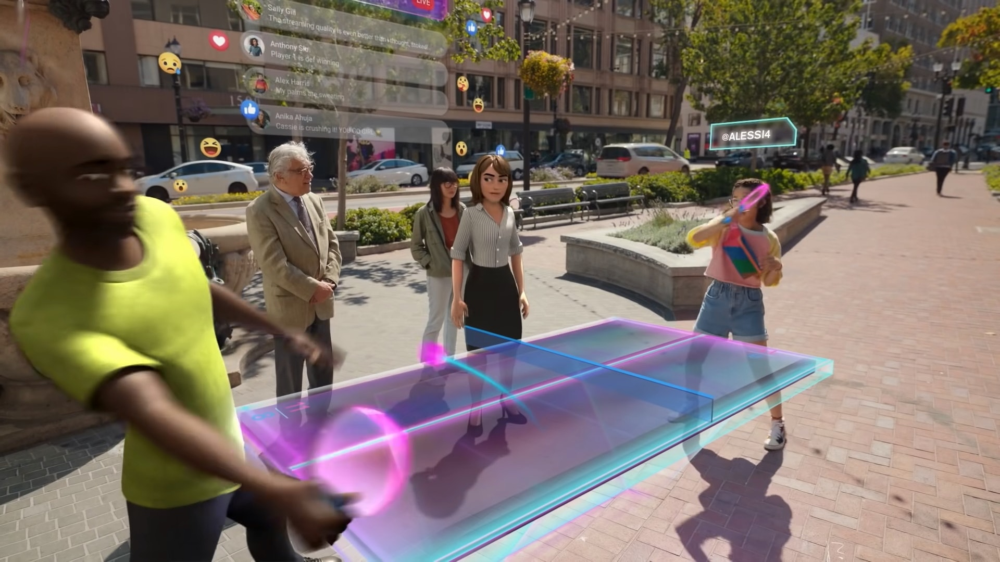

元宇宙作为一个新的概念，一经提出就得到了很多人的关注，SaaS 企业也开始探索与元宇宙的结合，那么元宇宙会和 SaaS 结合的怎么样呢？文章给出了答案，让我们一起看看吧！

元宇宙的第一个应用场景是游戏，因此人们对元宇宙的初体验多来自游戏。

元宇宙第一股「Roblox」便是一家游戏公司，在 Roblox 中的游戏能够自定义角色，同时着重满足玩家社交需求的设计，也拥有一套游戏内的经济系统。早在 2019 年，Roblox 的社区玩家月活量就已过亿，累计有千万名创作者使用过 Roblox 提供的工具来开发游戏。

目前，元宇宙的边界正逐渐拓展，从消费级市场进入企业级市场。

第一个提出企业元宇宙概念的是微软。2021 年 5 月，微软 CEO Satya Nadella 在 Build 开发者大会提出企业元宇宙 ( Enterprise Metaverse ) ，试图通过数字孪生技术建立虚拟数字世界，为企业提高生产效率，他们最先切入的赛道是远程协同办公。

然而在实践中，元宇宙作为远程办公工具取得的效果并不理想。微软研究人员针对 61000 多名微软员工的调研结果显示，微软向远程办公的转变已经损害到公司内不同业务团队之间的沟通与协作能力，进而威胁到员工的生产力水平与长期创新。

回归本质，元宇宙只有为企业提供价值，形成新的业务增长点，才能真正影响生产力的变革。

在元宇宙浪潮下，SaaS 企业开始思考元宇宙的商业价值，如何将 SaaS 与元宇宙结合，元宇宙 SaaS 的应用场景在哪里？未来有哪些可能性？

**一、降低数字人门槛**

数字人作为元宇宙的身份入场券，是企业元宇宙最早落地的商业场景。无论是虚拟美妆达人柳叶熙，数字偶像洛天依，还是虚拟助手度晓晓、虚拟代言人 AYAYI，以其逼真的外形和酷炫的 3D 特效，获得了高流量和高收益。

然而，一个超现实数字人的背后是高昂的制作成本和长时间的研发等待。数据显示，柳叶熙的研发有半年之久，光是成本就在百万元级别，而第一条柳夜熙的短视频成本约几十万元。这样的投入对于普通大众和中小企业而言显然不是小数目，对于元宇宙世界而言这入门级别也过 " 高 "。

来画首席增长官吴林认为：" 我们以数字分身的形式来体验数字世界，这个数字分身可以做成高模逼真的影视 CG 人物。尽管越逼真，效果越好，但会增加制作成本和承载的系统算力难度。" 当用 CG 人物去驱动元宇宙时，这个世界只会成为少数玩家的乐土，无法触及到多数人。

如何降低数字人的使用门槛，让更多人实现数字人自由？SaaS 化的虚拟数字人，能够通过订阅模式为客户提供标准化的服务，解决客户预算有限的痛点，并且提供敏捷的现代解决方案，及时响应客户的市场需求，为企业在不确定的未来提供确定性的服务保障。

当每个人都拿到通往元宇宙世界的门票，就会有海量用户进入数字空间，这时，开始考验厂商的第二个能力：如何创造一个良性互动的创作者生态，让用户在数字世界里获得价值感。

对此，吴林表示，来画除了为用户带来生产力价值外，还希望通过创意的方式协同生态。用户既是需求方也是创作者，一方面通过平台的素材模板实现内容创作，另一方面通过加入创作者联盟提供素材内容，取得个人收益，形成良性的创意互动。

" 创意与元宇宙的组合很容易打动数字原住民和 Z 世代这个群体，让他们快速地从真实世界切换到虚拟世界当中。" 吴林说。

需要注意的是，虚拟数字人市场潜力大的同时，也出现了同质化竞争严重、行业内卷加剧的局面。根据天眼查数据显示，我国现有虚拟数字人相关企业 28.8 万余家，有近七成的虚拟人企业成立于 1 年之内，行业进入爆发期。

**二、VR 会展促进互动沟通**

在疫情黑天鹅影响下，企业活动受到限制，大部分企业选择从线下会展转移到线上。然而举办会展的核心诉求不止在于获取有关展会的内容信息，更重要的是与他人发起问话、产生联系。传统的线上会展只有对话框和文字符号，不能传达情绪、自然地发起问话以及产生深度交流，降低了沟通效率。

而在元宇宙空间中天然具备互动和社交的属性，每个人都能通过虚拟形象的方式与他人进行洽谈和交易。在参观 VR 会展时，用户可通过 VR 头显和手机上的 App 进入现场，在逛展时用户能够招手、移动、交换名片、鼓掌等社交行为与他人产生互动。

在具体业务上，SaaS 化的 VR 会展解决方案能够通过 VR 素材采集、图像处理、 云存储、沉浸化展示等服务，为企业快速构建元宇宙会展，聚拢潜在用户，可广泛应用于教育、营销、酒店等领域。

如果元宇宙会展带给客户的体验仅限于用 APP 进入的平面世界，那么这显然没有实地看展更高效。这时，以 VR 头显为代表的终端设备对于 VR 会展的意义凸显出来，在接入 VR 头显后，展商以及采购方在物理世界中的肢体动作能够被数字空间捕捉，映射在数字分身上，实现跨界同步，与元宇宙的其他人 " 异地同场 "，进行深度交流，提高沟通效率。

实际上，VR 会展要达到 100% 完全虚拟场景，还需要产业链上游的硬件设备与基础设施的支撑。

由于元宇宙的硬件设备与基础设施的不成熟，延迟了人们进入 3D 互联网的时间。VS • work 联合创始人兼 COO 徐晨翔表示，目前的 VR 眼镜只能用很小的一块屏幕，还有很多现实场景肉眼无法覆盖，沉浸感不足，并且体积笨重，不能像手机一样当作日常设备使用。

其次是云端的算力。当太阳眼镜般大小的 VR 眼镜普及的时候，可以想象它的终端算力是很小的，在元宇宙的 3D 环境里还原和复刻宏伟的场景，需要庞大的计算系统来提供云渲染服务。就当下的现状而言，云渲染的产业链不成熟，导致厂商的制作成本昂贵，乃至客户的使用成本也很高。

关于元宇宙的未来，移动微世界创始人兼 CEO 王兴灿认为："VR 技术的软硬件和网络环境不成熟，短时间内进入大规模的用户不现实，这需要市场端五年到十年的交易、认可过程。"

目前，VR 行业正处于爆发前夜。据 IDC 最新数据显示，Meta 的 Quest 2 占据了 VR 头盔市场 90% 的份额，其次字节跳动的 Pico 占 4.5% 的份额，此外苹果也将推出 VR 头盔瓜分整个市场。

可以预见，巨头的加入将加速 VR 产业链上游的发展，下游应用端的格局也面临着洗牌。对于 SaaS 厂商而言，软件硬吃的时代或将来临，"SaaS+ 硬件 " 的模式在未来更有竞争力。

**三、MR 直播提升企业效率**

随着直播在企业端逐步渗透和深度应用，用户对直播体验和直播能力的需求提高，而传统的直播环境还存在 " 布景单一、内容同质、互动性差 " 等问题，直播行业需要在体验、互动和内容上展开新的变革。在此背景下，MR（混合现实）直播应运而生。

MR 直播作为一种新型直播形态，能够呈现出虚拟画面与现实信息相交互的 3D 式效果，依靠线下绿幕区，构造出一个逼真的虚拟场景，将线下活动搬移到线上直播间，理想状态下无法辨别真实场景与虚拟场景。

保利威技术副总裁梁瑛玮前段时间提到：" 作为 SaaS 厂商，我们思考的事情并不仅仅是怎么应用更酷炫更高级的技术，还有怎么使我们的用户以低成本、低门槛去应用到我们更新的技术，产生更多的价值。"

在助力企业数字化转型过程中，SaaS 化的 MR 直播能够让企业办公更加高效。举个例子，企业在大型的发布会上会花几万元布置场景，而在日常培训和研讨中，则趋于用免费或成本更低的技术方案实现沟通目的。现在通过 MR SaaS 技术，仅需要一台笔记本连接 MR 直播系统，就能获得低成本、多场景、低延时的体验。

值得关注的是，MR 设备通过收集周围发生的新信息，将虚拟和物理世界融合在一起，尽管这一形式不符合人们对于元宇宙的设定，不能让用户沉浸在完全虚拟的环境，但是 MR 技术能够提升企业的生产经营效率，广泛地应用于企业培训和营销活动中，其发展前景依然让人期待。

此外，MR 技术作为 AR/VR 技术的补充，与其他 XR 技术的结合，能够让人们提前享受虚拟世界，这一组合将成为现阶段的主流。

**四、结语**

目前 SaaS 厂商对于元宇宙场景的探索，主要体现在模拟物理世界和移动互联网的玩法上，除文章涉及的场景外，还有生产车间、自动驾驶、教育培训、建筑工程设计、购物等方向。

随着云端算力、3D 渲染、终端设备以及网络通讯技术的发展，元宇宙与 SaaS 的结合在未来预计将出现更多可能。但在这之前，厂商仍需从降低门槛、丰富场景、构建生态方面继续探索。聚光灯下的元宇宙 SaaS，依然任重而道远。