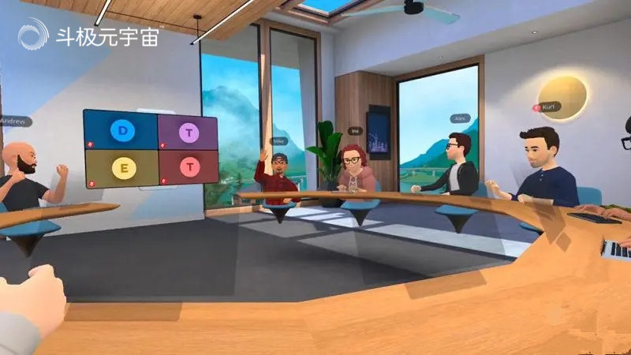

到2022年，疫情已经伴随我们走过了三个年头，如果说一开始我们感到恐慌，让我们手足无措的话，那么现在，我们应该要适应与疫情斗争形势之下的工作、学习和生活的状态。这个世界一直是在变化的，无论是向好还是向坏的变化，我们一定不能以不变应万变。也不要去埋怨疫情打乱的社会秩序，而要是顺应当前的大环境，去改变自己，调整自己。

尤其是现在网络技术发达，因为疫情，很多人被隔离，工作和学习场景也不得不从在公司和学校变为居家。实现远程办公和学习，也越来越被大家关注。

什么是 SpatialChat？

SpatialChat 是一个虚拟事件托管平台，可帮助人们举办虚拟活动。与 Zoom 或 Google Meets 不同，SpatialChat 允许您创建一个空间，人们可以在其中探索和加入不同的分组讨论室、参加虚拟讲座以及使用其他交互功能。

SpatialChat 成立于 2020 年 4 月，该公司每月拥有超过 25 万在平台上举办虚拟活动的用户。全球大流行加速了对工具的需求，这些工具可以帮助团队和活动组织者创建专注于参与的独特虚拟体验，而 SpatialChat 正在顺应这种需求所产生的浪潮。

在SpatialChat平台，进入空间后，每个人都会通过网络摄像头用一个圆圈和他或她的脸来表示。 您可以看到其他人在虚拟空间中的位置，当您的头像靠近他们时，您可以很好地听到他们的声音，而如果您将您的头像远离他们，他们的声音就会消失。这可以模拟办公的空间，员工可以在其中与一位同事进行简短的交谈，然后转向另一位同事更换伙伴。或者可以举行虚拟办公远程会议。

SpatialChat 提供了一个虚拟空间，您可以在其中与朋友或同事会面。这个工具的一个优点是使用起来非常简单。它可以在计算机浏览器（Chrome、Firefox、Safari）、Mobile Safari (iPhone) 和 Mobile Chrome (Android) 上流畅运行。

SpatialChat 是一个关于在线课程如何发生的漂亮实验。您无法与其他替代品进行比较。SpatiolChat 允许学生在课堂上相互交谈。我喜欢的另一个功能是多个共享屏幕。没有其他会议软件允许我这样做。对于编码课程，这是一个非常宝贵的功能。我想说 SpatialChat 是第一个比现实世界课堂教学更好地增强我的课堂的工具。小编觉得使用 SpatialChat 的老师比在某些教室里更好。

它的功能是举办诸如 World Cafés 之类的活动，这是一种让学生参与语言课程的有趣方式。

在小编看来，SpatialChat 提供了将面对面会议的网络交流带入在线时代的最佳方式。在这些事件中的许多由于 COVID 而被数字化（或混合）之后，人们一直在努力取代个人对网络交互的感觉。SpatialChat 提供了最好的解决方案（据小编所知），可以从模仿现实生活互动的大群人中获得更多个性和轻松的对话。当数百人在线时，Zoom 和其他平台无法提供简单的解决方案来进行小组聊天。SpatialChat 找到了一种完美捕捉这一点的方法，我期待着用这个平台组织下一个有意义的活动。

（免责声明：本文转载自其它媒体，转载目的在于传递更多信息，并不代表本站赞同其观点和对其真实性负责。请读者仅做参考，并请自行承担全部责任。）