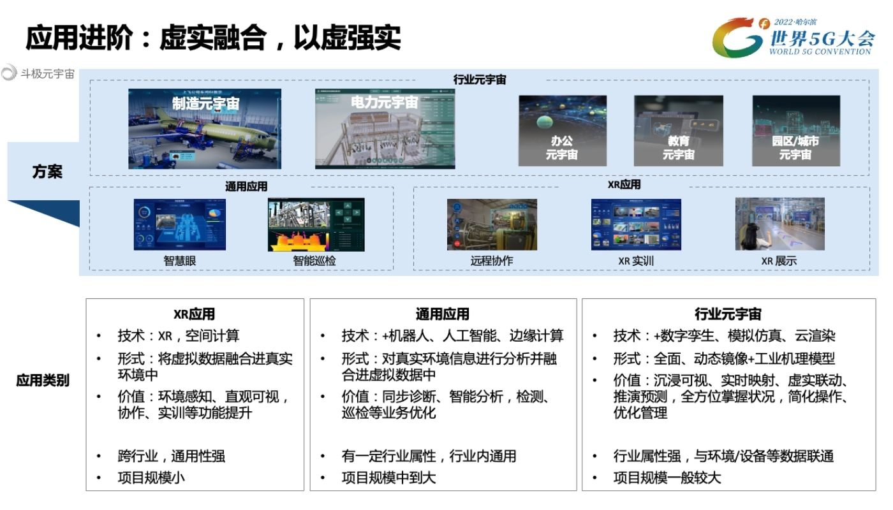

由国家发改委、科技部、工信部与黑龙江省人民政府共同主办的世界5G大会,于8月9日在哈尔滨正式召开。作为全球首个5G领域的国际盛会,本次大会围绕“筑 5G生态,促共创共利”大会主题,呈现了 5G在千行百业和融合生态中的深度实践。

联想集团副总裁、联想研究院上海分院院长毛世杰出席本次大会,并发表《行业元宇宙架构与实践》主题演讲,展示出联想在元宇宙领域的技术布局的成功应用。

联想集团副总裁、联想研究院上海分院院长毛世杰

**聚焦元宇宙核心赛道,持续引领关键技术创新**

近年来,随着高速率、低时延、大连接的5G技术成为应用场景的网络基础,以及云计算、人工智能等元宇宙所需的底层技术快速成熟,加之政策红利的不断释放,元宇宙赛道正呈现蓬勃发展的态势。

毛世杰认为,在元宇宙大繁荣的助推下,作为支撑元宇宙关键技术之一的AR/VR已成为元宇宙发展的重要抓手。尤其是在企业的数字化转型中,AR/VR作为数字能力在实体经济中发挥着重要作用。“当前整个工业面临着产业升级的需求,在这一背景下更应通过AR技术和AI技术的结合,来提高工业的智能化,达到降本增效的目的。”毛世杰表示。

作为全球领先的ICT企业,早在2012年,联想就前瞻性洞察到,AR/VR将会成为下一代智能平台发展标的,开始积极探索AR/VR技术的落地应用。2017年,联想Mirage AR智能头盔套装正式问世,作为全球首款沉浸式AR游戏设备,这也标志着联想对于AR/VR的探索与实践取得了初步成功。随后,在2017年和2021年,联想又分别推出了晨星AR和Think Reality A3 AR智能眼镜,成为了AR应用的里程碑式产品。

联想布局元宇宙的技术框架及当前发展重点

在AR/VR技术逐渐积累与成熟后,联想以AR赋能制造业的元宇宙图景逐渐展现。毛世杰表示,AR/VR技术作为连接物理世界和虚拟世界的桥梁,通过数字孪生、虚实融合、虚实联动等方式,在物理世界中叠加虚拟世界的信息与感知能力,提升人/机器人的决策能力与协作效率,同时也能够在虚拟世界中进行仿真、推演,实现真实世界难以实现或成本很高的应用,“这不仅是企业数字化转型的高级需求,也为联想AR/VR赋能制造业奠定了基础”。

毛世杰介绍,联想身为制造业的行业龙头,目前在产业数字化转型加速的背景下,已经形成了一套完整的元宇宙解决方案:即通过全要素+开放平台,大大降低构建成本;通过虚实联动+智能化应用,大大提高应用价值。通过多个维度发力,不断丰富元宇宙的应用场景,为企业工业制造与产业智能化变革提供科技动能。

**赋能数字经济发展,元宇宙技术成为新引擎**

作为产业发展的未来形态,元宇宙能够充分打开产业数字化转型发展的新空间。毛世杰表示,目前联想围绕AR/VR这一元宇宙入口持续发力,通过智能化转型沉淀的技术实力与实践经验,打造了制造业元宇宙与电力元宇宙教育元宇宙等应用场景,为产业智能化转型升级提供强劲动能。

联想行业元宇宙布局全景图

在制造业元宇宙,毛世杰表示认为,通过元宇宙的虚实联动,能够创造出一个虚拟工厂的模型,在设计、制造、运营、服务等方面,为制造业打造一个全价值链体系。

在具体实践中,联想与青岛特钢共同搭建的图像识别预警系统,能够准确进行上料台钢坯位置检测、钢坯编号识别、加热炉内钢坯位置检测等,有效解决了传统巡检中依靠工人对异常工况进行观察,漏检误检而且处置不及时的问题,使人均效率、协同效率与机组工作时间均得到有效提升。此外,图像识别预警系统还进一步降低了人员成本,使其成为国内人力成本最低的特钢高线产线。

同时,联想还与国际化工巨头巴斯夫进行了深度合作,借助联想架设的AR眼镜和控制器,能够远程操控联想所开发的晨星立式机器人,实现处理异物、物体进行分类以及执行智能巡检等功能,从而达到人机协同。

在电力领域,联想深入元宇宙的肌理,通过表真孪生和肌理孪生进行虚实联动。例如,联想与南方电网合作的基于AR技术的电网应急培训系统,可以在虚实结合的场景中,低成本、高效率、高安全地帮助学员进行针对电力应急要求的抢修、火灾、通讯等场景的培训,该项目亦荣获了2022年全国设备管理与技术创新成果一等奖。

联想与国电保定电力合作的智能机器人巡检项目,具备设备自主巡检、巡检信息总览、巡检点位信息配置、巡检线路及任务规划管理、巡检信息实时监控、巡检报告生成等功能,可以满足满足复杂应用场景中对多变环境和更丰富应用模块的需要,在提升生产效率的同时降低人工作业风险。基于其在智能制造领域的技术创新价值,该项目荣获了2022年金巡奖全国电力巡检技术创新应用案例奖。

此外,联想元宇宙在变电站的巡检中,也发挥着重要作用。“我们发现,目前很多变电站的巡检还主要依靠人力,不仅效率缓慢,差错率还特别高,这也给我们的电力部门造成了不小的安全隐患。”毛世杰表示,联想与国电上海电力公司合作的变电站智慧巡检方案,通过AR的数字克隆虚实融合,实现了智能识别表计读数及过往历史数据实时查看,帮助巡检人员实时检测设备的运行状态,保障电力系统安全。此外,该方案还具备无纸巡检与专家智慧即时环绕等功能,进一步实现巡检的自动化和智能化。

在教育元宇宙领域,联想在降低构建成本与推进应用上进行深度发力,打造了联想5G超高清沉浸式未来教室。通过裸眼3D等虚拟现实与智能化功能,实现了教师在异地虚拟空间的映射,并以虚实融合互动增加教学趣味,提升了学生的学习质量,增加了知识的具象化,有效提升在元宇宙在教育中应用价值。近日,2022全球数字经济大会人工智能驱动未来产业论坛发布了“北京国家人工智能创新应用先导区示范案例”,联想5G超高清沉浸式未来教室成功入选。

谈及联想在元宇宙的未来规划,毛世杰还介绍,联想将进一步夯实自身在AR/VR上的技术优势,用元宇宙赋能智慧城市、智慧园区以及智慧能源等,输出更多数字化转型成果,不断丰富元宇宙更多内涵,进一步夯实其在元宇宙赛道的竞争力。

联想在元宇宙应用进阶上实现虚实融合,以虚强实

根据统计,目前联想AR/VR相关的发明专利数量多达697项,荣获北京市科学技术奖技术发明一等奖、中国计算机学会科技进步卓越奖、中国产学研合作创新成果一等奖等重量级奖项,并入选国家重点研发计划。这些核心的技术优势,为联想在元宇宙上的布局,提供了有力支撑。

毛世杰最后表示,为整合和协调全球元宇宙产业资源,共同发展元宇宙领域主流技术,联想还将与行业伙伴共同组建元宇宙产业与技术联盟,进一步促进元宇宙产业健康、可持续发展。这些新模式与新探索,将逐渐构建起联想元宇宙的完整生态,赋能更多行业与企业的智能化转型,让元宇宙更好地服务于产业、服务于社会,担当起数字经济发展中的中坚力量。

（免责声明：本文转载自其它媒体，转载目的在于传递更多信息，并不代表本站赞同其观点和对其真实性负责。请读者仅做参考，并请自行承担全部责任。）