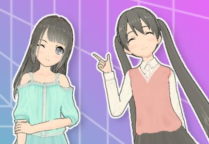
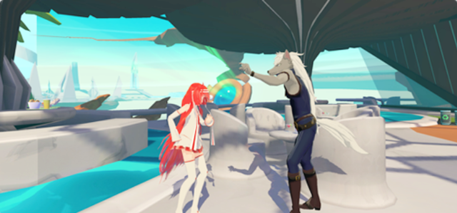
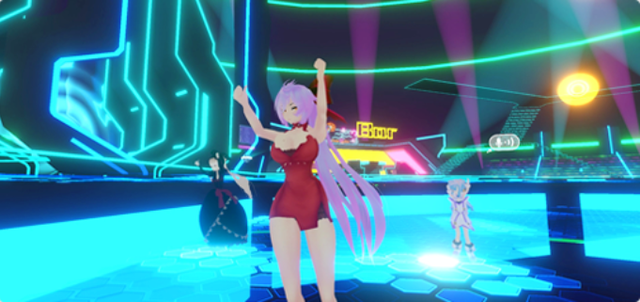
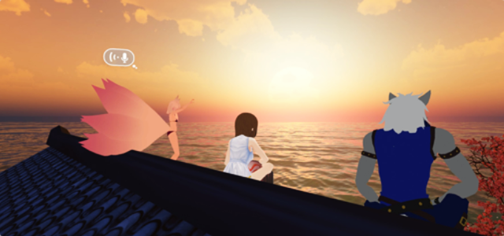
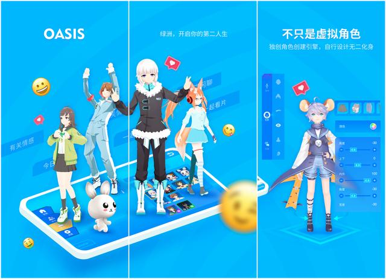

元宇宙到底是什么？从本质上说，元宇宙是一个由无数相互关联的虚拟社区组成的世界。随着元宇宙概念的持续火热，其引发的各类商业场景也应运而生，元宇宙概念正在从文学中的奇思妙想走向现实。

绿洲Oasis便是一个基于元宇宙概念推出的一个在线虚拟社交平台，支持PC和VR的跨平台多人操作。这是一个充满了无限可能性的“绿洲”，一片开放、自由的社交与游戏新大陆。没有固定的玩法，但有无限可能。

玩家可以组织聚会游戏，在酒吧里和朋友一起跳舞，蹦最野的迪；像巫师一样阅读和释放咒语；自带着队友来一场“追逐游戏“；在霍格沃茨和你的好哥们魔法决斗；在自营的牧场体验五谷丰登；去咖啡馆和朋友聊天，玩累了和猫玩……这些行为都可以在Oasis的世界中得以实现。

绿洲Oasis拥有高自由度玩法，即使没有编程背景，玩家也可以自由地创建自己的头像和地图，甚至设计自己的游戏世界。在最新版本的绿洲Oaisis中，你还可以创造属于自己的家园系统，发挥你的想象，无论是宇宙空间还是风情小岛；无论是海盗风格还是书生意气；只要你愿意创造，在绿洲oasis的家园体系中都可以实现。

【无限的虚拟形象】

在绿洲，你可以成为任何人，每个人可以在这里自由的设计虚拟形象的五官与外形。也可以使用任何虚拟形象，洛丽塔，机械战士，甚至是一只兔子。富有表现力的头像和全身追踪，头像通过直观的肢体语言增强您的社交互动。

【丰富的世界玩法】

绿洲有大量的FPS/模拟/益智游戏供你玩和认识新玩家，你可以和你的新朋友去跳舞或狼人杀，去露天电影院看场精彩的电影也是个不错的选择。立体地图多样，不仅现有的立体聊天地图非常多而且不断新增；支持PC和VR之间的跨平台游戏，与朋友一起畅玩虚拟世界，邀请好友一起探索虚拟世界的全部地图。

【聊天交友】

沉浸式虚拟世界使用全空间3D音频聊天，你可以更真实立体地和玩家进行实时互动，和他们聊天并且成为朋友。自由添加好友，每个人可以在这里向遇到的任何人发送好友申请，特别设置房主功能，邀请好友到你的聊天室畅聊，作为聊天室的房主可以对聊天室权限进行掌控。

（免责声明：本文转载自其它媒体，转载目的在于传递更多信息，并不代表本站赞同其观点和对其真实性负责。请读者仅做参考，并请自行承担全部责任。）