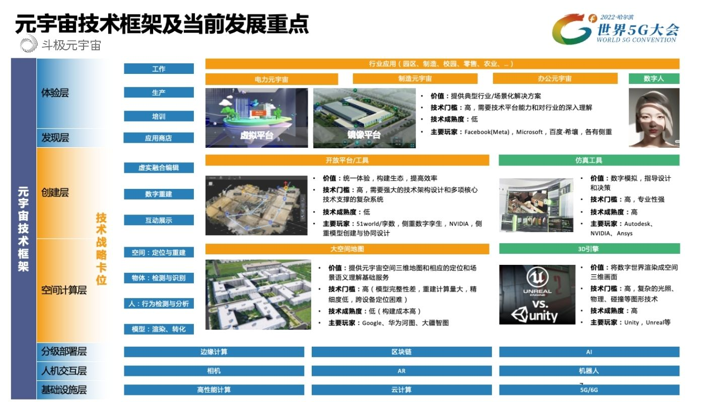
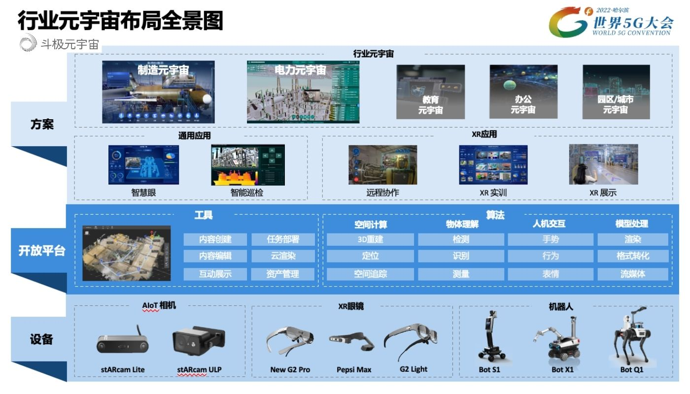

​        由国家发改委、科技部、工信部与黑龙江省人民政府共同主办的世界5G大会，于8月9日在哈尔滨正式召开。作为全球5G 领域的国际盛会，本次大会围绕“筑 5G 生态，促共创共利”大会主题，呈现了 5G 在千行百业和融合生态中的深度实践。

　　联想集团副总裁、联想研究院上海分院院长毛世杰出席本次大会，并发表《行业元宇宙架构与实践》主题演讲，展示出联想在元宇宙领域的技术布局的成功应用。

　　**聚焦元宇宙核心赛道，持续引领关键技术创新**

　　近年来，随着高速率、低时延、大连接的5G技术成为应用场景的网络基础，以及云计算、人工智能等元宇宙所需的底层技术快速成熟，加之政策红利的不断释放，元宇宙赛道正呈现蓬勃发展的态势。

　　毛世杰认为，在元宇宙大繁荣的助推下，作为支撑元宇宙关键技术之一的AR/VR已成为元宇宙发展的重要抓手。尤其是在企业的数字化转型中，AR/VR作为数字能力在实体经济中发挥着重要作用。“当前整个工业面临着产业升级的需求，在这一背景下更应通过AR技术和AI技术的结合，来提高工业的智能化，达到降本增效的目的。”毛世杰表示。

　　作为全球领先的ICT企业，早在2012年，联想就前瞻性洞察到，AR/VR将会成为下一代智能平台发展标的，开始积极探索AR/VR技术的落地应用。2017年，联想Mirage AR智能头盔套装正式问世，作为全球首款沉浸式AR游戏设备，这也标志着联想对于AR/VR的探索与实践取得了初步成功。随后，在2017年和2021年，联想又分别推出了晨星AR和Think Reality A3 AR智能眼镜，成为了AR应用的里程碑式产品。

联想布局元宇宙的技术框架及当前发展重点

　　在AR/VR技术逐渐积累与成熟后，联想以AR赋能制造业的元宇宙图景逐渐展现。毛世杰表示，AR/VR技术作为连接物理世界和虚拟世界的桥梁，通过数字孪生、虚实融合、虚实联动等方式，在物理世界中叠加虚拟世界的信息与感知能力，提升人/机器人的决策能力与协作效率，同时也能够在虚拟世界中进行仿真、推演，实现真实世界难以实现或成本很高的应用，“这不仅是企业数字化转型的高级需求，也为联想AR/VR赋能制造业奠定了基础”。

　　毛世杰介绍，联想身为制造业的行业龙头，目前在产业数字化转型加速的背景下，已经形成了一套完整的元宇宙解决方案：即通过全要素+开放平台，大大降低构建成本；通过虚实联动+智能化应用，大大提高应用价值。通过多个维度发力，不断丰富元宇宙的应用场景，为企业工业制造与产业智能化变革提供科技动能。

　　**赋能数字经济发展，元宇宙技术成为新引擎**

　　作为产业发展的未来形态，元宇宙能够充分打开产业数字化转型发展的新空间。毛世杰表示，目前联想围绕AR/VR这一元宇宙入口持续发力，通过智能化转型沉淀的技术实力与实践经验，打造了制造业元宇宙与电力元宇宙教育元宇宙等应用场景，为产业智能化转型升级提供强劲动能。

　　

联想行业元宇宙布局全景图

　　在制造业元宇宙，毛世杰表示认为，通过元宇宙的虚实联动，能够创造出一个虚拟工厂的模型，在设计、制造、运营、服务等方面，为制造业打造一个全价值链体系。

　　在具体实践中，联想与青岛特钢共同搭建的图像识别预警系统，能够准确进行上料台钢坯位置检测、钢坯编号识别、加热炉内钢坯位置检测等，有效解决了传统巡检中依靠工人对异常工况进行观察，漏检误检而且处置不及时的问题，使人均效率、协同效率与机组工作时间均得到有效提升。此外，图像识别预警系统还进一步降低了人员成本，使其成为国内人力成本较低的特钢高线产线。

　　同时，联想还与国际化工巨头巴斯夫进行了深度合作，借助联想架设的AR眼镜和控制器，能够远程操控联想所开发的晨星立式机器人，实现处理异物、物体进行分类以及执行智能巡检等功能，从而达到人机协同。

　　在电力领域，联想深入元宇宙的肌理，通过表真孪生和肌理孪生进行虚实联动。例如，联想与南方电网合作的基于AR技术的电网应急培训系统，可以在虚实结合的场景中，低成本、高效率、高安全地帮助学员进行针对电力应急要求的抢修、火灾、通讯等场景的培训。

　　联想与国电保定电力合作的智能机器人巡检项目，具备设备自主巡检、巡检信息总览、巡检点位信息配置、巡检线路及任务规划管理、巡检信息实时监控、巡检报告生成等功能，可以满足复杂应用场景中对多变环境和更丰富应用模块的需要，在提升生产效率的同时降低人工作业风险。

　　此外，联想元宇宙在变电站的巡检中，也发挥着重要作用。“我们发现，目前很多变电站的巡检还主要依靠人力，不仅效率缓慢，差错率还特别高，这也给我们的电力部门造成了不小的安全隐患。”毛世杰表示，联想与国电上海电力公司合作的变电站智慧巡检方案，通过AR的数字克隆虚实融合，实现了智能识别表计读数及过往历史数据实时查看，帮助巡检人员实时检测设备的运行状态，保障电力系统安全。此外，该方案还具备无纸巡检与专家智慧即时环绕等功能，进一步实现巡检的自动化和智能化。

　　在教育元宇宙领域，联想在降低构建成本与推进应用上进行深度发力，打造了联想5G超高清沉浸式未来教室。通过裸眼3D等虚拟现实与智能化功能，实现了教师在异地虚拟空间的映射，并以虚实融合互动增加教学趣味，提升了学生的学习质量，增加了知识的具象化，有效提升在元宇宙在教育中应用价值。近日，2022全球数字经济大会人工智能驱动未来产业论坛发布了“北京国家人工智能创新应用先导区示范案例”， 联想5G超高清沉浸式未来教室成功入选。

　　谈及联想在元宇宙的未来规划，毛世杰还介绍，联想将进一步夯实自身在AR/VR上的技术优势，用元宇宙赋能智慧城市、智慧园区以及智慧能源等，输出更多数字化转型成果，不断丰富元宇宙更多内涵，进一步夯实其在元宇宙赛道的竞争力。

　　毛世杰最后表示，为整合和协调全球元宇宙产业资源，共同发展元宇宙领域主流技术，联想还将与行业伙伴共同组建元宇宙产业与技术联盟，进一步促进元宇宙产业健康、可持续发展。这些新模式与新探索，将逐渐构建起联想元宇宙的完整生态，赋能更多行业与企业的智能化转型，让元宇宙更好地服务于产业、服务于社会，担当起数字经济发展中的中坚力量。

（免责声明：本文转载自其它媒体，转载目的在于传递更多信息，并不代表本站赞同其观点和对其真实性负责。请读者仅做参考，并请自行承担全部责任。）