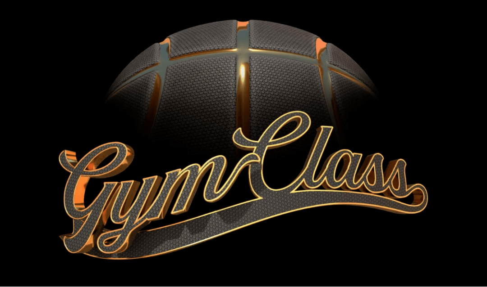

**1/**

**CAA任命Joanna Popper为首席元宇宙官**

CAA近日宣布，任命Joanna Popper为首席元宇宙官，负责帮助CAA及其客户制定针对VR、区块链和NFT的战略，寻找业务机会。

CAA一直密切关注包括元宇宙在内的，各种好莱坞可能涉及的新兴娱乐内容分发渠道。

CAA总裁Jim Burtson表示，元宇宙将对内容创作、分发和交互产生巨大影响，为CAA的客户带来重大机遇。而Joanna的知识、洞察力、资源和专业能力，在其中将发挥重要作用。

她还担任过奇点大学的媒介与营销执行副总裁和NBC环球的营销副总裁，工作范畴一直覆盖区块链、VR/AR、人工智能、机器人和数字生物以及娱乐内容。

CAA已经在元宇宙领域有不少布局，代理了包括Oxb1、Jenkins the Valet等在内的多位知名NFT艺术家，还投资了Dappler Labs、Opensea、Mojito等相关公司。

**2/**

**威尼斯电影节VR环节改名Venice Immersive**

威尼斯电影节宣布将在沉浸式内容单元展出43个XR项目，其中包括《浴血黑帮VR》、《Space Explorers》等热门作品。

本次威尼斯电影节沉浸式单元将展出多款VR电影、VR游戏等沉浸式题材，作品分别来自39个国家，开放展出时间为9月1日到10日。此外，Meta和HTC将为本次活动提供技术支持。

今年的活动将从原来的Venice VR Expanded改名为Venice Immersive，原因是除了VR外，还包括了混合现实、沉浸式装置、现场表演、虚拟世界、全景视频等更多形式。

过去两年威尼斯电影节一直在线上举行，今年将恢复线下。

**3/**

**美国冰球联盟准备拥抱元宇宙**

NHL（美国冰球联盟）正在做好准备，进一步拥抱元宇宙。据 ESPN 报道，NHL正在利用VR技术抓住年轻球迷。

联盟业务发展和创新执行副总裁Dave Lehanski表示，NHL想要做的是利用这些新技术，为用户提供前所未有的体验。

目前，联盟旗下的洛杉矶国王队，已经和一家以色列初创公司合作，用体感技术记录球员的镜头。此外，圣路易斯蓝调队推出了虚拟购物服务，球迷可以虚拟的球队更衣室环境下，浏览球队商品。

除了冰球，其它体育领域也显示出对虚拟世界的热情。洛杉矶公羊队在赢得今年的超级碗后，就开设了虚拟球迷屋。

而今年6月，洛杉矶湖人队的传球人物魔术师约翰逊宣布，他已经购买了数字体育联盟 SimWin Sports 的足球和篮球特许经营权。约翰逊在关于收购的新闻稿中说，这项「价值数十亿美元的业务即将起飞」。

**4/**

VR篮球游戏《Gym Class》开发商获800万美元融资

VR篮球应用《Gym Class》所在工作室宣布获得800万美元种子轮融资，由a16z领投，YC孵化器跟投。工作室表示，游戏将在秋季正式登陆Meta Quest应用商店。

《Gym Class》是一款受欢迎的VR篮球应用，此前已经登录App Lab等平台，通过在tiktok分享游戏画面爆火，获得了近100万次下载，App Lab评分4.9/5分，评论次数超1.4万。这个游戏可逼真模拟VR篮球运动，并将健身、社交、娱乐、游戏、虚拟化身等元素融合。

此外，游戏中的篮球场支持定制，为玩家带来多样化的玩法。

随着VR使用者越来越多，多人VR游戏/应用逐渐成为可能，一些原有的VR游戏也开始支持多人对战或社交模式，比如《Beat Saber》。

**5/**

**2022WISE元宇宙x游戏产业革新峰会**

为了更好帮助行业健康成长，并通过媒体研究视角为用户带来专业且全面的游戏、元宇宙及Web3.0前沿资讯，36氪于2022年8月2~3日在北京举办了「虚实共生，无尽未来」主题峰会，此次峰会邀请了多位投资人、学者和产业创变者共同探讨产业发展趋势。

与此同时，36氪联合元力星球推出了峰会纪念数字藏品，联合尚屹汇诚在现场推出了AR互动抽奖等玩法，让现场参会的观众近距离体验到了虚实共生带来的魅力。

在游戏、元宇宙和Web3.0前景可期的趋势下，36氪将通过最前沿的视野、最专业的的分析持续开展研究，为产业提供全面的支持。

**6/**

# **文化数字化转型孕育新业态**

据媒体近日报道，北京文化论坛发布《北京文化产业发展白皮书（2022）》，提出新业态引领构建数字化发展新格局发展趋势，强调北京游戏动漫、文旅文博等领域积极探索元宇宙应用场景，推动业态的虚拟化、沉浸式、数字化发展。

疫情之下，博物馆遭受巨大冲击。各大博物馆纷纷开展线上观展，走上“云端”、数字化转型也为博物馆提供了新的发展机遇。今年3月，来自全国50家博物馆、高校的60位馆长、学者联名发布《关于博物馆积极参与建构元宇宙的倡议》，呼吁博物馆与时俱进，积极与元宇宙相融合，“让自己和藏品在元宇宙里活起来”。

我国博物馆也从“倒逼上云”到主动拥抱新兴技术，从数据上网到积极主动参与构建元宇宙，推动文化产业新业态形成。中国国家博物馆首个虚拟数智人“艾雯雯”发挥了虚拟人物形象生动和共情的优势，成功“破圈”，吸引大量粉丝关注。

（免责声明：本文转载自其它媒体，转载目的在于传递更多信息，并不代表本站赞同其观点和对其真实性负责。请读者仅做参考，并请自行承担全部责任。）