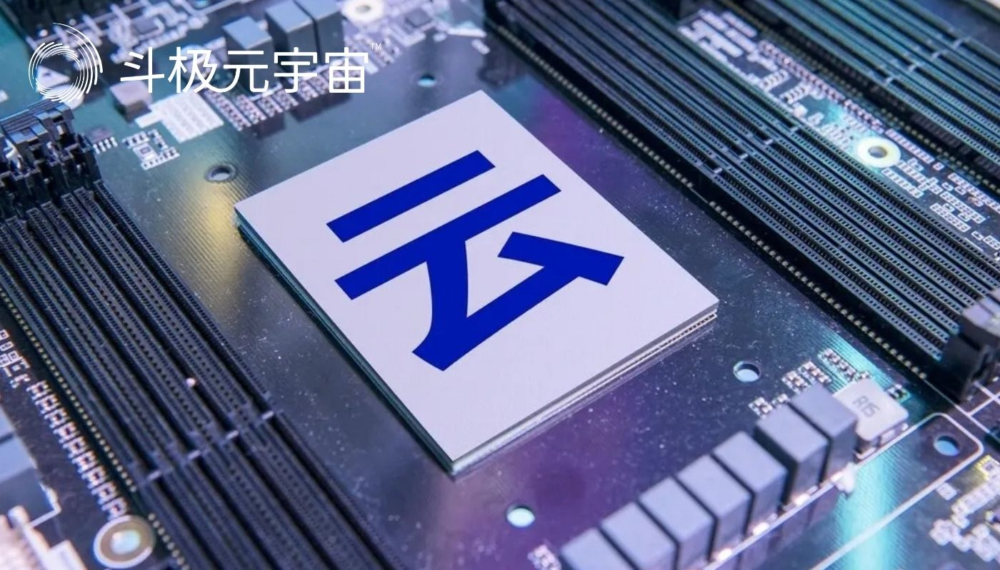

​        8月10日，“2022世界5G大会”正式开幕，中国铁塔元宇宙、5G海洋装备、华为鸿蒙小矿车、中国联通5G智慧港口等场景均在现场进行了展示，元宇宙、6G、工业互联网等成为热词。

　　“从此次大会来看，工业互联网的创新应用最为丰富，已逐步呈现规模化效应，元宇宙等成为5G技术应用创新的重要方向。作为基础移动通信，5G生态已经呈现蓬勃发展的态势，国产化、自主化的需求将进一步加大，这也给光通信等产业链企业带来更多新机会。”首都改革发展研究会理事肖旭对《证券日报》记者表示。

　　**工业互联网规模化效应显现**

　　5G正式商用已三年，如今在工业互联网等面向企业领域的应用取得了突破性进展。在此次大会上，5G前沿技术、典型应用悉数亮相。通信巨头华为、中国联通、中国铁塔等公司均展示了最先进的技术及应用场景。

　　从各大展区来看，华为展示了VR元宇宙、虚拟健身、智慧矿山等5G创新业务应用，其中一辆搭载无人驾驶的矿车引发关注。

　　中国信科展出SoC系列等高端芯片、智慧光网及特色5G应用，并在光通信领域展示了针对煤炭、电力、石化行业的典型应用场景；中国联通则设立5G智慧医疗、5G智慧工厂等展示内容；在“龙江数字经济展区”，数字制造、农业技术等领域的发展前景也得到体现；北大荒打造的5G数字农场，演示了人、机等一体化的智能感知体系。

　　中国联通终端与渠道支撑中心相关负责人告诉记者：“目前主力运营商已基本解决了5G建设选址难、进场难等问题。5G在工业互联网、智慧城市的众多领域已首先实现规模化发展，相关效应正在显现。”

　　在看懂研究院研究员、通信工程师袁博看来，目前5G在垂直行业依然处于商用的探索期，在工业领域的商用场景得到更多落地，5G在智慧矿山、智慧港口等场景已经逐渐形成规模化效应，在工业制造、机器视觉、仓储物流等场景也开始逐步走入正轨。

　　**6G离我们还有多远？**

　　被视为5G下一代的技术，6G此次也备受热议。

　　中国工程院院士、未来移动通信论坛理事长邬贺铨在此次大会的先导论坛上表示，目前6G处于早期愿景研究阶段，全球相关组织正在积极讨论6G相关愿景和需求，并进行关键技术的研究。6G将全面支撑全社会的数字化转型，实现智联万物和数字世界。

　　环球通信行业分析师马波对《证券日报》记者表示，5G商用以来，实质上已经进入了从“样板间”到“商品房”转变阶段，属于规模应用爆发的阶段，而6G等技术布局也在酝酿。目前，5G还没有出现“杀手级”应用，随着技术进一步发展，应用场景也将从to B领域加速向文旅、电竞等行业to C业务拓展，有望出现爆发性应用。

　　不过，袁博认为，5G目前的难点依然是成本和商用场景问题，短期内还不会很快向6G过渡，而是会更聚焦于向5.5G的演进，做厚行业的应用场景，让5G在B端得到大规模的商用。

　　中国工程院院士张平表示，6G对新一轮技术创新和产业变革至关重要。开展6G前瞻研究，对于发挥我国超大规模市场优势，抢占技术高地、构建产业生态、培训核心企业、取得战略主导权具有重要意义。他建议，企业应坚定不移走独立创新的路线，破解6G发展中的堵点。

　　**元宇宙将成创新发展重要方向**

　　值得注意的是，元宇宙成为众多专家关注的5G创新方向，运营商、手机等企业亦在联合布局。

　　中国工程院院士谭建荣在此次大会首设的元宇宙论坛上表示，元宇宙将开创互联网发展的新局面，推动网络进入第三代互联网，即从移动互联网到元宇宙互联网。不过，元宇宙从概念到落地，还需要加强人才培养等方面的全面协同。

　　而行业产业联盟也得到落地。在“2022世界5G大会”上，未来移动通信论坛、清华大学、HTC等联合发起成立元宇宙产业与技术联盟。该联盟将为建立元宇宙生态体系提供有力支撑，在虚拟现实、人机交互、数字孪生等领域形成发展合力。

　　在元宇宙相关展区，HTC展出了全球首个全息娱乐元宇宙平台；联想也展示阐述了图像识别预警系统、用AR眼镜和控制器操作的晨星立式机器人等。

　　联想集团副总裁毛世杰在论坛上表示，目前联想围绕AR/VR这一元宇宙入口持续发力，已经打造了制造业元宇宙与电力元宇宙、教育元宇宙等应用场景，以支持产业智能化转型升级。

　　不过，业内也对元宇宙提出了冷思考。工信部高质量发展高层次咨询专家项立刚接受《证券日报》记者采访时表示：“5G生态的扩容带动元宇宙、车联网等各类新兴应用场景蓬勃发展，但整体尚未在应用上形成成熟的商业模式，很多领域仍存不确定性，热效应不宜过度，资本也应更加理性。”

（免责声明：本文转载自其它媒体，转载目的在于传递更多信息，并不代表本站赞同其观点和对其真实性负责。请读者仅做参考，并请自行承担全部责任。）