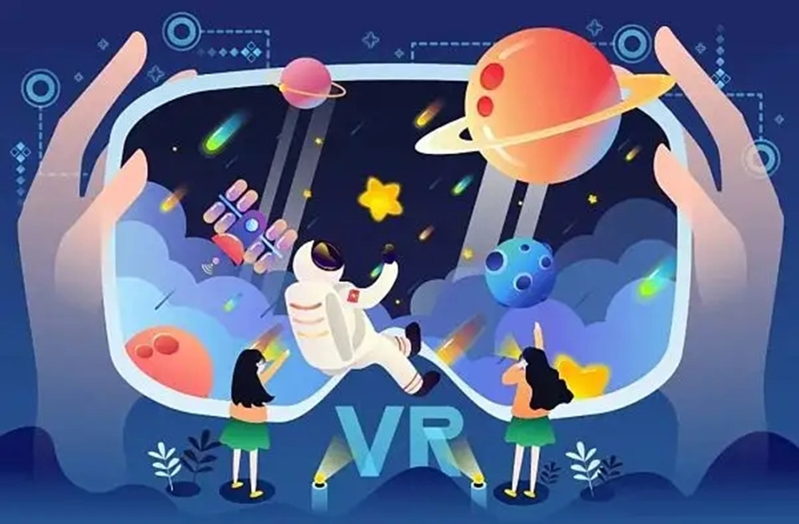

在太空中拾级而上，头顶是满天繁星，身下是一望无际的大海。这是存在于元宇宙中的一个世界。这里的世界是指，用户在虚拟空间里自由创建的多种多样的假想世界。

**虚拟空间逐步扩大**

去其他世界走走看吧。既有充满游乐园气氛的运动场，也有放学后被晚霞笼罩（时间仿佛停滞）的教室。在现实中无法看到或很难到访的美丽空间，可以通过被称为Avatar的自己的网络分身去自由漫步。

提供这样的“未来的散步”服务的是元宇宙平台Cluster，其运营商的首席执行官是加藤直人。该公司在日本抢先打造虚拟空间，于2020年5月受日本凯迪迪爱公司委托开设了“虚拟涩谷”，在虚拟空间中再现东京涩谷街景，累计吸引100多万人次体验。2022年2月，“虚拟大阪”正式启动。可以让人们享受街头漫步乐趣的虚拟空间逐步扩大。

加藤曾在京都大学学习宇宙论和量子物理学。为了研究量子计算机，他继续到研究生院深造。但是，他开始担忧，要建造自己梦想实现的、人与计算机直接连通的世界，在大学从事研究可能是绕远路。不到一年后，他选择退学。在自2012年起的3年时间里，他过着闭门不出的生活。

不过，加藤喜欢散步。每周有两三次，他会去附近的“哲学道”散步，然后陷入沉思。除此之外，他即使外出也只是去便利店购物，几乎不与人接触。他说：“（我）非常积极且快乐地宅在家里。多亏了互联网，当时的生活算是相当丰富的。”他可以利用社交网络和线上游戏平台获得信息和物资。尽管如此，还是有唯一无法消除的痛苦，那就是缺乏“身临其境”的感觉。无法与他人直接接触，这造成了压力。这与很多人在新冠疫情期间的感受是一致的。

**足不出户触达远方**

“在既有数字空间，缺乏伴随身体感觉而来的、人与人之间的亲近感。即使足不出户也能到处走，与人见面对话，要是这样的时代到来，那该多好啊。”正当加藤开始这样想的时候，他第一次有机会戴上虚拟现实眼镜。那是一个很大的冲击，给他带来前所未有的沉浸式体验。与自己房间完全不同的景色呈现在眼前。加藤说：“这是人类最终向未来迈进的第一步。”当时获得的灵感促使他自己打造虚拟空间。

“打造一个让足不出户的人可与他人互动的空间”，这方面的努力正在取得成果。20岁的森野孤独（音）是一位虚拟主播，他创造了一个精神分裂症患者也可以生活的世界。他说：“足不出户就可以与远方的人联系，这真是太好了。”他本人在16岁时患上这种疾病，无法上高中，甚至变得无法走出家门。

社交网络的内容以文字和图像为主，很难让人产生与他人真正见面的感觉。森野说，与此不同，元宇宙“让人产生自己眼前‘有人’并与之‘交谈’的真切感受”。对于害怕歧视的精神分裂症患者来说，“可以不公布姓名和长相，匿名参与”，这有助于产生安心感。

**网络分身变换形象**

元宇宙是可实现人们所描绘的理想生活的另一个世界。如果利用网络分身，则可以自由变换形象。人们可以访问自己喜欢的地方，不受现实环境的限制。如果只追求效率，则不移动是最有效率的。尽管如此，仍有许多人在元宇宙中行走，例如，在再现神社及周围街道的世界，来访游客人数达近8万人次。

在现实世界中，有“受需求驱使、费劲的行走”，也有“快乐的行走”。不过，加藤指出，在元宇宙中，可以通过“瞬移”省去“痛苦的行走”，只选择“快乐的行走”。加藤将“奢侈”定义为“刻意选择浪费”，对他而言，元宇宙是可以追求奢侈“行走”的地方。近日，网络分身所穿的耐克品牌虚拟运动鞋以超过1000万日元（约合50万元人民币）的高价成交。可以说，这也是奢侈“行走”的一种形式。

目前，要沉浸在元宇宙空间中，人们需佩戴眼镜和头戴式显示器等设备。不过，隐形眼镜型设备和将半导体芯片直接植入大脑的“侵入式”设备的研发工作将快速推进。如果这样的设备被研发出来，则即使是有视力或听力障碍的人，或者身体无法自由移动的人，也将能够完全重获五种感官并在虚拟空间中自由走动。加藤称：“就像眼镜弥补了视力缺陷、扩充了身体功能那样，元宇宙也扩展了人类世界。”

加藤说：“最接近元宇宙的是人脑。”人如果在大脑内发挥想象力，则可以成为任何东西，走到任何地方，遇见任何人。他预测，可以像在脑海中想象的那样在元宇宙中行动的时代终会到来。他说：“元宇宙给人的印象是年轻人游玩的地方，但它实际上很适合老年人。即使身体机能衰退的人也可以自由自在地在涩谷之类年轻人较多的地方漫步。”

现在，人们在元宇宙的世界里行走时，还不能感受到拂面而来的微风和嗅到花田里的清香。不过，在不久的将来，我们可能会在一个充满刺激的理想世界中漫步，不受地点和身体的限制。

（免责声明：本文转载自其它媒体，转载目的在于传递更多信息，并不代表本站赞同其观点和对其真实性负责。请读者仅做参考，并请自行承担全部责任。）