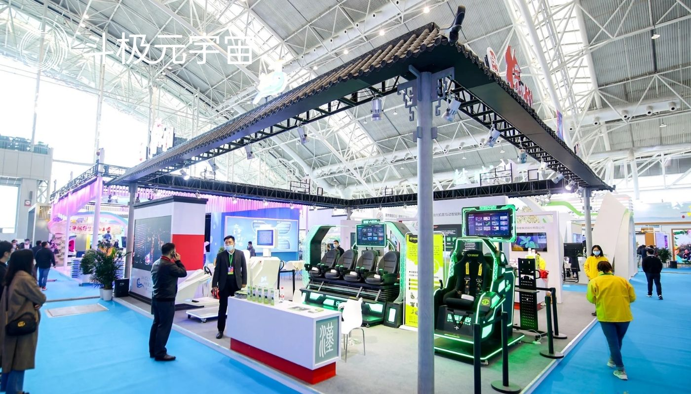

2021年被称为全球元宇宙元年。国内外元宇宙产业界都在积极推进元宇宙建设。以沉浸感、低延迟、随时随地性、丰富多样性、虚拟身份、虚拟朋友等为显著特征的元宇宙功能非常强大，应用领域十分广泛，其中包括文化领域。

文化进入元宇宙是一种必然的时代趋势。元宇宙赋能文化创新发展具有内在机理。我们需要认真思考元宇宙促进文化创新发展的机理与路径，积极行动起来，早日布局。

**元宇宙赋能文化创新的内在机理**

元宇宙是构建在大数据、区块链、云计算、人工智能等数字化技术逐渐成熟、融合推动基础之上的，是数字化发展到高级阶段的必然产物。真实的元宇宙场景的实现和元宇宙功能的成熟，业界认为只是一个时间问题。

被元宇宙赋能的文化势必获得前所未有的创新发展：一是文化的展示将不再依赖传统实物，而是完全能够高级虚拟；二是文化的展示空间将不再是传统的现实物理空间，而是高科技的高阶虚拟空间；三是文化的创造、展览、欣赏、交易、收藏等将不再离不开传统实物与空间，而是能完全数字化与深度虚拟。

地理阻隔、交通受限、语言相异往往限制文化发展。借助于元宇宙，未来文化事业、产业、行业不仅能摆脱地理偏远、交通不便、语言不通等障碍限制，而且还能让文化走得更远——迈向地球上的全部世界，甚至走到月球、火星。因此，元宇宙将带来一系列革命性变化，以及新的职业，比如元宇宙文化产品鉴别师。

元宇宙的突出特性是高度沉浸感，这有赖于深度使用虚拟现实（VR）、增强现实（AR）、扩展现实（XR）等计算机科学技术。在高度沉浸之中，逼真的元宇宙让人感觉置身于真实的现实，从而获得感官与心灵的完美体验。这对文化产品的消费者而言是非常奇妙的体验，进而形成积极的文化消费心理，愿意消费更多元宇宙文化产品。

元宇宙有突出的社交性，而且允许用户以化身的身份开展社交。

元宇宙给文化创新发展提供了自由空间。这给文化的创新发展带来各种可能，包括产出许多在现实世界因物质短缺等无法产出的文化产品，进而极大地丰富、拓展甚至更新人类的文化世界及精神世界。

元宇宙赋能文化创新发展的机理还有人的普遍接受性。2020年初至今的新冠肺炎疫情，迫使人们把生活与工作场景从线下更多地转移到线上。史无前例的大规模数字化迁徙，让大家对元宇宙有了更多关注、思考、讨论、接受。目前，人类已经大规模向赛博迁徙，成为现实世界生活与元宇宙生活的两栖动物。元宇宙将在未来10~15年落地成真。届时，元宇宙将开启人类两栖生活，人类正式步入元宇宙时代，进入“数字人类世界”。正因为如此，人们能接受元宇宙文化，包括在元宇宙中生产、展示、传播、交易、收藏、消费各种文化产品。

**元宇宙赋能文化创新的具体路径**

**积极筹建大型国家级元宇宙文化服务综合平台。**有了这样一个平台，就能够让很多文化组织机构、团体、个人进驻文化元宇宙，开展各种文化元宇宙活动。这方面，中国已经行动起来了。工信部工业文化发展中心正在筹建工业元宇宙服务平台，并拟于今年推出首批工业文化数字藏品。工业文化是人类文化的重要组成部分，创建这样的国家级工业文化元宇宙服务综合平台，对工业文化借助元宇宙创新传承大有好处。

**创建元宇宙图书馆、博物馆、档案馆、文化馆、美术馆、展览馆、会展中心等文化场馆。**有了元宇宙基础场馆，就能开展各种各样的元宇宙文化活动。比如，今年5月，广东省潮州市工业和信息化局与智度集团携手打造的潮州工艺美术元宇宙精品馆在“Meta彼岸”APP上线，成为国内首个元宇宙地方工艺美术馆。苗绣、杨柳青年画、金石篆刻、微缩榫卯营造赵州桥等非物质文化，通过元宇宙展示可以打破时空限制，进一步提高传统文化的传播度，降低欣赏门槛。

**进行数字文化藏品创造、展览、欣赏、交易。**数字藏品是指用区块链技术对特定文化艺术作品生成唯一数字凭证，在保护数字版权的基础上实现真实可信的数字化发行、购买、收藏和使用。数字藏品是元宇宙概念下的新玩法，实现了实物资产的数字化转型。所有数字藏品都配有作品来源、细节、作者、介绍等。消费者在平台约定时间内抢购成功后获得一个区块链序列号，即该藏品唯一证明。藏家能在平台内对所拥有的数字藏品搭建个人数字展区，也能将拥有的数字藏品售卖与赠予。

各类文化珍宝作为数字藏品颇受欢迎。目前国内几大互联网巨头、故宫等博物院与敦煌、中国航天等超级文化IP纷纷入局数字藏品。比如阿里旗下鲸探平台推出了“宝藏计划”“关山月的艺术创作”“大美河山”等数字文化藏品。元宇宙还赋能传统民族文化的传承、保护和发展。比如一款名为“夷宇宙”的数字藏品5月13日通过NFT中国成功发行，受到传统民族文化爱好者追捧。

**推出人民群众喜闻乐见的元宇宙庙会与灯会，打造元宇宙文化街区。**这方面，广东省广州市越秀区已经率先尝鲜。今年春节，广府庙会元宇宙选点在沉淀千年商都辉煌历史的北京路，以古道、骑楼、城隍庙等广府符号作为搭建元素，通过数字建模与虚幻引擎技术，结合传统新春氛围，为市民打造了线上虚拟的公共文化空间。今年1月23日，“中国·自贡中华彩灯大世界云观灯”全网直播，让广大观众在云上领略一场“自贡归来不看灯”的极致视听体验。

在打造元宇宙文化街区上，广州首开先河。6月12日开街的广州非遗街区（北京路）被誉为国内第一条元宇宙非遗街区。市民戴上虚拟现实眼镜便能畅游其中，欣赏广彩、广绣、榄雕、箫笛、通草画、岭南古琴、西关打铜等。

总之，面向未来的元宇宙会在很大程度上颠覆文化的传承、创新发展，以及生产与消费。“文化元宇宙”的理想运行状态包括大量化身用户持续在线、文化体验高度沉浸感、文化产品高仿真，以及文化内容生产的高效与丰富。通过元宇宙赋能，文化确实能在当下和未来获得更多、更好的创新发展。我国应该高度重视元宇宙数字空间创新，为数字文化发展创造机遇。

（免责声明：本文转载自其它媒体，转载目的在于传递更多信息，并不代表本站赞同其观点和对其真实性负责。请读者仅做参考，并请自行承担全部责任。）