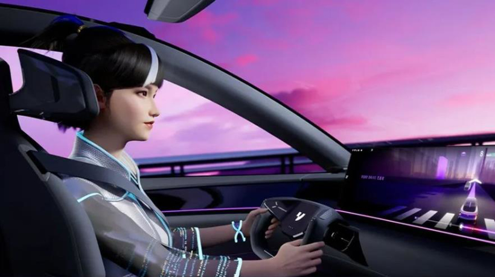
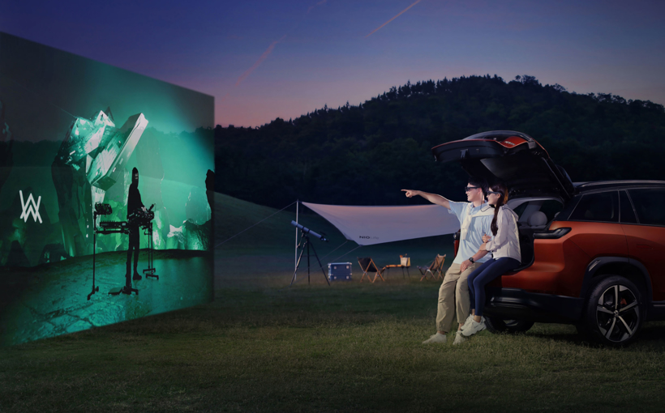
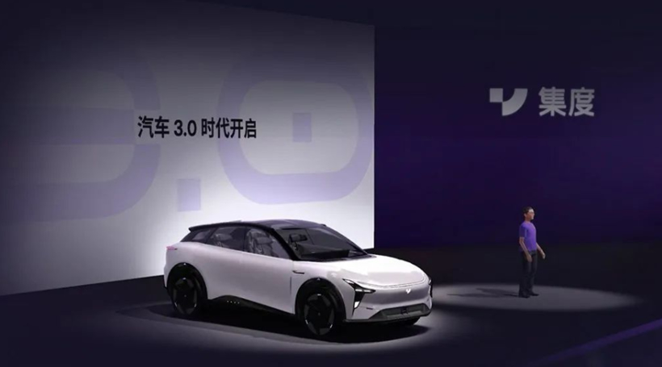
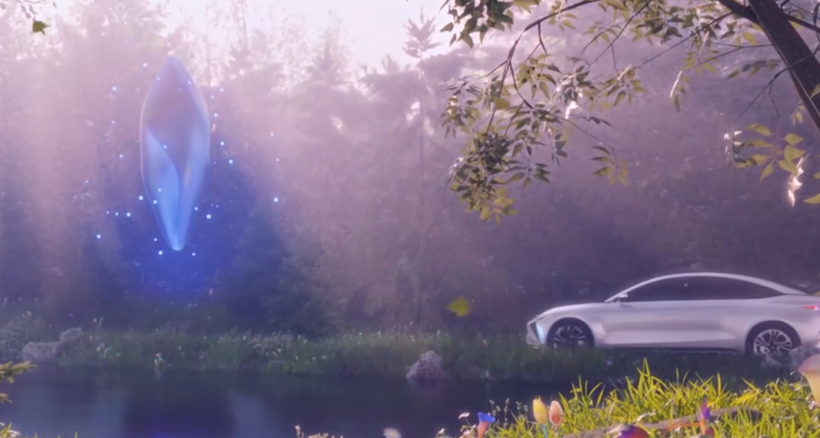
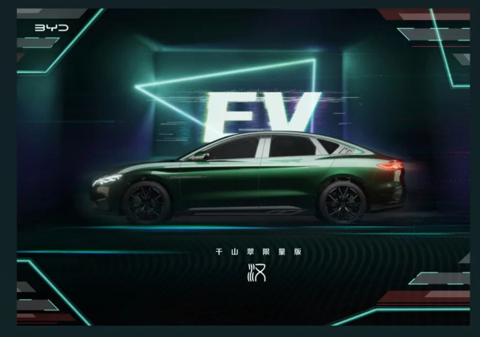

​        如果从1992年尼尔·斯蒂芬森的科幻小说《雪崩》首次提出“元宇宙”开始算起，这个概念迄今已经存在了近30年的时间。

　　但元宇宙真正开始爆火，是在2021年。

　　2021年3月，元宇宙第一股Roblox在美国纽交所上市，首日市值即突破400亿美元，由此引发社会各界对元宇宙的广泛关注。

　　紧随其后，全球最大的社交网络Facebook宣布更名为Meta，并表示以后一切的事务都是以元宇宙优先，将元宇宙的热度推向一个新的顶峰。

　　一时间各行各业都在争相和元宇宙接轨。尤其是知名的科技及互联网公司，例如微软、谷歌、英伟达、腾讯、阿里、百度、字节跳动等，纷纷宣布加大元宇宙布局，试图在这个全新的赛道继续他们的“造富神话”，汽车行业亦不例外。

　　放眼市场，如今越来越多的车企在进行新产品开发时，都会或多或少地借力元宇宙，应用相关的技术，甚至有些车企在产品的研发设计以及生产制造阶段，就开始与元宇宙进行技术接轨，试图通过元宇宙+汽车打开新的产业突破口。

　　万物皆可元宇宙，汽车也可以

　　2021年，元宇宙一夜爆红，引发了各行各业的广泛关注和加入。作为传统制造与尖端科技深度融合的产业，汽车产业也在积极拥抱“元宇宙”。

　　在“元宇宙”爆火之初，以上汽、一汽、吉利、蔚来、小鹏、理想等为代表的车企就争相抢注元宇宙商标，其实仅上汽就一口气申请了上百个“元宇宙”商标。

　　进入2022年，车企们对元宇宙的追逐，开始从简单的蹭概念热度转为实际行动。

　　近日，广汽传祺宣布与小冰公司达成合作，基于人工智能小冰框架和开放域对话引擎，共同研发可定制的、具有完备情感交互能力的“虚拟人”。在此之前，已经有不少车企借助虚拟技术把品牌或者用户形象拟人化，例如一汽-大众虚拟形象品牌官Ida、奇瑞OMODA的虚拟代言人元宇宙少女阿喜、东风标致为用户打造的虚拟数字人IP小狮妹Léa等。其中奇瑞还推出了OMODA元宇宙社区，开启用户共创新玩法。

　　要知道元宇宙世界的打造，第一步就是要具备虚拟身份。Roblox曾在招股书中提到，元宇宙有八个关键特征：身份、朋友、 沉浸感、低延迟、多元化、随地、经济、文明，其中身份是排在第一位的。在大众问问CEO张人杰看来，未来类似随驾伴侣型的设备，一定会成为汽车的标准配置。

　　VR/AR设备作为公认进入元宇宙空间的主要终端，也逐渐被当做提升座舱沉浸式体验的重要手段。比如AR-HUD，正逐步替代中控及仪表，在多家车企的智能座舱中批量落地，赋予驾驶员沉浸式的交互体验。在一些更前沿的解决方案里，开发人员们还设想是否可以通过AR车窗进一步提升座舱的沉浸感。

　　还有游戏，某种程度上被认为是元宇宙的雏形，亦在快速“上车”。加之汽车对3D化数字内容的需求持续提升，紧跟这股趋势，诸如Epic Games、Unity、Cocos等知名游戏引擎近两年纷纷朝着汽车领域跨界。

　　集度甚至在百度希壤元宇宙世界里举办了一场声势浩大的发布会，用于发布其首款汽车机器人概念车[ROBO-01](https://db.auto.sina.com.cn/4845/?c=spr_auto_trackid_1e17744b130ea936)，一同亮相的还有集度汽车CEO夏一平的数字人形象以及ROBO-01首位人工智能车主希加加，其同时也是百度AI数字人。

　　针对汽车行业争相拥抱元宇宙的行为，集度汽车CEO夏一平日前在与盖世汽车CEO周晓莺探讨汽车&元宇宙的现状与趋势时表示，很重要的一点在于，在当前以AI算力为驱动的时代里，汽车与元宇宙背后的技术之间会有很多的结合点，这将带动一些与元宇宙体验相关的产品逐渐进入到汽车里。

　　“比如元宇宙的发展，一个关键支撑是算力，因为要实现对3D虚拟场景的大规模渲染，而当前智能汽车的发展，本身也需要算力的不断提升。”此外还有更强大的AI算法、更智能的人机交互、更沉浸的用车体验，都与元宇宙天然适配。

　　目前普遍认为，所谓元宇宙即是一个平行于现实世界的3D化高沉浸感的虚拟世界，在这个虚拟世界里，人们既可以做自己在现实世界里能做的事情，比如社交、游戏、工作等，也可以做很多在现实世界里无法做的事情，类似玩游戏。所以现在也有观点认为，游戏是元宇宙的雏形。

　　但与游戏不同的是，真正的元宇宙世界除了能给人感官及情绪上的愉悦体验，更重要的是可以通过超越现实的手段，对现实世界产生正反馈。就如科幻电影《头号玩家》里所说的，大家来到“绿洲”（电影里十分接近元宇宙形态虚拟世界）是因为可以做各种事，但他们沉沦于此是为了不一样的人生。当然，这并不是指游戏致富。

　　简言之，作为物理世界与数字世界深度融合的产物，元宇宙既脱胎于现实，又超越现实。其中，沉浸感、经济系统、社交、内容创造和经济系统等都成了元宇宙的关键属性，这些特性使得元宇宙与汽车领域的很多业态都可以完美结合。

　　甚至在夏一平看来，未来不排除汽车就是一个元宇宙入口。“想象一下，未来你进入汽车，车门一关里面就完全是一个虚拟的空间。”这在目前已经有初步的雏形。刚刚于6月份上市的[蔚来ES7](https://db.auto.sina.com.cn/4818/?c=spr_auto_trackid_1e17744b130ea936)[(配置](https://db.auto.sina.com.cn/4818/peizhi/?c=spr_auto_trackid_1e17744b130ea936)[|询价)](javascript: void(0))，其搭载的全景数字座舱 PanoCinema就支持通过AR眼镜为用户投射出视距 6 米、等效 201 英寸的超大屏幕，赋予用户沉浸体验感。

　　“智能座舱本身就是一个封闭的空间，在里面我们需要一定的轻社交，不会影响驾驶，并且我们对这辆车是有感情的，在这样一个有意思的空间里，通过里面的一些配置，以及未来可以去加持的一些配置，很容易实现沉浸式体验，而这种环境恰恰是汽车元宇宙应用特别需要的，所以智能座舱本身也是元宇宙的一个天然入口。”张人杰也表示。

　　不过对于怎么进入这样的汽车元宇宙，目前还未有定论。电影《黑客帝国》中，主人公尼奥以及崔妮蒂等是通过脑机接口进入类似于元宇宙的虚拟世界。但在更多的场景中，则是借助AR眼镜，《头号玩家》里人们要想进入“绿洲”世界，在其中自由探索、娱乐和生活，就主要是借助VR 设备。

　　但在车内，这样的方式显然不现实，至少在现阶段整车自动驾驶水平还不是很高的情况下，与汽车所要求的高驾乘安全是相违背的，而且体验估计也难言美好。

　　元宇宙改变的，不仅仅是车本身

　　对于元宇宙的概念，虽然目前尚未形成统一，但对于开启元宇宙世界大门所需要的底层技术，业界基本形成了共识，包括虚拟现实、增强现实、数字孪生、人工智能、区块链等。这些技术除了可以赋能汽车智能化升级，很多在车企数字化转型过程中，也是关键的技术支撑。

　　例如集度在元宇宙里举办的ROBO-01发布会，虽然过后有观众形容这场发布会甚至连“五毛钱”的特效都不如，但不可否认，集度在元宇宙里举办新车发布会的确是汽车行业一次大胆的突破，对于启发汽车行业探索新的工作方式、业务模式，提升工作效率，具有重要启发意义。

　　“从我们早期围绕元宇宙展开的实践经验来看，无论是在元宇宙空间里去做一些品牌的发布，还是用户运营，抑或工厂的虚拟化、数字化改造，所带来的效率都远远高于过去传统的线下模式。”夏一平表示。

　　一汽-大众、一汽奔腾等也在做类似的尝试，实现不仅在虚拟空间里举办新车发布会，还可以3D全方位看车、虚拟试乘试驾。宝马则在探索让员工在元宇宙空间里跨地域、跨时区协作办公，并为此推出了iFACTORY战略，使宝马集团世界各地的员工可以在“元宇宙工厂”里协同办公。

　　不过值得注意的是，这里所说的在元宇宙里协作办公与使用腾讯会议、Zoom等有着本质的不同，元宇宙办公更讲究沉浸式体验，以及个体的社交需求，让用户真正有参与感。而且这种沉浸感不仅仅来自于视觉，还将包括触觉，甚至有可能是嗅觉。例如《头号玩家》里的男主角帕西瓦尔在“绿洲”里与人打斗时，所受到的冲击均通过触感设备传递给了现实世界里的他，可谓真正实现了虚拟世界与现实世界的感官融合。

　　甚至还有车企在通过元宇宙发掘新兴的商业模式。近日，智己汽车宣布全面开放“原石谷”，并于8月7日正式上线“里程式开采”。所谓“原石谷”即智己汽车此前提出的“用户数据权益计划”，用数据权益的方式回馈用户数据的贡献。

　　这里的“原石”类似于一般意义上的积分，用户获取“原石”的方式有两种，一种是“里程式开采”，即以用户车辆的有效行驶里程数据作为原石“开采”的最重要输入，按照一定的规则赋予用户原石奖励；一种是“养成式开采”，主要是通过参与App上的互动任务、官方组织的共创活动或开通使用特定功能来获取。

　　根据智己此前公布的信息，新用户使用最多6800枚原石+10000元现金，即可兑换IM AD激光雷达融合智驾系统，包括高精度激光雷达，高算力Orin X芯片等全套硬件。未来，智己还计划支持原石兑换软硬件升级、智享服务、限定精品、数字藏品及限定体验活动等。

　　这意味着，智己即将正式完成“原石谷用户数据权益平台”的全路径贯通，通过用户数据创造的价值和区块链技术独特的公平性和安全性，真正实现用户数据确权和权益变现，而这恰恰是元宇宙的重要表征之一。

　　类似做法还有发布NFT数字藏品，例如比亚迪推出的NFT数字画作，吉利发放的“中国星数字人民币消费券”，以及雪佛兰的NFT跑车拍卖计划，不过后者最后流拍。

　　整体来看，目前大家对于元宇宙的探索，还是偏向局部应用，现在谈汽车元宇宙，更多是在谈车内的社交、游戏等单一技术领域与元宇宙的共轨，距离汽车真正成为通往元宇宙世界的重要入口还有很长一段路要走。即便放眼全球，科技巨头们推出的元宇宙应用，也均只能覆盖到一小部分用户。“要想大规模去做这个事情，可能还需要一段时间。”夏一平表示。

　　这背后，技术的限制是很重要的一方面，包括算力的挑战、带宽的挑战。尤其是如何在元宇宙世界中实现一比一的仿真，据NVIDIA中国区高级技术市场经理施澄秋此前表示，需要的算力根本没有办法用一个数字来形容。此外还有人工智能、显示技术、区块链技术等，都是支持元宇宙发展的关键技术集群。

　　但这却可能是车企们不得不走的一条路。如夏一平所言，做一个企业或者品牌很多时候不能只看眼前，而是需要用发展的眼光去看5年甚至10年后，真正接受或者拥抱这些新事物的用户，他们是怎样的人群。

　　目前来看，伴随着Web2.0一同成长的年轻一代，对于元宇宙这类新事物有较高的接受度。尤其是2010年出生之后的新一代，被认为与生俱来就与尖端科技互动，将是“元宇宙”完全意义的“原住民”。甚至有预测认为，未来超过90%以上的日常活动，如科研、教育、娱乐、研发、会议等，都可以发生在元宇宙场景中。

　　至于这样的景象什么时候才能在汽车里面变成现实，用张人杰的话来讲，当汽车完成了从“它-她/他-我”的转变，即真正成为人们在元宇宙世界里的化身，或许才是汽车元宇宙入口的真正形成。

　　而目前大家的触及的，不过是元宇宙的冰山一角。

（免责声明：本文转载自其它媒体，转载目的在于传递更多信息，并不代表本站赞同其观点和对其真实性负责。请读者仅做参考，并请自行承担全部责任。）