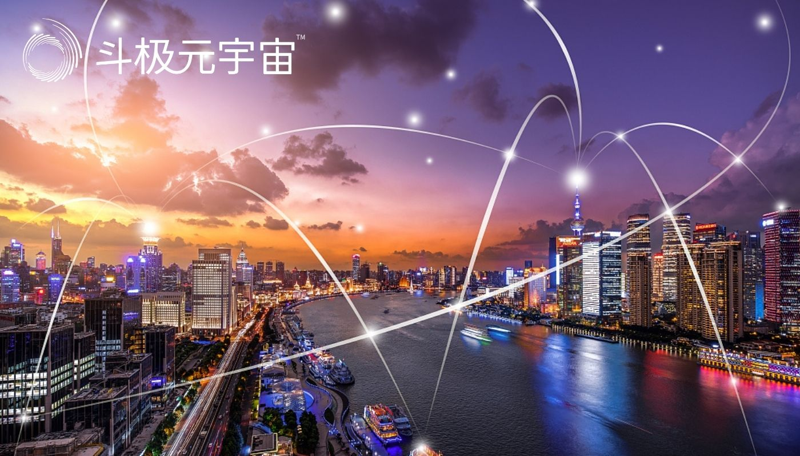

元宇宙（Metaverse）一词，诞生于1992年的科幻小说《雪崩》，小说描绘了一个庞大的虚拟现实世界，在这里，人们用数字化身来控制，并相互竞争以提高自己的地位。

随着5G、大数据、AI等技术的发展，虚拟与现实结合似乎成为一种势不可挡的趋势，而被认为是下一代互联网的新形态元宇宙也被推倒了风口上。

##### **各行各业，争相入场**

今年年初以来，元宇宙的概念随着游戏公司Roblox的上市而爆炸，上市首日，该股上涨54．4％，收于69．50美元，公司估值超过450亿美元。

当Facebook宣布将在5年内将公司转型为元宇宙公司，预计他将向元宇宙投资至少10亿美元，再次将“元宇宙”这个大浪推向高潮。

国内各大公司开始宣布进入元宇宙板块，字节跳动以15亿美元收购VR软硬件公司Pixsoul，启动元宇宙布局。腾讯还将进入元宇宙全真互联网；HTC推出虚拟偶像Vee融入现实生活等。

各路资金也奔涌进入元宇宙板块。在二级市场，元宇宙的概念彻底爆发。

##### **元宇宙赛道，运营商们的主场？**

11月11日，中国移动通信联合会“元宇宙产业委员会”举办揭牌仪式，宣告国内首家元宇宙行业协会正式成立，成员包括中国移动、中国联通、中国电信等。

次日，中国电信方面宣布，以元宇宙新型基础设施建设者为定位，立足创新应用成果，启动2022年“盘古计划”，全面卡位元宇宙赛道，加速5G创新应用融合发展。

再早些，中国移动咪咕公司总经理刘昕发表的演讲就以“搭乘5G信息高铁加速通往元宇宙”为题，分享了专门针对元宇宙的“MIGU演进路线图”。三大巨头齐聚！不禁发问：谁的主场？

##### **四大山头四大名派**

事实上，在Facebook、字节跳动之外，类似中国移动咪咕这样的元宇宙“新”参赛者，早已以不同的目的，相同的动作踏上赛程。

这群人被以“增量派”、“防御派”、“延展派”、及“机遇派”四大帮派划分开。

以Facebook、字节跳动为代表的被誉之为增量派，顾名思义，他们的出现是要给带给现实世界所没有的一些东西的。

如Facebook，它所要突破的是当下过于单一、核心用户老龄化、政策监管持续加码等瓶颈所面临问题的商业模式。

字节跳动在近年来，用户增量也触摸天花板。

它们都拖着老躯体带着不死之魂寻找着下一个宿主。而元宇宙具有“身份、朋友、沉浸感、低延迟、多元化、随地、经济系统、文明”八大基本特征，它们都具备更好的用户和产品基础。

以腾讯、阿里为代表的企业，则被称之为防御派。曾经在互联网时代里的天之骄子，先后冠上了“元宇宙”之大名。阿里心态更见急迫，一夜之间注册下“阿里元宇宙”、“淘宝元宇宙”、“钉钉元宇宙”在内的多个商标，并在云栖大会开展了以“元宇宙”为主题的演讲压轴全场。

在新生事物面前，他们不得不“怀疑人生”。防御性进取动作是它们此时的自我保护的措施。

投机派当然是指那些炒概念的企业在此不多加赘言。

##### **谋产品、推项目、聚生态**

不管从哪路来的，资质、禀赋如何，它们落地所要做的不外乎谋产品、推项目、聚生态。

元宇宙一度被认为是XR产业的第二春，而XR确实因为成为元宇宙的关键入口而获得新的机会——不管谁来做元宇宙，XR产品的“基石”布局都成为必须的动作。

如Ray－BanStories眼镜以及各种版本的Oculus虚拟现实头盔；

如字节跳动也在今年8月以90亿元人民币收购VR厂商Pico；

如Facebook已经推出了Portal视频通话设备系列。

“推项目”则在游戏及体育赛道上被发挥得淋漓尽致。

中国移动咪咕投入大量资源打造的5G＋云游戏，要“推进云网融合、视频互动、跨享终端云原生游戏”，与亚洲电子体育联合会（AESF）达成独家战略合作，发起“亚洲数智竞技创新中心”，依托云原生游戏技术推出数智竞技大厅，布局多个竞技游戏赛道，试图聚拢庞大的用户人群，构建起所谓“数智竞技元宇宙”。

此外，咪咕方面宣称将与亚足联携手，综合运用5G＋4K／8K＋XR＋AI等技术，为2023年亚足联亚洲杯打造具有即时互动、沉浸体验等能力的所谓“5G云赛场”。

元宇宙需要的是多方面的能力，从硬件到软件到产品，一家企业即便是巨头也不太可能自己全部做下来。

虽然，元宇宙的相关标准还没定下来，但它是推动人们在虚拟界以更多的方式互联这一本质将致使他们永远不会是“独一家之言”。

聚生态则是“大鱼吃小鱼，小鱼吃虾米的”游戏规则。只有一个闭环的生态场景才能之城起元宇宙精彩绝伦的人类未来生活：

中国移动咪咕发布的AR新品来自其生态伙伴Nreal，一些互联网巨头也时刻在等待着并购的机会。

“好风凭借力，送我上青云”！没有信号给你们，再多的头盔也成废铁。说到底，运营商才是最后的老大哥。这个老大哥当然也不是盖的，它有相当高的技术要求。

11月2日的2021中国移动全球合作伙伴大会主论坛上，董事长杨杰重点介绍了中国移动对算力网络的部署：要构建泛在融合的算力网络，打造一点接入、即取即用的“算力服务”，达成“网络无所不达、算力无所不在、智能无所不及”的愿景。

这种联接多地计算中心的统一协同计算网络其背后所带来的强大算力和协同规划，本身就是元宇宙对未来底层计算的客观要求。

背靠运营商的咪咕把自己天然的以连接为中心的优势做法转变为以算力为中心，以网为根基，构建元宇宙的“MIGU演进路线图”，推动数字经济发展同时实现元宇宙应用和体验。

##### **化有边为无边，化有限为无限**

中国移动一直以来构建的以5G、算力网络、智慧中台建设为重点的“连接＋算力＋能力”新基建，其形成了云（全架构游戏云化等）、网（5G动态切片、QoS网络保障等）、边（GECCNode、智能边缘调度等）、端（手机、TV端、头显、车载等）各层次能力布局，客观上形成了针对元宇宙的技术储备。

它们的出现，以庞大的体量占尽先机，力挽狂澜地完成一个时代向另一个时代的过渡。

“元宇宙是未来20年的下一代互联网，是未来人类的数字生活虚拟空间，是未来数字资产的重要生产地。”中国电信旗下上市公司，新国脉董事长李安民这样描绘了以元宇宙新型基础设施建设者为定位的战略布局。

李安民认为，新国脉未来将分为两阶段实现发展目标，近若干年，在以现实世界为基础，一系列大大小小的虚拟世界相结合的过程中，提供平台和云网基础能力，服务好各类虚拟世界业态；在多年发展后的第二阶段，将会逐步形成超级虚拟世界，新国脉力争成为提供虚拟世界底座的“国家队、主力军”。

“元宇宙不是下一个‘移动互联网’，运营商搭建的‘连接＋算力＋能力’网络才是”。有业内人如此指出。

中国联通董事长刘烈宏也曾指出，推动VR产业加速前行，要打牢数字底座，为VR产业铺就“虚实相通”新高速；突破人机交互、万物智联的诸多瓶颈，提升“虚实相融”新效能。

虽然，三大运营商结合原有VR能力并在内容上迅速落地令人震撼，但是，元宇宙的概念业界没有统一的维度，宽泛的讲元宇宙只是虚拟和现实的一个载体，元宇宙其实是一个非常窄的场景，场景的实现无疑是入局者最需要考量的一部分。

早在2018、2019年，多家公司就展示了VR、AR在5G游戏中的应用，以及虚拟教师在5G远程教育课堂的应用，在这些应用场景里，智能机器人不仅能看、能动，还会思考。大量的应用都已经在其他领域中出现，笔者认为，真正的元宇宙它是跨场景化的，化“有边”为“无边”。

无论元宇宙未来走向何方，电信运营商搭建的“连接＋算力＋能力”网络，都将在未来的数字经济中发挥积极的作用，进而推动整个社会的进步。

（免责声明：本文转载自其它媒体，转载目的在于传递更多信息，并不代表本站赞同其观点和对其真实性负责。请读者仅做参考，并请自行承担全部责任。）