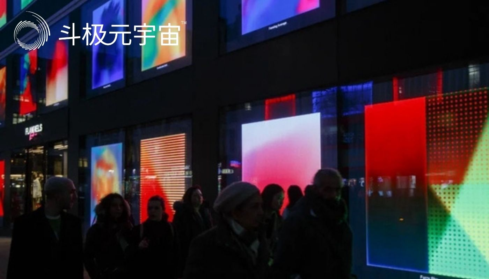

​        随着监管的加强、二级市场的降温，元宇宙正从喧嚣走向现实。但有一点毋庸置疑，虚实融合的互联网时代终会到来。

　　“元宇宙”当属眼下科技界和产业界最热的话题之一。

　　2021年被称为“元宇宙元年”。元宇宙、虚拟人、Web3.0、NFT、数字经济等概念开始频繁出现在人们的视野里，并不断渗透到各行各业：你可以在游戏中畅游平行世界，听一场虚拟人演唱会，参加NFT数字藏品的拍卖活动，戴上VR眼镜3D体感试衣，甚至在元宇宙平台购买虚拟地皮。

　　元宇宙自诞生以来，一直被看作是构建未来数字世界的重要方式。中国国内如腾讯、阿里巴巴、字节跳动等互联网巨头纷纷进场，开始打造自己的元宇宙生态。阿里巴巴和腾讯均成立了XR（扩展现实）部门；百度推出了首个国产元宇宙App“希壤”；字节跳动斥资数十亿元收购VR设备研发商Pico。

　　北京、上海、广州、合肥、武汉等多地已将元宇宙纳入到未来城市的发展规划，以期抢占互联网下一个“风口”。部分省市还设立元宇宙产业基金，给予元宇宙企业房租财政补贴。

　　元宇宙之风还吹到了资本市场。元宇宙不仅成为一级市场投资人眼里的“香饽饽”，从去年9月开始，元宇宙题材在A股崛起，只要公司宣布跟“元宇宙”概念沾边，股价便扶摇直上。但这一热度并未持续多久，今年上半年，万得（Wind）元宇宙指数回撤近30%。

　　市场上对于元宇宙的质疑和争议一直存在。元宇宙发展仍处于早期阶段，商业化落地、监管政策等还面临诸多挑战和不确定性。

　　部分市面上出现的所谓元宇宙产品，只是给自己披上了元宇宙的外衣。如果市场继续爆炒元宇宙概念，无疑将会催生巨大的风险和泡沫。银保监会近期发文指出，民众需防范以“元宇宙”名义进行的非法集资。

　　不过从长期趋势来看，元宇宙、虚拟现实、数字经济等，已经被定义为Web3.0第三代互联网技术，成为资本的必争之地。

　　中文在线投资公司总经理王昱对《财经》记者表示，任何新产业，在概念期，大多数人认同并涌入，就会产生泡沫，“就如啤酒一样，适量的泡沫是美妙而且必须的。当然，不能光有泡沫，没有好酒。企业现在专注做的工作就是酿好‘元宇宙’的美酒，让新业态健康成长”。

　　那么，元宇宙是否只是AR/VR设备的又一次短期爆发？如何看待元宇宙对未来经济、社会的深远影响？元宇宙当下有哪些布局机会？元宇宙带来的新机遇，是科技巨头逐鹿的战场，还是初创公司崛起的机遇？

　　元宇宙缘起

　　元宇宙译自“Metaverse”（Meta表示超越，Verse代表宇宙），首次出现在1992年美国科幻作家尼尔·斯蒂芬森的科幻小说《雪崩》中。在这部小说里，人们可以通过AR和VR终端设备连接网络，进入一个与现实世界平行的虚拟世界。

　　30年后的今天，这个原本只出现在科技圈的概念，因2021年Roblox（RBLX.N）的上市和脸书（Facebook）的更名火爆全网。

　　2021年3月，一家名叫Roblox的美国网络游戏和社交平台公司在纽交所上市，并在招股书中把自己的业务类别称为“元宇宙”，这是“元宇宙”第一次出现在资本的公共视野。上市当日，Roblox股价上涨55%，从45美元/股涨到了70美元/股。八个月后，股价直接翻倍，市值突破500亿美元。

　　元宇宙的概念也让陷于传统社交概念发展困境的美国互联网巨头Facebook的创始人马克·扎克伯格看到了希望。2021年10月，扎克伯格宣布公司更名为Meta，以展示其向元宇宙进发的决心。此后元宇宙概念以迅雷不及掩耳之势席卷全球，成为科技和资本领域的热门话题。

　　究竟何为元宇宙？虽然其融合了区块链（blockchain）、VR/AR、人工智能、大数据、云计算等前沿技术，并把这些时髦词汇混杂在“元宇宙”的大筐里向大众传播，但当前学界业界对元宇宙尚无统一定论。

　　2018年的科幻电影《头号玩家》被大众认为是对元宇宙最为形象化的解释。借助VR眼镜，人们可以进入到一个名为“绿洲”的虚拟世界。这个虚拟世界里有繁华的都市，有独立的经济系统，一切与现实无异。

　　在杭州优链时代科技有限公司创始人、首席执行官（CEO）蒋亚洪博士看来，元宇宙是一种场景而不是技术，必须具备三个核心要素：一是要构建3D的虚拟数字世界；二是要有沉浸式的体验，无论是借助头戴的设备还是眼镜等；三是与现实世界互联互通，“假如你戴着VR眼镜，向数字人销售员买个产品，线下是可以寄过来的”。

　　不过，30年前已经有的元宇宙概念，为什么在2021年形成爆发？“其实类似的场景早就有了，只是不叫‘元宇宙’这个名字，可能叫‘虚拟现实’‘数字孪生’‘全真互联网’等，直到Facebook更名后，中国人翻译为‘元宇宙’，发现这个概念可以囊括之前的各种叫法。”蒋亚洪这样说。

　　很多人一提到元宇宙，首先想到的就是游戏、VR硬件设备等等，这是在把元宇宙简单等同于“3D互联网”“游戏互联网”。

　　但在中国移动通信联合会元宇宙产业委员会执行主任、火大教育校长于佳宁博士看来，元宇宙始于游戏，但不止于游戏，“随着技术的成熟，元宇宙在数字世界和现实世界相结合的领域，在很多场景都实现了落地应用”。

　　他举例，工业领域，宝马公司的高度自动化工厂使用芯片巨头英伟达开发的模拟协作技术平台，在数字世界中搭建了真实工厂的数字孪生场景，全球的工程师、设计师都可以直接在数字孪生工厂中进行协作；商业领域，超写实数字人AYAYI成为天猫超级品牌日的首位数字主理人；Snapchat推出了服装和潮鞋的AR试穿功能，用户可以通过滤镜以虚拟方式试穿商品，并直接看到上身效果；在医疗领域，应用骨科手术机器人导航手术系统后，机器人可将X线导航图像输入电脑，医生在电脑上借助手术人机交互软件进行路径规划。

　　风语筑副总经理张树玉看好数字虚拟人以及NFT数字藏品市场：“数字虚拟人有足够的粉丝基础后，可以如真人偶像一般参与产品代言、商业演出等。数字藏品是源于国外的NFT，去年发展到国内后迅速落地，带火了博物馆、文博、艺术作品、动漫、IP原创作品、版权等行业。”

　　高尔夫尊（中国）首席市场官郑杰非常看好元宇宙在高尔夫培训领域的应用前景。据他对《财经》记者介绍：“高尔夫模拟器运用了‘元宇宙’六大支撑技术——区块链、交互技术、电子游戏、人工智能、核心算力和物联网，可以将室外真实的球场环境模拟到软件系统中，并通过投影机投射到球手面前的幕布上，同时通过传感器对球的飞行数据进行采集分析，因此不仅方便了教学培训，还能为用户创造超越沉浸感的在场感体验。”

　　鉴于元宇宙广阔的产业化前景，2021年伊始，国家及地方层面开始布局元宇宙产业，国内城市在元宇宙赛道上的较量已悄然展开。

　　据《财经》记者不完全统计，上海、武汉、合肥、成都、杭州、深圳多地均已将元宇宙写入政府工作报告或产业规划。如上海最先将元宇宙写入地方产业“十四五”规划，并预计到2025年，上海元宇宙产业规模突破3500亿元，打造十家以上具有国际竞争力的头部企业。

　　今年，不少地方政府牵头组建元宇宙产业投资基金。3月，北京第一只元宇宙母基金落地通州；5月，广州市天河区元宇宙联合投资基金正式发布，总规模逾200亿元；6月，上海宣布将设立百亿级元宇宙产业基金。

　　资本抢滩元宇宙

　　当元宇宙成为风口，资本自然不会错过。陷入长期增长乏力的中国互联网巨头将元宇宙概念视为发展机遇，利用自身平台、资金优势，扎堆布局元宇宙。

　　比如，目前想要进入元宇宙，最基本的要求是拥有一款头戴式虚拟现实设备。Meta在2014年就收购了VR头盔硬件公司Oculus，后者生产的虚拟现实设备成了Meta进军元宇宙的硬件基础。

　　根据IDC的数据，2022年一季度，全球VR头显出货356.3万台，其中Oculus份额占全球VR市场的90%。中国VR头显出货25.7万台，同比增长14.8%，其中一体机VR出货22.8万台，Pico和爱奇艺的奇遇VR位居前列。

　　Pico是字节跳动去年斥资90亿元收购的VR硬件厂商。如今，打开小红书、抖音、B站，明星和头部博主们几乎都在用Pico健身、跳舞、玩游戏。字节跳动近年来在元宇宙赛道上的动作频频，去年以1亿元投资了元宇宙概念公司代码乾坤，今年6月底，还收购了北京波粒子科技——一家专注于二次元虚拟社交的科技公司。

　　对腾讯来说，如今的元宇宙，就相当于早前马化腾口中所说的“全真互联网”。在这一赛道里，腾讯早有动作，2012年收购美国视频游戏软件开发商Epic，2019年与Roblox合作，次年参与其上市前G轮融资，近期正式成立XR部门（意为扩展现实，包括了虚拟现实VR、增强现实AR、混合现实MR等）。

　　阿里巴巴早在去年10月就成立了XR实验室，近期还砸3.8亿元投资国内知名消费级AR眼镜制造商Nreal。百度也早早推出了“希壤”平台，目前已成为部分品牌数字营销的虚拟世界新阵地。

　　大厂相继出手布局，是刺激一级市场元宇宙赛道融资加速的关键。VC、PE闻风而动，一些中小型企业也正乘势而起。“元宇宙时代不一定是互联网大厂的天下。”以真人3D数字分身切入元宇宙领域的蒋亚洪认为，一个新的技术时代的开启，对每个人又是一个新的起点，这也就提供给中小企业相对平等的机会。

　　据IT桔子统计，2021年至今，元宇宙赛道一共完成111笔融资，已披露具体融资数额的仅有37笔，披露融资总额约143亿元。投资方除字节跳动、腾讯、小米、百度等互联网大厂之外，还有红杉中国、高瓴创投、五源资本、高榕资本、真格基金、GGV纪源资本等在内的VC/PE公司，以及三七互娱（002555.SZ）、风语筑（603466.SH）等上市公司。

　　从项目类型来看，资本更注重VR/AR硬件设备、游戏平台、虚拟人等方向。

　　德鼎创新基金合伙人王岳华自去年起就在布局元宇宙赛道，他告诉《财经》记者，目前元宇宙领域里最火的可能还是硬件设备，比如“人机接口这些传感器”，因为硬件大家摸得着、听得懂，更容易被资本市场接受；其次是互联网平台的商业应用场景，比如游戏、社交、电商等，虽然这类项目创新度不够，但资本比较容易看得懂。

　　王岳华投资了国内外不同的元宇宙项目，对于国内外元宇宙产业的差异深有体会：“国外会把金融产品也融入元宇宙，商业生态更丰富，比如虚拟土地的买卖，结合了金融产品，在这片土地上面可以盖房子、出租等等。国内项目由于监管环境、不能运行通证经济，只能聚焦一些比较单纯的硬件和互联网应用。”

　　元宇宙的火热也推高了项目的估值。在王岳华看来，目前一级市场的估值泡沫更多是受到二级市场的影响。

　　去年9月，二级市场一批元宇宙概念股爆发。最疯狂的时候，一家公司只要蹭上一点元宇宙概念，就能接连收获几个涨停板。

　　2021年9月至12月，77只元宇宙概念股中，有中青宝（300052.SZ）、中文在线（300364.SZ）、恒信东方（300081.SZ）、锋尚文化（300860.SZ）四只个股实现翻倍，风语筑、佳创视讯(6.160, 0.14, 2.33%)（300264.SZ）等五只个股涨幅超八成，其余还有汤姆猫 0.11, 3.08%)（300459.SZ）、三七互娱、完美世界](15.040, 0.24, 1.62%)（002624.SZ）等13只个股涨幅超五成。

　　《财经》记者梳理发现，彼时77只元宇宙概念股中，部分公司的元宇宙项目还处于概念阶段，未有相关技术或产品落地，有些公司借早已有的VR、AR搭上元宇宙的便车，还有一些公司的股东、高管趁着股价攀升之际，开始减持套现。

　　不过，元宇宙的火爆局面只持续到了2021年底。今年初，元宇宙概念股便开始遭遇大面积降温，截至7月27日，Wind元宇宙指数下滑超三成。

　　其中最有代表性的当属游戏公司中青宝，自从抛出元宇宙游戏《酿酒大师》的开发计划后，其股价从2021年9月初8元/股一度涨到11月中旬40元/股，涨幅高达400%。但这款游戏在对外测试阶段市场反馈不佳，月平均活跃用户数量从今年2月的1317人下滑至5月的211人。随同月活用户下滑的还有公司股价，距历史高点已接近“腰斩”。

　　“相关概念股的价格出现了较大幅度的回调，未尝不是一件好事，让市场风险适当暴露，对蹭热点的公司进行清洗，反而更有利于后续元宇宙的可持续发展。”于佳宁称。

　　概念落地仍需时日

　　国内元宇宙概念股的过山车，似乎给风口上的元宇宙泼了一瓢冷水。更多的事实表明，即便赶上了“元宇宙”的热潮，但如果相关产品、技术尚未成熟，荣光也终会散去。

　　有美国媒体将“元宇宙”视为科技公司的概念炒作。比如纽约时报专栏文章写道，元宇宙呈现了资本主义史在更广泛层面的一场愈发令人不安的转折，在这一体系下，股票价格与其说是由收益驱动，不如说是由科幻小说的幻想驱动。

　　元宇宙传入中国后，也受到了质疑。《三体》作者刘慈欣说，“人类的未来，要么是走向星际文明，要么就是常年沉迷在VR的虚拟世界中。如果人类在走向太空文明以前就实现了高度逼真的VR世界，这将是一场灾难。”

　　作为通往元宇宙入口的关键技术，VR硬件的出货量，某种程度上是元宇宙火热程度的风向标。不过，苹果原定于今年在全球开发者大会上发布的AR/VR头显设备延迟至明年发布。天风国际分析师郭明錤称，Meta推迟了2024年之后的所有新头戴设备AR/MR硬件项目，并将2022年的出货量预测下调了40%，从1000万至1100万件降至700万至800万件。

　　Meta头戴设备业务放缓，与其经营情况密切相关。Facebook更名Meta后，股价接连下挫。其更名后的首份财报显示，2021年元宇宙业务部门共计亏损101.93亿美元，2022财年一季度再度亏损29.6亿美元，同比增长62%。这也让Meta不得不放慢脚步。

　　号称“元宇宙第一股”的Roblox，2021年净亏损高达4.92亿美元，同比扩大近1倍。低于市场预期的业绩，也让其二级市场表现不振，目前市值距离去年11月历史高点已蒸发70%。

　　国内科技市场中最有代表性的，是今年7月，媒体报道腾讯计划裁撤数字藏品平台“幻核”的消息。数字藏品源于国外的NFT概念，其全称为Non Fungible Token，即非同质化代币。作为一项区块链技术创新应用，NFT作为凭证可用来标记特定数字资产。该技术也被认为是“元宇宙”的基础设施之一。国内多家互联网大厂都推出了自己的数字藏品平台。

　　但不同于国外NFT产品具备的金融属性，中国对虚拟货币炒作一直持禁止态度，国内NFT集体去币化，更名“数字藏品”。

　　“幻核采用联盟链技术支持，而联盟链无法给用户做真正的资产交割。对于联盟链上购买的数字藏品，用户只有使用权，没有所有权，无法在公开市场自由交易。” 星图比特创始人张炯告诉《财经》记者，这直接导致，幻核一旦关停，用户所拥有的数字藏品如何清退，成为亟待解决的问题。

　　元宇宙头部企业在业务、股价上的变动，让资本市场对元宇宙的态度，逐步从疯狂炒作变为更加务实。

　　“元宇宙投资依然存在风险回报比是否匹配的问题。市场投资的热度高，资产就会变得相对稀缺，公司对自己的自我估值可能会产生虚高。”王昱称。

　　王岳华则认为，关键是商业模式如何落地的问题，“毕竟在国内是要做出收入和利润。这是一个很大的挑战”。

　　元宇宙赛道盈利难的原因之一，在于前期巨大的技术成本投入。“元宇宙技术的研发及优质内容的制作都需要大量资金的投入。比如虚拟人的动作要足够自然流畅，需要强劲的硬件设备和更为优异的人工智能算法。虚拟人制作成本虽有所下降，但是打造一个优秀虚拟人的花费依然在百万量级。”张树玉称，VR、AR、AI、区块链等底层技术瓶颈制约元宇宙发展，未来要顺畅地实现虚拟空间中的社交生活等活动，技术的成熟与完备是基本保障。

　　元宇宙三部曲作者易欢欢认为，如今元宇宙发展的难点，在于技术的突破，怎么让性能更快更强、成本更低；应用场景如何更广泛，产生类似微信这样的杀手级应用；人工智能怎么样能够更加栩栩如生；网络和计算怎么能够适应元宇宙的海量计算需求。

　　百度副总裁马杰曾对外表示，元宇宙要成为现实，还有三大技术难点需要突破，包括算力、算法与高昂的VR内容制作成本。他认为，目前元宇宙处于人们对其过度期望的时期，大概到2022年下半年或者2023年，潮水将会退去。

　　需要注意的是，元宇宙的发展过程中，也伴随着法律伦理、虚拟货币监管等合规性问题的产生，甚至还有以“元宇宙”为噱头的诈骗行为。

　　今年2月，银保监会发布了《关于防范以“元宇宙”名义进行非法集资的风险提示》的公告，提示近期一些不法分子蹭热点，以“元宇宙投资项目”“元宇宙链游”等名目吸收资金，涉嫌非法集资、诈骗等违法犯罪活动。包括编造虚假元宇宙投资项目、打着元宇宙区块链游戏旗号诈骗、恶意炒作元宇宙房地产圈钱、变相从事元宇宙虚拟币非法谋利等。

　　看来政府在元宇宙产业发展的监管方面已有所行动。人们也应该意识到元宇宙背后的风险，以及在数字经济时代，数据安全与个人隐私的保护至关重要。

（免责声明：本文转载自其它媒体，转载目的在于传递更多信息，并不代表本站赞同其观点和对其真实性负责。请读者仅做参考，并请自行承担全部责任。）