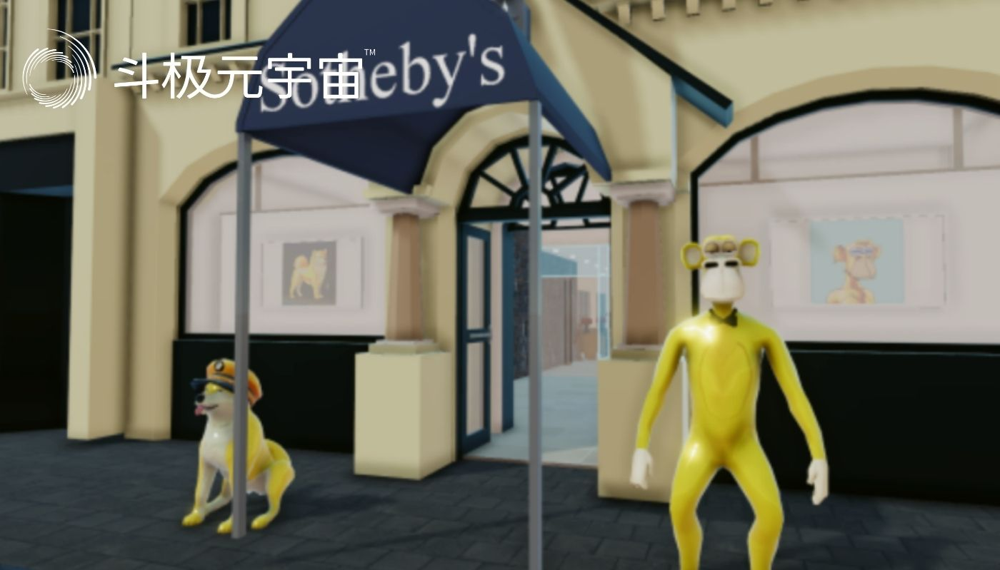
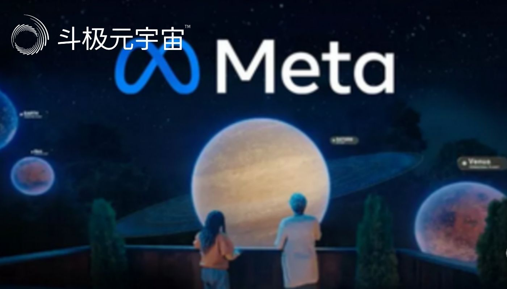
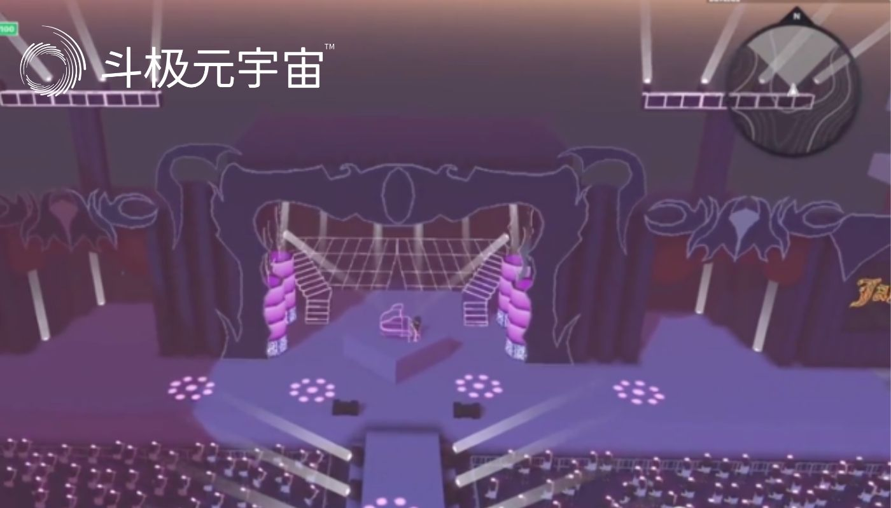
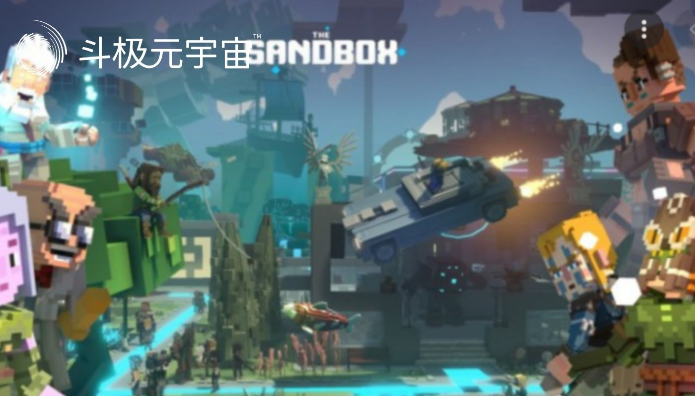

​        元宇宙作为一个概念，无论我们将其视为化身、数字名人、数字时尚、新的加密游戏初创公司还是其它，都非常接近这条道路。疫情将很多人都限制在家里，加速了人们将经济和时间带入数字空间的不可避免的行为，点亮了世界各地资本家的眼睛，带来了一个边际成本趋势为零且产品可扩展性无限的世界。

　　7月18日，《时代》周刊发布文章《元宇宙将重塑我们的生活，让我们确保它变得更好》。文章提到，美国 SEC 的报告称，在 2022 年的前六个月，“Metaverse（元宇宙）”这个词在监管文件中出现了 1100 多次，而在 2021 年，仅有 260 次被提及。

　　人人都想分一杯羹

　　在元宇宙诞生之际，几乎每个人都在努力成为其中的先驱。

　　可口可乐：是在 Decentraland 上推出基于区块链的独特收藏内容的全球领导者。在在线活动的框架内，可以参与 NFT 拍卖，获得友谊卡或声音播放器等东西，模拟可口可乐罐的打开。

　　Gucci：在一个名为 Roblox 的网站上宣布了它在 Metaverse 中的存在，并以 4，115 美元的价格出售了它的数字包，其所有者已通过 NFT 认证。值得一提的是，这款包包比实体版包包还要贵，实体店售价 3，400 美元。这似乎是今天的现实，尽管可能没有多少女性会喜欢 NFT 包作为生日礼物。

　　阿迪达斯：与 The Bored Ape Yacht Club 合作推出了“Into the Metaverse” NFT。

　　RTFKT：（人工制品，创建虚拟设备并通过 NFT 确保所有权）在 2 月的 7 分钟内售出了 600 只数字鞋，价值 310 万美元。任何购买数字鞋的人都可以将其添加到自己在 Instagram 上的现有照片中。

　　Fortnite和 Animal Crossing：允许在他们的游戏中举办音乐会。

　　时装秀：也在网络空间举行，一些系列的售价超过 130，000 美元。在即将到来的元宇宙时装周中，您可以直接从 Decentraland 的像素中购买 Hugo Boss 的实物服装。Balenciaga 将高级时装带入了 Fortnite。

　　苏富比和佳士得：都在 Decentraland 开设了一家画廊（数字总部）。

　　CNN 也有影响力，因为他们以 NFT 形式出售他们最好的时刻，而莱昂内尔·梅西 （Lionel Messi ） 在“Messiverse”上推出了他的 NFT。

　　在线成人娱乐：具有将其业务提升到新水平的巨大潜力。

　　游戏：游戏世界已经存在，数十亿人涌入他们的公司，以帮助他们实现虚拟转型。

　　德勤：开设了自己的虚拟世界商店，宣布成立“无限现实”工作室，以“帮助教育、启发、加速和执行客户的虚拟世界目标”。

　　普华永道香港：购买了一些 LAND，即以非同质化通证 （ NFT ）表示的虚拟房地产。

　　毕马威：正在通过开设其美国和加拿大部门之间的第一个协作中心来进军虚拟世界。毕马威在其加拿大分公司表示在其资产负债表上购买了比特币 （BTC） 和以太坊 （ETH） 并从女性世界 （WoW） NFT 收藏品中购买了数字艺术之后，才推出了元宇宙。

　　元宇宙的三个“浪”

　　第一个“浪”：娱乐

　　在线游戏便是元宇宙的其中一种展示模式，我们已经看到其市场发展迅速，也逐渐变得成熟和普及化。

　　第二个“浪”：商业应用场景

　　全球新冠肺炎疫情是一个加速器，促使人与人交流的模式变得非常数字化，在此前提下，可以应用在虚拟世界中的商业模式就变得多样化。

　　第三个“浪”：艺术品交易

　　在元宇宙中创造的数字资产离不开两个属性，第一点是其用途、实在性、有价值；第二点是观赏性，两者会产生价值。用户在任何地方都可以与世界各地的人交流有用途有观赏性的物品，以及一些具有收藏或纪念价值的资产。

　　近期数字艺术品的交易记录相当有市有价，而且元宇宙的展示和NFT的交易渠道在元宇宙中能为独立的艺术家创造一个新的平台，到达终端用户，而终端用户也能拥有新的选择，选购虚拟的艺术品，极具收藏及投资价值。

　　元宇宙有利于内容建构和艺术领域，它能加快内容和艺术货币化发展，降低相关贸易的障碍，同时也将有利于知识产权的发展。

　　来自投资者的眷顾

　　元宇宙可能会提高一些加密货币的价值，以及整个 NFT 市场。它可以降低成本并帮助公司更有效地运营。NFT、区块链系统、加密货币，都指向一个叫做元宇宙的地方。当然，元宇宙还有更多的投资机会，这些机会在今天不那么明显，随着未来的发展，将会浮出水面。元宇宙可能在数字世界中拥有自己的资本市场。

　　天使投资者、风险投资家、SPAC、基金和散户投资者将寻求元宇宙的故事和投资机会，可能具有高估值和高潜在回报。

　　从投资的角度来看，元宇宙为数字房地产市场带来了一系列新机会，增加了在环境中驾驭良好的现有科技公司（Facebook、腾讯、微软等）的价值。但也可以通过销售和营销机会（可口可乐、影响者营销公司）或基础设施的资源需求（Nvidia、高通等）获利的非科技公司将在元宇宙中找到机会。新公司可以从头开始成长，并在未来进行成功的 IPO（Decentraland 等）。

　　许多公司都在投资元宇宙。他们押注于此，不仅是为了娱乐目的，也是为了商业和专业目的。

　　最大的社交媒体平台Facebook将自己视为未来的元宇宙公司。Mark Zuckerberg 专注于构建社交虚拟世界并投资于 Oculus、Facebook 的 AR 和 VR 技术。2021 年 8 月，扎克伯格为 Oculus 推出了一个工作虚拟世界，让人们可以一起工作，坐在会议室里，像在办公室一样互动。这是一个完美的时机，因为越来越多的办公室已经转向在家工作的安排。

　　生活元宇宙中的营销

　　数字营销人员需要跟上最新的技术发展。这包括了解元宇宙及其全部潜力。营销人员需要了解的是，元宇宙不仅仅是一个时髦的新事物；似乎它会留下来，并正在成为下一件大事。

　　我们已经看到先行者为他们的用户提供身临其境的体验，例如在 Roblox 举行的 Lil Nas X 音乐会、Gucci Garden 体验参观以及作为华纳兄弟的一部分的华盛顿高地社区的虚拟再现。品牌最近通过与 Roblox 元宇宙和其他元宇宙的合作发现了新的收入来源。

　　元宇宙平台沙盒出现了周杰伦演唱《开不了口》的视频。舞台上，周董正弹着发光的钢琴边弹边唱，舞台下，无数粉丝跟着节奏整齐的挥舞着荧光棒，现场还能听到响亮的助威声。

　　作为个人，如何探索元宇宙

　　1．在虚拟世界中建造、探索和玩耍

　　在 2020 年代，像 The Sandbox 和 Decentraland 这样的加密游戏正在通过添加数字资产来颠覆电子游戏经济。您不仅可以将自己的不可替代令牌 （ NFT ） 导入游戏并购买虚拟土地，还可以使用游戏的可替代治理令牌来更改您将居住、探索和构建的虚拟世界的参数。

　　两者都由加密货币提供支持——Sandbox使用可替代的 SAND 通证作为游戏内货币，并使用NFT来表示土地和其他游戏原生物品、装饰你头像的资产种类，而 Decentraland 有可替代的MANA通证和等价的虚拟资产的可替代品。

　　撇开加密经济学不谈，这些游戏的玩法与其他任何沙盒游戏一样。您可以在游戏各自的虚拟世界中漫游，与争相垄断市场的品牌和名人闲逛。在虚拟空间，如购物中心、艺术画廊或广场，您可以四处走动并与人交谈、玩游戏、建造房屋或参加活动。Decentraland 甚至举办自己的音乐节。

　　2．结识来自任何地方工作或娱乐的人

　　元宇宙中有很多聚会空间。您可以聚集在 The Sandbox 和 Decentraland 等巨大的开放世界中，也可以在Spatial等平台上玩定制房间。这些应用程序专为活动、会议和会议而构建。您可以使用 Google 等 Web 2 登录名或 MetaMask 等 Web3 登录名登录 Spatial。Spatial 的虚拟世界被分隔成房间；您可以访问预制房间或创建自己的房间。Spatial 的画廊支持 NFT。

　　戴上 VR 耳机，例如 HTC Vive、Valve Index 或 Meta（以前的 Oculus）Quest，然后将自己带入网络空间。Meta（前身为 Facebook）正在为其 VR 耳机建立一个社交中心，Steam 的 VR 软件预装了一个虚拟家。

　　MetaHub 等公司正在为会议和商务活动创建虚拟聚会空间，Decentraland 于 2021 年举办了首个音乐节——尽管艺术家们在《第二人生》中这样做早在它很酷之前就已经这样做了。闲逛是元宇宙的界限开始模糊的地方，营销活动开始瓦解。

　　3．创建一个看起来像你的 3D 化身

　　你的头像是你元宇宙身份的重要组成部分。

　　对于某些人来说，像 CryptoPunks 或Bored Ape Yacht Club这样的个人资料图片 NFT对于 Discord 和 Twitter 来说已经足够了，主要是基于文本的平台，其中 2D 图片就足够了。对于 3D 领域，Ready Player Me 等应用程序提供可组合的数字身份，据称可用于 1，330 种应用程序和游戏，包括Nike 的 RTFKT、Somnium Space 和 VR Chat。你也可以从 RTFKT 购买 NFT 运动鞋，或者从其即将推出的“阿凡达项目”中购买化身，尽管目前尚不清楚哪些游戏会让你“穿”这些。

　　4．收藏虚拟土地、NFT

　　当然，如果您实际上还没有兴趣与现实分开，您可以随时投资于热闹的虚拟世界。有很多方法可以解决这个问题。你可以收藏 NFT 头像，就像耐克或阿迪达斯提供的那样。您可以收藏虚拟土地或游戏内物品，例如 Decentraland 、Otherside和 The Sandbox 提供的物品。

.jpg)

　　您可以随时投资元宇宙指数基金，例如 Index Coop 提供的元宇宙指数 （MVI）。MVI 根据当时最大的元宇宙币重新平衡其投资组合。

　　如果加密资产不是你的菜，你可以投资虚拟现实和元宇宙公司的股权。

　　如何在元宇宙中购买土地

　　几个元宇宙平台已经创建了市场，用户可以在其中以 NFT 的形式买卖数字土地和其他收藏品。以下是购买元宇宙土地的步骤：

　　1．希望购买元宇宙房地产的用户需要确定他想购买哪个平台的数字土地。流行的选择是 Decentraland 和 The Sandbox，尽管还有其他几个。在购买虚拟世界中的任何土地之前，请先进行自己的研究。

　　2．用户需要创建一个数字加密货币钱包，这是一种连接到区块链网络并存储加密货币的计算机软件，并与为元宇宙平台提供动力的相关区块链兼容。

　　3．从那里，购买者需要访问他选择的 Metaverse 平台的市场并将他的数字钱包连接到该平台。市场通常可以在 Metaverse 平台网站上找到。

　　4．在这个阶段，购买数字土地看起来很像购买物理世界的土地。买家需要考虑他正在考虑购买的数字土地的价格、位置和未来价值。

　　5．一旦买家确定了一块土地，他需要获取 Token 来购买并将它们存储在他的数字钱包中。执行交易所需的Token类型因元宇宙平台而异。例如，要在 Decentraland 购买数字土地，用户需要购买MANA 。如果他想在 The Sandbox 购买土地，他需要获得 SAND 。

　　6．如果买家已经将他的数字钱包连接到元宇宙市场并为其提供资金，他所需要做的就是对土地出价或直接购买土地。土地的成本将从数字钱包中扣除，代表土地的 NFT 将转移到用户的钱包中。

　　7．同样的过程也适用于购买其他元宇宙 NFT 物品，例如用于头像的服装和配饰。

（免责声明：本文转载自其它媒体，转载目的在于传递更多信息，并不代表本站赞同其观点和对其真实性负责。请读者仅做参考，并请自行承担全部责任。）