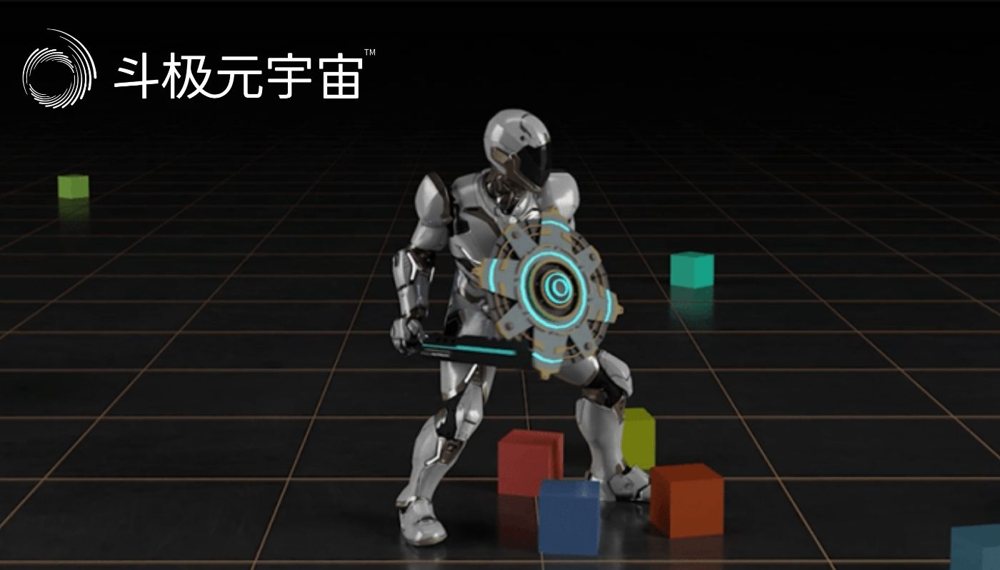
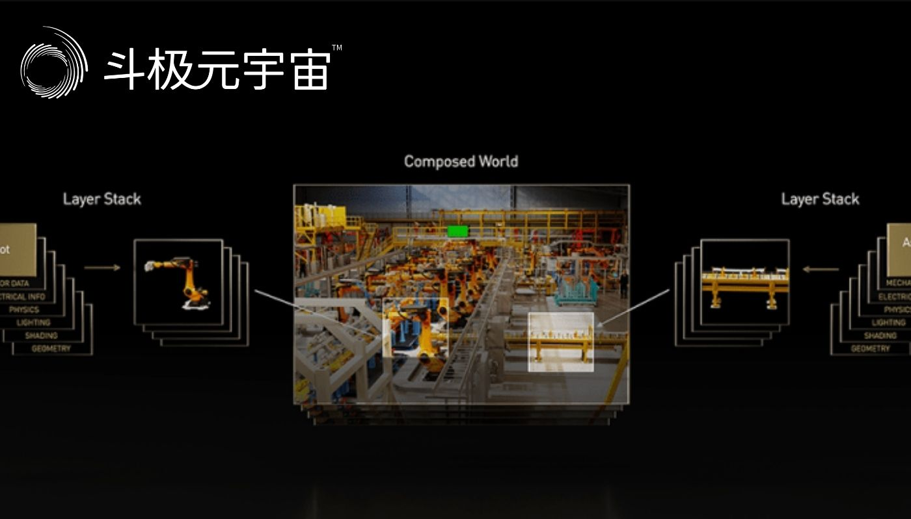

1993年，是英伟达诞生之年，是Web大规模普及的一年，也是电影《侏罗纪公园》问世的一年，预示着3D计算机图形时代的到来。

据悉，在今日举行的计算机图形学年会SIGGRAPH上，英伟达Omniverse和仿真技术副总裁Rev Lebaredian谈到自1993年以来，2022年将是计算机图形行业最大的转折点，今年的SIGGRAPH“可能将载入史册”。

在SIGGRAPH的主题演讲期间，英伟达宣布了一系列由AI驱动的元宇宙新工具，包括实时协作与仿真平台Omniverse的新版本、能帮助开发者更快构建高质量虚拟人的Avatar云引擎，并公布一项将“元宇宙语言”USD应用于工业元宇宙的多年发展路线图。

今天，英伟达已经是专注于3D计算机图形学的最重要的公司之一。

英伟达创始人兼CEO黄仁勋说：“人工智能和计算机图形学的结合将为元宇宙提供动力，即互联网的下一次演变。”Rev Lebaredian亦谈道：“我们看到的是互联网新时代的开始，一个被广泛称作「元宇宙」的时代。”

迄今为止，我们看到的元宇宙概念依然庞杂，整个生态还处于混沌阶段。不过短暂的混乱并不会影响长远的走向，整个信息技术产业都在走向虚实结合，并将影响力辐射至各行各业。因此英伟达所擅长的图形渲染、人工智能（AI）计算等能力，未来将持续有很大的增长空间。

在此前多数公开场合中，英伟达并不经常谈论“元宇宙”这个概念，但从它近年的布局可以看到，在构建元宇宙所需的软硬件基础设施布局上，英伟达已经走得相当之远。

一、助攻构建虚拟人！推 Avatar 云引擎，大降开发门槛

虚拟形象的边界正在迅速扩展，从游戏界发展向娱乐、银行、交通和酒店等更多行业。如今，游戏中的虚拟形象愈发逼真生动，虚拟人唱歌跳舞、带货直播、客户服务也不是什么鲜见的事。

但要打造足够逼真的、神态自然、能与人类流畅互动的虚拟人，对技术有较高的要求。

而英伟达正在做的事，就是设法降低虚拟人、虚拟化身、3D虚拟头像的开发门槛。

为此，英伟达今天发布了一个用于高效创建和部署3D虚拟形象的云原生AI模型和服务——Omniverse Avatar Cloud Engine（ACE）。

ACE建立在英伟达的统一计算框架基础之上，内置有许多复杂的AI技术，为用户提供丰富的软件工具和API。

它基本覆盖了虚拟人所需的各种核心功能，如实现理解多种语言、响应语音提示、智能视频分析、高性能推荐系统、与环境互动并提供智能建议等等。这些工具使开发者足以解锁交互式虚拟人所需的大部分技能，并做到先进水平。

比如ACE内置的AI工具Audio2Face，可以用音频文件直接创建面部动画，并提供有推理和生成逼真情绪的新功能；Audio2Gesture能用能用音频文件生成逼真的身体姿势动作；Project Tokkio则能提供视觉、感知和智能对话能力，让虚拟形象提供建议、提高餐厅等场所的客户服务水平。

借助此类工具，虚拟人可以具备像真实人类一样复杂的面部信息、流畅自然的表情和动作，以及与说话内容契合的口型。

ACE的模型和服务都在云端，因此企业不用担心算力问题，任何规模的企业都可以立即获得构建部署虚拟形象所需的大规模算力。

这对游戏、聊天机器人、虚拟人、数字孪生和虚拟世界的大规模生产工作都会很有帮助。

二、元宇宙工具包再升级， Omniverse 新版本发布

在元宇宙热潮爆发前，英伟达的Omniverse平台就在持续打磨和预热。如今该平台在构建虚拟世界方面的价值日益凸显，这也成为黄仁勋颇具远见性的又一例证。在本届SIGGRAPH上，黄仁勋公布了Omniverse的新版本。

Omniverse是一个用于构建虚拟世界的多GPU可扩展计算平台，已被全球约700家领先的公司用于改进建筑和产品设计、简化视觉效果工作流程以及构建工厂、城市和地球的数字孪生。黄仁勋将其描述为“一个USD平台，一个构建元宇宙应用的工具包，一个运行虚拟世界的计算引擎”。

此次针对Omniverse的扩展包括多项AI工具和功能，它们让艺术家、开发者和工程师能够比以往更加轻松地构建虚拟世界和内容，并且更加无缝地连接当今领先的3D应用。

其中，Omniverse Kit是用于构建本地Omniverse扩展和应用程序的工具包，里面用于优化物理仿真的PhysX和提高3D工作流程协作效率的OmniLive Workflows均得到更新；Omniverse Machinima则用于轻松构建3D电影和动画电影，里面有来自数百个游戏的全新免费3D资产。

我们使用谷歌、百度等搜索引擎查资料已经是家常便饭，英伟达同样打造了一款专门用来查找3D视觉数据的搜索引擎DeepSearch。

DeepSearch利用AI技术，准确地在庞大的、未标记的3D视觉资产数据库中进行搜索。使用者用自然语言文本就能在DeepSearch上进行搜索。目前该搜索引擎已面向Omniverse Enterprise客户开放。

物理机器学习框架NVIDIA Modulus现在也可以用作Omniverse扩展程序。之前科学家和工程师用这个框架创建数字孪生。

经Modulus训练的物理机器学习模型能提供近实时的性能，根据不同的应用，其速度可提高4000甚至100000倍，并且具有前所未有、更接近高保真模拟的准确性。

此外，英伟达与工业、设计、模拟和CAD软件生态系统中的合作伙伴一同发布了11个新的Omniverse连接器（Connector），这些基于USD的插件进一步向工业界和科学界的公司开放Omniverse工作流程。Omniverse USD生态系统中的连接器总数现已达到112个。这些连接器将进一步解锁元宇宙工作流程。

英伟达还发布了多项核心仿真模拟技术的重大更新。这些技术在元宇宙世界中用于表示材质、物理和光线。NVIDIA MDL材质标准一直支持物理级精确的3D材质表现，现已完全开源，使开发者能够为任何渲染器带来材质定义语言支持。

其他新发布还有下一代OpenVDB（存储体积数据开源库）NeuralVDB，它能为稀疏体积数据集带来了AI和GPU优化，并将这些海量数据集的内存占用率降低了多达100倍。

三、开源 USD 资源与测试套件，支撑工业元宇宙应用

通用场景描述（USD）一种3D世界的开源和可扩展语言，是在动画和视觉效果工作流程中实现3D数据交换标准化的一种方式。

USD在视觉特效和动画、工业、设计和科学应用等方面都呈现出快速增长的势头。媒体、游戏、机器人、工业自动化、零售和百货行业的创新者已经开始将USD作为他们首选的元宇宙语言。

今日，英伟达宣布了一项发展USD的大型计划，准备将USD发展成为开放元宇宙和3D互联网的基础。其计划包括让所有国家和语言的用户都能参与USD的国际字符支持、实现城市规模和行星规模数字孪生的地理空间坐标支持，以及实现数字孪生与物理世界同步发展的物联网数据实时流式传输。

英伟达将与USD的发明者皮克斯以及Adobe、Autodesk、西门子等多家行业内领先的企业合作，实施一项多年发展路线图，将USD的功能扩展到视觉效果应用之外，使其能够更好地支持建筑、工程、制造业、科学计算、机器人、工业数字孪生等领域的工业元宇宙应用，助力3D艺术家、设计师、开发者等人员，在构建虚拟世界时能够在不同的工作流程和应用中进行协作。

“USD是皮克斯动画制作流程的基石。”皮克斯动画工作室首席技术官Steve May认为，“英伟达将帮助USD发展成为完全可互操作3D平台的开放基础，造福所有行业。”

工业巨头西门子就在跟英伟达合作实现未来的设计、工程和协作空间——工业元宇宙。西门子数字工业首席技术官Dirk Didascalou说：“我们十分高兴能在西门子Xcelerator平台上支持USD，并计划与英伟达合作开发下一代USD格式。”

沃尔沃汽车高级可视化专家Mattias Wikenmalm 亦认可USD的巨大发展前景：“沃尔沃在第一时间了解到开放、可扩展、可互操作的3D场景描述对我们元宇宙项目的价值。通过保持统一的资产来源并实现它们在不同虚拟世界之间的交换，沃尔沃将打造出真正无缝的3D互联网消费者应用。

为了加速USD的开发和采用，英伟达宣布开发一个开放的USD兼容性测试和认证套件，开发者可以自由使用该套件来测试他们使用USD构建的项目并验证结果是否符合预期。

此外，英伟达正在发布一系列免费资源来加速USD的采用范围，其中包括数千种专门用于帮助不具备3D专业知识的用户构建开放虚拟世界的USD资产。英伟达还提供数百个可按需选择的教程、文档和开发者工具来帮助普及USD教育。

NVIDIA还宣布投资构建能够将流行的3D软件生态系统连接到NVIDIA Omniverse的USD插件。

NVIDIA还在SIGGRAPH上汇集了USD生态系统中的数百名工程和产品负责人，并组成工作委员会，帮助NVIDIA调整USD开发的优先事项并获取关于重点开发方向的反馈。

目前，Adobe、Autodesk、皮克斯和西门子等众多公司都在为USD的发展提供帮助和支持。

四、推神经图形工具包，简化虚拟世界构建过程

为了进一步简化虚拟世界建模过程，提高建模速度，英伟达发布了多个使用AI和神经图形标准研究的软件开发工具包。

神经图形用于模拟和渲染一个动态的虚拟世界。英伟达人工智能研究副总裁Sanja Fidler说：“神经图形将人工智能和图形交织在一起，为未来适合从数据中学习的图形流水线铺平了道路。”

构建虚拟世界，3D内容创作是关键部分。而神经图形旨在引导内容创造者为元宇宙世界创造“有趣的内容”，不仅是艺术家，社交媒体用户也可以借助它来轻松地据照片创建3D内容。

一个应用例子是将扫描的2D图像带入虚拟现实。Fidler谈道，以前要做件事，艺术家必须使用不同的工具，很费时，而英伟达的“神经重建”过程将其变成了一个统一框架。

借助英伟达研发的软件Instant NeRF，艺术家可以用摄像头扫描并使用神经图形进行快速捕捉，从2D图像创建物体或场景的3D模型，并可以立即将其导入虚拟世界。

英伟达新发布的Kaolin Wisp，是深度学习工具库Kaolin的补充，能让工程师几天内就实施新的训练模式；还有用AI大幅减少3D模型数据内存占用的NeuralVDB，这是对体积数据存储OpenVDB行业标准的改进。

结语：英伟达的元宇宙雄心

从今年英伟达在SIGGRAPH上的主题演讲，我们可以看到英伟达已经将支撑元宇宙所需的技术及产品，视作拉动未来增长的重要引擎。

元宇宙也被称作“3D版互联网”，而如果要让它像现在大多数上网用户都非常习惯的互联网，那么它必须具备让普通用户也能轻松获取、构建3D内容的基础条件。

现在，英伟达显然正试图接过这一重任。

英伟达提供的Omniverse平台以及一系列元宇宙构建相关工具，都在为开发者提供打通物理世界和虚拟世界之间的便捷工具，即让虚拟人、虚拟物体、虚拟世界的创建都更便捷，同时更加趋近于真实的世界。

这些软件工具越是好用，就越是会吸引更多开发者进入英伟达的生态、采购英伟达的硬件产品，从而推动英伟达的业绩走向新的高度。

在图形处理时代和人工智能时代，英伟达都是底层硬件基础设施的核心供应商，随着人们准备迈向元宇宙时代，英伟达同样雄心勃勃，意图占据硬件中心之位。

正如NVIDIA Omniverse和仿真模拟技术副总裁Rev Lebaredian所言：“元宇宙蕴含的商机价值数万亿美元，任何企业机构都不愿错过它。”

（免责声明：本文转载自其它媒体，转载目的在于传递更多信息，并不代表本站赞同其观点和对其真实性负责。请读者仅做参考，并请自行承担全部责任。）