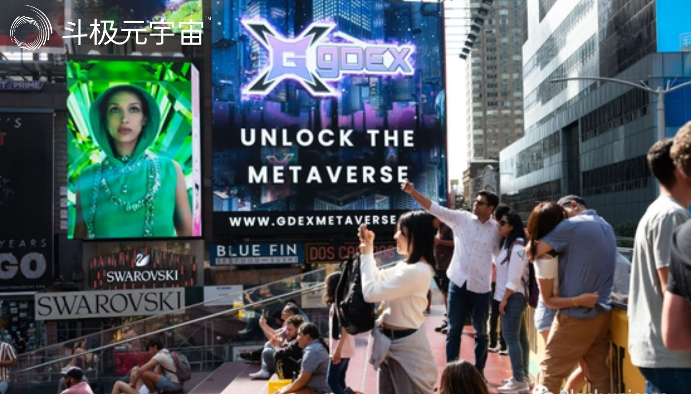

​         Matthew Ball 是早期风险基金 Epyllion 的管理合伙人，Makers Fund 的风险合伙人，以及《The Metaverse And How it Will Revolutionize Everything》的作者。

　　元宇宙将重塑我们的生活，让我们确保它变得更好。

　　美国证券交易委员会报告称，在2022年前6个月，Metaverse一词在监管文件中出现了1100多次。前一年有260次被提及。之前的二十年? 总共不到12次。越来越多的人觉得，好像每个公司的高管都觉得有必要提及 “ 元宇宙 ”——当然，还有它如何自然的比竞争对手更适合他们公司的能力。似乎很少有人解释这是什么，或者他们将建造什么。高管阶层似乎也对这个新平台的基本方面存在分歧，包括虚拟现实头盔、区块链和加密技术的重要性，以及它是现在存在、可能很快出现，还是几十年后才会出现。

　　这些都是没有限制的投资，关于Facebook更名为“Meta”，以及它每年因元宇宙计划而损失的100多亿美元，已经有很多报道了。但世界上另外六家最大的上市公司——亚马逊、苹果、谷歌、微软、英伟达、腾讯——也在忙着为元宇宙做准备。他们正在进行内部重组，重新编辑职位描述，重新设计产品，并准备推出价值数十亿美元的产品。今年1月，微软宣布了大型科技公司历史上最大的一笔收购，斥资750亿美元收购了游戏巨头动视暴雪(Activision Blizzard)，后者将 “ 为元宇宙提供构建组件 ”。据麦肯锡公司(McKinsey & Company)估计，今年前五个月，企业、私募股权公司和风险投资家共进行了1200亿美元的跨领域投资。

　　到目前为止，上面提到的几乎所有的工作对普通人来说都是看不见的。就像元宇宙本身。我们并没有真正能够购买到的元宇宙产品，也没有在损益表中找到“元宇宙收入”。事实上，就元宇宙曾经存在的程度而言，它似乎已经来了又走了。加密已经崩溃了，Facebook的市值也是如此。更名为Meta时，该公司市值超过9000亿美元，但目前约为4450亿美元。今年，电子游戏销量下降了近10%，部分原因是疫情结束迫使许多人进入室内。

　　元宇宙似乎正在爆发，对于许多人来说，这是一件好事。最大的科技平台已经对我们的生活，以及现代经济的技术和商业模式产生了巨大的影响。很明显，今天的互联网有很多问题;为什么不在扎克伯格所谓的“继任者”进入之前解决这些问题呢?

　　答案就在这个问题中，元宇宙，一个30年的术语，但将近一个世纪前的想法，正在我们周围形成。每隔几十年，平台的转变就会发生——比如从大型机到个人电脑和互联网，或者随后的演变到移动和云计算。一个新时代一旦形成，要改变领导它的人以及如何领导它是极其困难的。但在不同时代之间，这些事情通常会发生变化。如果我们希望建设一个更美好的未来，那么我们必须像那些投资建设未来的人一样积极的塑造它。

　　那么未来会怎样呢? 把元宇宙世界想象成一个平行空间的虚拟存在层，它跨越了所有的数字技术，甚至会控制物质世界的大部分。这种结构有助于解释元宇宙作为3D互联网的另一种常见描述，以及为什么建立它如此困难，但也可能是值得的。

　　我们今天所知道的互联网几乎覆盖了每个国家，4万个网络，数百万个应用程序，超过1亿个服务器，近20亿个网站，以及数百亿台设备。每一种技术都可以连贯一致的交换信息，“在网上”找到彼此，共享在线账户系统和文件(JPEG、MP4、一段文本)，甚至相互连接(想想新闻发布者如何链接到另一家媒体的报告)。近20%的世界经济被认为是“数字化”的，其余80%的经济都是数字化的。

　　尽管互联网具有弹性、覆盖面广阔和强大的功能，但它并不是为涉及大量参与者的实时互动体验而建立的——尤其是在3D成像方面。相反，互联网的设计主要是为了一个静态文件(如电子邮件或电子表格)可以被复制并从一个设备发送到另一个设备，这样它就可以被独立和异步地审查或修改。这也是为什么即使在“流媒体战争”(Streaming Wars)和市值数万亿美元的大型科技公司盛行的时代，简单的两人视频通话也会如此不可靠的部分原因。(在线多人游戏居然还能运行，真是个奇迹。)此外，关于3D信息的文件格式或约定也没有达成共识，在虚拟世界中也没有交换数据的标准系统。我们也缺乏像我们想象的那样实现元宇宙的计算能力。我们希望有很多新设备能实现这一点，不仅仅是VR眼镜，还有全息显示器、超声波力场发生器，以及听起来很诡异的设备，用于捕获跨肌肉发送的电信号。

　　我们无法事先确切知道3D互联网对全球经济的重要性，就像我们以前不知道互联网的价值一样。但我们确实对答案有一些看法，随着互联网连接和计算机处理器的改进，我们已经从无色的文本转向原始的网页和网络博客，然后是在线档案(如Facebook页面)和基于视频的社交网络，表情符号和过滤器。我们在网上产生的内容数量已经从每周几篇留言板上的帖子、电子邮件或博客更新，增长到不断压缩我们生活的多媒体内容流。这一趋势的下一个演变可能是一个持久的、“活生生的”元宇宙世界，它不是我们生活的窗口(如Instagram)，也不是我们交流的地方(如Gmail)，而是一个我们也存在的世界——而且是3D的世界(因此人们会关注沉浸式VR头戴设备和虚拟形象)。

　　目前，每天有近1亿人登录《Roblox》、《我的世界》和《堡垒之夜创意》等平台，这些平台运营着数千万个相互连接的世界，支持一致的虚拟身份、虚拟商品和通信套件，可以从大多数设备访问。在这些平台上的大部分时间都花在休闲上——玩游戏、听音乐会——但我们开始看到人们走得更远。

　　Electric Daisy Carnival 是 Roblox 的第一个音乐节，于 2021 年 10 月举行了几天（图片来源于美国商业资讯/美联社）

　　教育是我们长期以来一直期待数字时代改变的一个类别，但迄今为止一直在抵制它。自1983年以来，高等教育的成本增长了1200%以上;同期美国医疗保健和服务费用增幅排名第二，增幅只有美国的一半。真正的挑战是，与几十年前相比，它所需要的资源不比几十年前少，而且转移到远程计算机屏幕上时，会失去什么？朋友、眼神交流、动手实验等。Zoomschool、YouTube视频和数字多项选择都不能代替真实的东西。

　　在元宇宙中，魔法校车成为可能。几十年来，学生们通过观看他们的老师丢下一根羽毛和一把锤子，然后看到阿波罗 15 号指挥官大卫·斯科特在月球上做同样的事情来了解重力（剧透：它们以相同的速度下落）。这样的演示不一定会消失，但可以通过创建精心制作的虚拟 Rube Goldberg 机器来补充它们，然后学生可以在类似地球的重力下、火星上甚至在地下进行测试金星高层大气的硫磺降雨。我们无需解剖青蛙，而是可以在它的循环系统中穿行，这与我们在马里奥赛车中驾驶蘑菇王国的方式不同。无论地理位置或当地学校董事会的资源如何，所有这些都是可用的。

　　2021年，约翰·霍普金斯大学的神经外科医生使用增强现实头盔进行了医院史上首次活体病人手术，从而为外科医生提供了病人内部解剖的交互式显示。实施手术的蒂莫西·威瑟姆(Timothy Witham)医生，同时也是该医院脊柱融合实验室的负责人，将其比作拥有GPS。这个参照是很重要的，我们经常认为元宇宙会取代我们今天所做的事情——比如戴上VR头戴设备而不是使用智能手机或看电视—— 我们不会驾驶 GPS 而不是汽车，而是开带有GPS的汽车。

　　2021年早些时候，谷歌发布了其“星际计划”(Project Starline)设备，该设备使用机器学习、计算机视觉、十几个深度传感器和摄像头以及基于织物的多层光场显示器，无需使用混合现实眼镜就能创建3D“全息视频”。谷歌表示，与传统的“2D”视频通话相比，其Starline技术使眼神交流增加了15%，非语言交流(手势、点头、眉毛动作)增加了25-50%，对对话的记忆力提高了30%。很少有人喜欢Zoom，也许我们的一些不满可以通过增加另一个维度来缓解。

　　基础设施是另一个很好的例子。香港国际机场现在在该设施上运行一个实时的 “数字孪生”，允许机场运营商使用实时的3D模拟来确定乘客和飞机应该被引导到哪里。耗资数十亿美元、历时数十年的城市项目正在使用这些技术来确定某栋建筑可能会如何影响交通流量和应急响应时间，或者它的设计将如何影响某一天当地公园的温度和阳光，这些大多是不连贯的模拟。下一步是让它们在线上——就像从离线的微软Word文档转移到基于云的、协作的文档——把世界变成一个数字开发平台。

　　然而，对于社会来说，元宇宙到底意味着什么还不清楚。这让一些人产生了可以理解的犹豫，他们看到数十亿美元被投入到一款游戏中。但是，可以将元宇宙视为计算和网络的第四个时代——继 1950 年代至 1970 年代的大型机之后，1980年代至2000年代中期的个人电脑及互联网;以及我们今天所经历的移动和云时代。每个时代都改变了访问计算和网络资源的人、时间、地点、原因和方式。这些变化的结果是深远的，但它们也很难具体预测。

　　即使是移动互联网最坚定的信徒，也曾一度难以预测 “更多的人，更多的上网次数，更多的原因” 之外的事情。对数字网络有详细的技术理解并不能照亮未来，在研发方面投入数十亿美元也不能。Facebook、Netflix或亚马逊的AWS云计算平台等服务在事后看来是显而易见的，但它们的商业模式、技术和设计原则在当时都不是。在这方面，我们应该认识到混乱、合并和不确定性是破坏的先决条件。

　　不过，仍有一些具体问题可以解决。元世界经常被错误地描述为沉浸式虚拟现实头盔，如Meta Quest (née Oculus VR)，或增强现实眼镜，迄今为止最著名的例子是谷歌的臭名昭著的眼镜。VR/AR设备可能成为访问元元宇宙世界的首选方式，但事实并非如此。考虑到智能手机与移动互联网不同，元宇宙世界不是《Roblox》、《我的世界》、《堡垒之夜》或其他任何游戏，这些虚拟世界或平台很可能成为元世界的一部分，就像Facebook和谷歌是互联网的一部分一样。出于类似的原因，把元宇宙看作是单数，就像我们说“互联网”而不是“互联网”一样。(就我们今天识别不同互联网的程度而言，这在很大程度上反映了地区监管差异)另一个常见的合并是元宇宙和Web3、加密和区块链之间的合并。这三者可能成为实现元宇宙潜力的重要组成部分，但它们仅仅是原则和技术。事实上，许多元宇宙的领导人怀疑加密是否有任何未来。

　　元宇宙不应该被认为是对互联网的彻底改革，也不应该被认为是将取代所有移动模型、设备或软件的东西。它将产生新的技术和行为，但这并不意味着我们要抛弃我们喜欢的东西。我仍然在PC（个人电脑）上写作，这可能仍然是写长篇文本的最佳方式。如今，大多数互联网流量都是在移动设备上产生和终止的，但几乎所有的流量都是在固定线路电缆上传输的，并使用20世纪80年代设计的互联网协议套件。

　　元宇宙还没有到来(即使一些高管会声称它已经到来，或者至少即将到来)。与此同时，转换不会经历“开关翻转”。我们今天处于移动时代，但第一次蜂窝网络呼叫是在1973年，第一次无线数据网络是在1991年，智能手机是在1992年，以此类推，直到2007年iPhone出现。虽然不可能说元宇宙的发展是何时开始的，但它显然正在进行中。2021年年中，就在Facebook公布其元宇宙计划的几周前，《堡垒之夜》开发商Epic Games的首席执行官兼创始人Tim Sweeney在推特上发布了该公司1998年游戏《虚幻》的预发布代码，并补充说玩家 “ 可以进入网站，在(不同的世界)之间旅行……没有战斗，(可以)站在一个圈里聊天。” 这些体验在当时没有得到普及，原因有很多——上网的人太少，创造世界的工具太难使用，支持它们的设备太贵太笨重，等等。“我们有元世界的愿望已经很久很久了……”几分钟后他补充道，“ 但只是在最近几年，一个临界质量的工作部件才开始迅速聚集在一起。”

　　2022 年 6 月 20 日在纽约市举行的第四届 NFT.NYC 年度会议期间，时代广场的一块广告牌上写着 “ 解锁元宇宙 ”。诺姆·加莱—盖蒂图片社

　　元宇宙本身也不是反乌托邦的，这是一个常见的误解，因为“元宇宙”这个词来自于尼尔·斯蒂芬森的反乌托邦小说《雪崩》。《雪崩》的前辈，如威廉·吉布森的《神经漫游者》(1984)和菲利普·k·迪克的《泡沫的麻烦》(1953)，同样给读者留下一种元宇宙恶化了现实世界的感觉。戏剧是大多数小说的根源;乌托邦很少是流行故事的背景。但自20世纪70年代以来，出现了大量的“原始元宇宙”，它们的中心不是亡国或牟取暴利，而是合作和创造。每过十年，这些世界的现实性就会得到改善，其功能、价值和文化影响也会随之改善。

　　今天的互联网的基础是几十年来通过政府研究实验室、大学、独立技术人员和机构的工作建立起来的。这些非营利组织通常专注于建立开放标准，以帮助他们从一个服务器到另一个服务器共享信息，这样做可以更容易在未来的技术、项目和想法上进行合作。这种方法的好处是多方面的。任何人都可以通过任何设备、任何网络，以低成本或零成本访问或构建互联网。

　　所有这些都没有阻止企业在互联网上盈利，或者通过付费墙或专有技术建立封闭的体验。相反，互联网的“开放性”使更多的公司得以建立，接触到更多的用户，获得更大的利润，同时也阻止了前互联网巨头(关键是电信公司)控制它。开放也是互联网被认为拥有民主化信息的原因，也是当今世界上大多数最有价值的上市公司都是在互联网时代创立(或重生)的原因。

　　不难想象，如果互联网是由跨国媒体集团为了销售小工具、提供广告服务或获取用户数据来盈利而创建的，互联网将会有多么不同。

　　然而，是 “ 企业互联网 ” 对当前元宇宙的期望。当互联网诞生时，政府实验室和大学实际上是唯一拥有计算人才、资源和建立 “ 网络中的网络 ” 的雄心的机构，而营利部门很少有人能想象到它的商业潜力。当涉及到元宇宙时，这些都不是真的。相反，它是由私营企业开创和建立的。

　　在2016年，早在世界各地的公司高管认真考虑元世界之前，Epic Games的Sweeney就告诉VentureBeat:“ 如果一家中心化的公司获得了(元宇宙)的控制权，他们将变得比任何政府都更强大，成为地球上的神 ”。我们很容易发现这样的说法有些夸张，但根据花旗集团(Citi)和毕马威(KPMG)的数据，到2030年，元宇宙每年的收入可能高达13万亿美元。摩根士丹利(Morgan Stanley)估计美国和中国都有8万亿美元，与高盛(Goldman Sachs)全球2.5 - 12.5万亿美元的预测相近;麦肯锡预计全球将达到5万亿美元。英伟达(Nvidia)的创始人兼首席执行官黄延森(Jensen Huang)认为，元宇宙的GDP最终将超过“物理世界”，英伟达在今年的大部分时间里都被列为全球十大上市公司之一。

　　正是在这一点上，对反乌托邦的恐惧似乎是合理的，而不是危言耸听。元宇宙的概念意味着我们越来越多的生活、劳动、休闲、时间、财富、幸福和人际关系将在虚拟世界中度过，而不仅仅是通过数字设备来辅助。它将是一个平行的存在，位于我们的数字经济和实体经济之上，并将两者结合在一起。其结果是，控制这些元宇宙世界及其虚拟原子的公司将比那些在当今数字经济中处于领先地位的公司更具主导地位。

　　元宇宙将使当今数字存在的许多难题变得更加尖锐，如数据权利、数据安全、错误信息和激进化、平台权力和用户幸福。因此，引领元宇宙时代的公司的哲学、文化和优先事项将有助于决定未来是比我们现在更好还是更糟，而不仅仅是更虚拟或更有利可图。

　　当世界上最大的公司和最雄心勃勃的初创企业追求元宇宙的时候，我们——用户、开发者、消费者和选民——明白我们仍然有能力决定我们的未来，也有能力改变现状，但前提是我们现在就行动。是的，元宇宙世界可能看起来令人生畏，如果不是完全可怕的话，但这一时刻的变化是我们把人们团结在一起的机会，改变那些抵制破坏的行业，建立一个更平等的全球经济。

　　就像 1990 年代和 2000 年代的互联网一样，未来的很多事情都是不确定的。但我们可以理解元宇宙可能如何运作以及为什么会运作；哪些经验可能在何时、为什么以及对谁可用；什么可能出错，什么必须正确。正如高管们惯常提醒我们的那样，有数万亿美元处于危险之中——更重要的是，我们的生命也受到了威胁。

（免责声明：本文转载自其它媒体，转载目的在于传递更多信息，并不代表本站赞同其观点和对其真实性负责。请读者仅做参考，并请自行承担全部责任。）