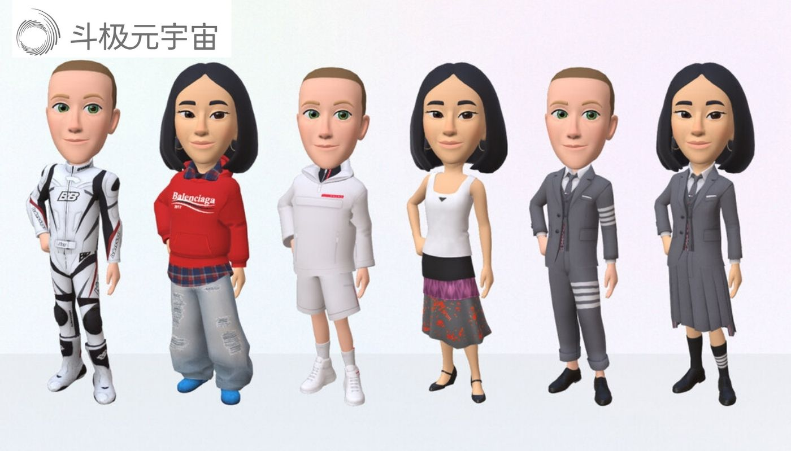
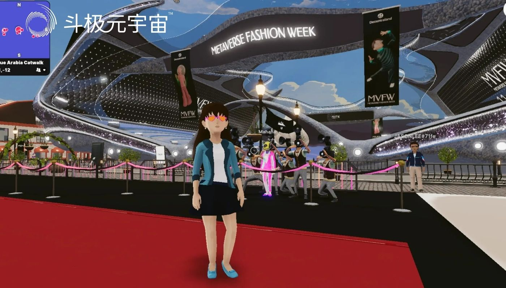

 据悉，去年10月，马克·扎克伯格公布了他为新Meta（前身为Facebook）设想的愿景，以及Web 3.0蕴藏的精彩未来，同时，由于他让一个与他本人日常穿着一样的虚拟化身来公布这些消息，因而受到群嘲（在一个充满无限可能的世界里，就穿这个吗！），Meta注意到了这个问题，发起了某种挑战。

“喂，巴黎世家，”这家公司发推说。“在元宇宙里要怎么穿？”

借由Meta新推出的虚拟化身时装店，巴黎世家、普拉达和汤姆·布朗在本周做出了回应。Meta的虚拟化身时装店已开始向美国、加拿大、泰国和墨西哥的用户开放。这是该公司首次邀请知名设计师为虚拟自我打造付费造型，尽管这家社交媒体公司一直为Facebook、Instagram和Messenger平台上的虚拟化身提供各种免费（且平平无奇）的服装。

答案就是……带有巴黎世家品牌logo的红色帽衫。

还有破洞牛仔裤和格子衬衫、摩托车连体服、黑色套裙，以及低腰牛仔裤，搭配带logo的短上衣和带logo的三角裤（共计四套衣服）。换句话来说，对任何关注巴黎世家的人来说，这些都是该牌子的经典造型。汤姆·布朗提供的设计也是这样：三件套的灰色“缩水”西装、灰色格子套裙和短裤都是汤姆·布朗的经典款。普拉达四个造型中有至少一套也是一样：一件带有三角形品牌logo的白色背心搭配百褶裙，这套造型看起来就像是从最新的时装秀上直接走出来的一样（尽管他们也提供常青款带品牌logo的运动衫）。

但还是会让人觉得，难道就这？

巴黎世家的德姆纳、普拉达的缪西娅·普拉达和拉夫·西蒙，以及布朗，都是当今最具创造力、最负盛名的四位时装设计师。他们的设计在最基本的层面努力应对社会和政治力量塑造身份的方式；作品中反映了气候变化、性别、战争、资本主义、价值问题和网红主题。为不被重力束缚、没有任何物理限制的空间设计服装时，他们（或者他们的数字、销售策划和营销团队）能想出来的，难道只是现有款式里那些最为人所熟知的造型的卡通版吗？

当被问及为何做出此种选择时，布朗在邮件里说，“我花了两秒钟，而不是一秒，就知道它应该是什么样的。我觉得那款灰色西装需要参与到这个世界里来。”

这番话的意思是，仅仅通过制作这些本来标价成千上万美元的衣服，使其触及一个更广泛的群体（在Meta商店里，它们的售价在2.99美元至8.99美元不等），他们是在将原本难以企及的东西加以大众化。从商业角度来讲，这一点没错，并且基本上还让这些Meta造型成为了新一代的“唇膏”，也就是扩散奢侈品牌覆盖面的最基础产品，因为总价不高而大致消除了准入壁垒。

德姆纳等人创造的这种时尚的意义在于，它不仅仅事关商业，而是在特定的时刻，以我们在亲眼目睹之前浑然不觉的方式，向我们展现自己是谁，或者我们想成为的样子。

你本来以为能够设想出范式如何转变的创意之才，就应该是他们这群人。

在现实世界的时装秀上，布朗已经在这么做了。不久前，他设计了一款看起来像是介于网球和龟甲造型之间的巨型绞花上衣，并且将一名女子变成了玩具士兵。德姆纳则将日常物品（毛巾浴袍、宜家购物袋）拿来，用颠覆所有预期的方式将它们变得非比寻常。你本来以为跃入元宇宙对他们来说简直是不费吹灰之力的事情。

但这三巨头为Meta商店秀设计的“衣服”，似乎在很大程度上只是一个展示品牌忠诚度、用最直白的方式利用设计档案的机会。这其中隐含的意味是，用户在数字空间中希望穿得像在物理空间一样（或者至少与他们渴望穿的衣服相同），而不是某些全新的东西。

在Instagram Live所做的一场对话活动中，Instagram时尚伙伴总监陈怡桦在介绍这个新商店时，向人们快速展示了扎克伯格的化身身着不同服饰的草图，并询问他的反应。“要从头到脚都穿普拉达，确实要有一定的自信才行，”扎克伯格说道，暗示他在现实世界中并没有这样的信心，但在元宇宙可能就有。

扎克伯格还在Facebook发帖谈到该时装店，他说Meta想创造一种虚拟化身时尚产品，因为“数字商品会是你在元宇宙表达自我的重要方式，也是创意经济的一大驱动力”。但自我表达并不是把某种设计师造型整个囫囵吞下。自我表达是利用设计师创造出的工具，打造出个性化的东西。

从头到脚穿一套某个设计师规定的搭配不需要信心，甚至不需要思考，仅仅需要成为品牌广告载体的欲望，而这是Meta目前正在推动的。也许这确实是用户想要的方向（也许这一直是一个幻想），但这不会让我们现在所知的世界扩大，只会形成更多的分裂。

尤其是因为虚拟化身并非跨平台的创造物。因此，如果你想让虚拟的自己穿上普拉达（或巴黎世家，又或是汤姆·布朗），你只能在Meta平台上实现这一点。如果你想让虚拟的自己身穿汤米·席尔菲格、拉夫·劳伦或古琦，你只能去Roblox。

说句公道话，也许随着技术变革，这种情况也会发生改变，就像给你的虚拟化身着装的能力可能会改变一样。现在，当你在Meta衣橱里挑选衣服时，你只能选一整套已经提前做好的造型，而不能自己一件件来搭配。也许在未来，一件巴黎世家帽衫可能会搭配一条普拉达短裙和一双非品牌的鞋子。

扎克伯格说过，在某个时候，Meta会让商店面向那些只有数字版的时尚品牌和其他新的创新品开放——那些已经在数字市场DressX上销售其商品的设计师/发明者。在DressX上，你看到的基本上是对“衣服”的真正另类诠释。

（免责声明：本文转载自其它媒体，转载目的在于传递更多信息，并不代表本站赞同其观点和对其真实性负责。请读者仅做参考，并请自行承担全部责任。）