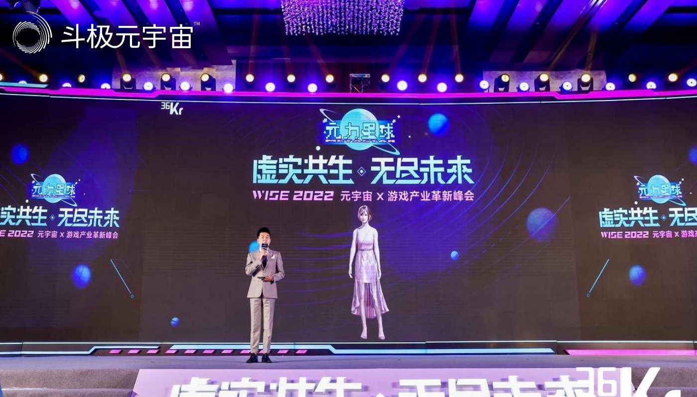
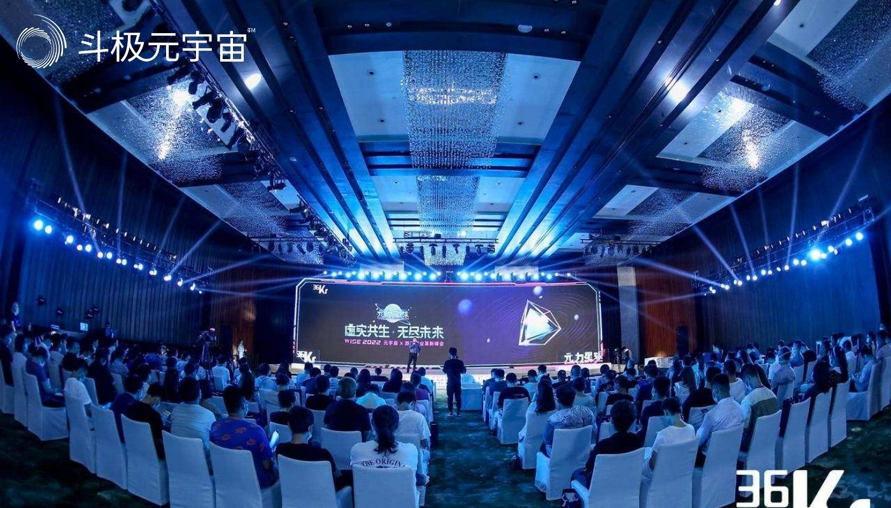

据悉，8月2日~3日，WISE2022『虚实共生·无尽未来』元宇宙×游戏产业革新峰会在北京望京凯悦酒店圆满落幕。

随着元宇宙“元年”的浪潮逐渐升温，游戏和Web3.0产业也进入了新的发展阶段，越来越多的创业者和学术专家，开始围绕云游戏、内容出海、游戏文化、XR、虚拟人、数字孪生、数字衍生经济等领域展开新一轮的突击。

无论是在传统游戏产业，还是元宇宙新兴领域，“虚实共生”都是绕不开的关键话题。将虚拟与现实结合，帮助人类走进数字化、网络化、虚拟化的下一个时代，将会开启基于Web3.0的无尽科技未来。根据领英与欧易OKX共同发布的《2022年全球区块链行业人才报告》显示，2022年已有超过15家风投机构推出了Web3.0专项基金，规模超过40亿美元，其中不乏红杉资本（6亿美元）、A16z（预计10亿美元）等头部机构，投资方向涵盖区块链技术、Gamefi等。

为了更好帮助行业健康成长，并通过媒体研究视角为用户带来专业且全面的游戏、元宇宙及Web3.0前沿资讯，36氪于2022年8月2~3日在北京举办了「虚实共生，无尽未来」主题峰会，此次峰会邀请了多位投资人、学者和产业创变者共同探讨产业发展趋势。与此同时，36氪联合[元力星球](https://36kr.com/project/1855057205077895)推出了峰会纪念数字藏品，联合尚屹汇诚在现场推出了AR互动抽奖等玩法，让现场参会的观众近距离体验到了虚实共生带来的魅力。

在游戏、元宇宙和Web3.0前景可期的趋势下，36氪将通过最前沿的视野、最专业的的分析持续开展研究，为产业提供全面的支持。

（免责声明：本文转载自其它媒体，转载目的在于传递更多信息，并不代表本站赞同其观点和对其真实性负责。请读者仅做参考，并请自行承担全部责任。）