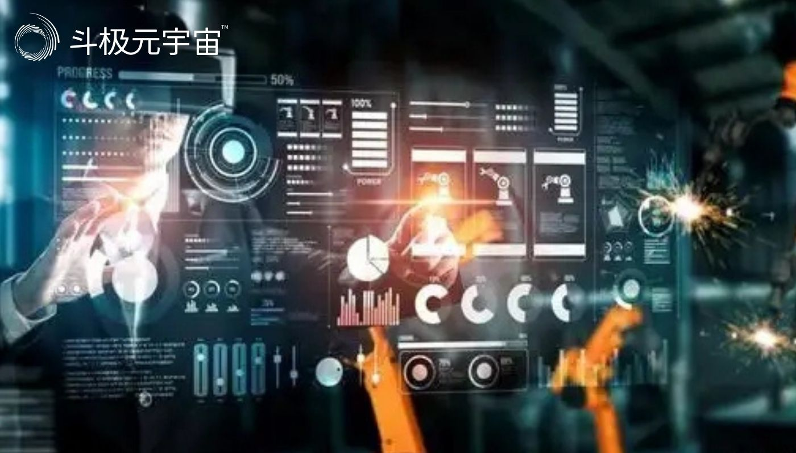
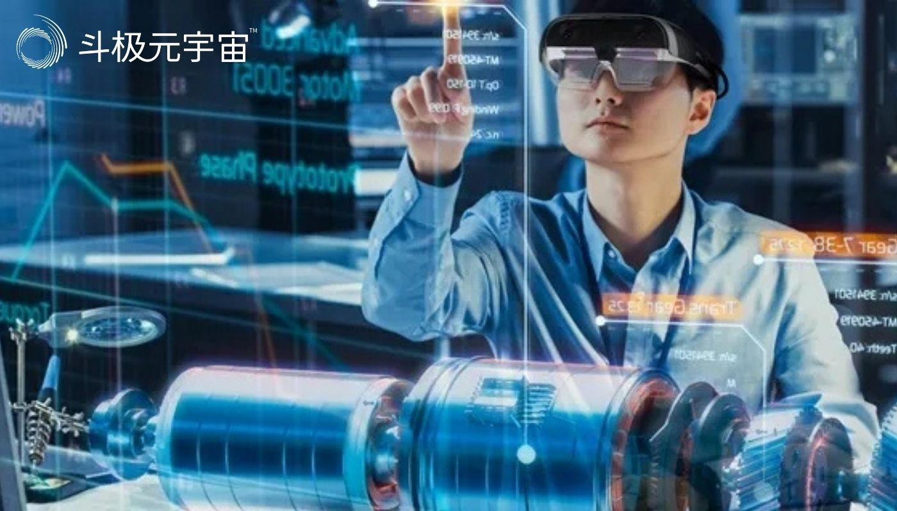

​        说到虚拟现实，第一时间你会想到什么？电影中的虚幻场景？用来玩游戏的VR头显？其实，C端消费场景之外，虚拟现实也可以在工业制造领域大放异彩。

　　近日，工信部副部长王江平在京调研虚拟现实等新一代信息技术在工业制造领域应用情况，并召开有关企业座谈会。座谈会上，虚拟现实、钢铁行业有关企业围绕“虚拟现实等技术助力行业降本增效”进行了交流讨论。

　　会议强调，要针对虚拟现实等新一代信息技术如何赋能工业领域开展深入研究，进一步加快虚拟现实等技术在各行各业应用，瞄准行业痛点、难点，不断提高应用的深度和广度。要加强政策宣贯和供需对接，加快推动新模式、新场景、新业态落地推广，努力实现虚拟现实产业和工业制造领域的双向赋能。

　　▍已有多个鲜活案例

　　工业元宇宙即元宇宙相关技术在工业领域的应用。虚拟现实打破了二维平面的桎梏，可以在虚拟装配、设备维护、培训等多方面加速制造业的生产率提升，在研发、装配、检修、培训等环节已经实现初步应用，工业元宇宙的稚嫩面容已被一笔笔勾勒出来，相关案例比比皆是。

　　工业一体化AR智能头盔已经应用于电力企业巡检作业中，国家电网、宁德核电等电力企业均已开启5G+AR项目。

　　在日常巡检中，员工佩戴好AR眼镜，电力设备的3D模型便“跃然眼前”，同步叠加实时数据，直观判断设备工作状态，还可收到由后台发出的巡检指令，作业人员只需按照屏幕指示步骤，且AR终端设备能根据现场工作的进展自动拍照留存，便于积累经验，形成知识库，这些都大大提高了运维效率。

　　波音公司早已开始使用虚拟现实技术研发飞机，这一知名航司利用3D VR头显将世界各地的波音工程师相联系实现实时协作。据统计，采用虚拟现实设计的波音777飞机，设计错误修改量减少了90%、研发周期缩短了50%、成本降低了60%。

　　另一方面，科技巨头们作为“工业元宇宙”的平台服务商积极参与。

　　工业机器人(11.100, -0.06, -0.54%)龙头川崎重工已经成为微软首位使用其“工业元宇宙服务”的客户。被定位为“工程师的元宇宙”的英伟达Omniverse也是一个用于复杂设计工作流，端到端实时协作和真实仿真平台。通过Omniverse的使用，宝马集团能够协调全球31座工厂的生产，据悉生产规划效率将因此提高30%。

　　▍价值或远大于消费领域

　　国内，工信部《虚拟现实产业发展白皮书5.0》中明确提出“通过财政资金促进虚拟现实技术产业化，支持面向工业、文化、教育等重点行业的虚拟现实技术应用”。工业元宇宙同样也是各个地方政府的规划重点，上海、广州、无锡、武汉等多地的相关政策均鼓励元宇宙在包括工业制造、社交娱乐等领域的应用，推动元宇宙与实体经济相融合。

　　与消费元宇宙相比，工业元宇宙更重视“由虚向实”的过程，关注解决确切场景中的确切问题。有多位业内人士分析称，工业元宇宙将覆盖工业生产全链条环节，元宇宙在工业领域的应用价值或远大于消费领域。

　　根据TrendForce集邦咨询预测，到2025年，工业元宇宙将催动全球智能制造市场规模突破5400亿美元，2021至2025年复合成长率高达15.35%。

　　不过当下，工业元宇宙仍处于初级阶段，为促进概念落实到应用，需要进一步开展多方面研究和建设。支撑工业元宇宙发展的，既包括强大的算力、AI、数字孪生等基础技术，也包括强大的芯片、传感器、光学镜头、VR/AR等硬件设备，生态体系建设同样不可或缺。

　

