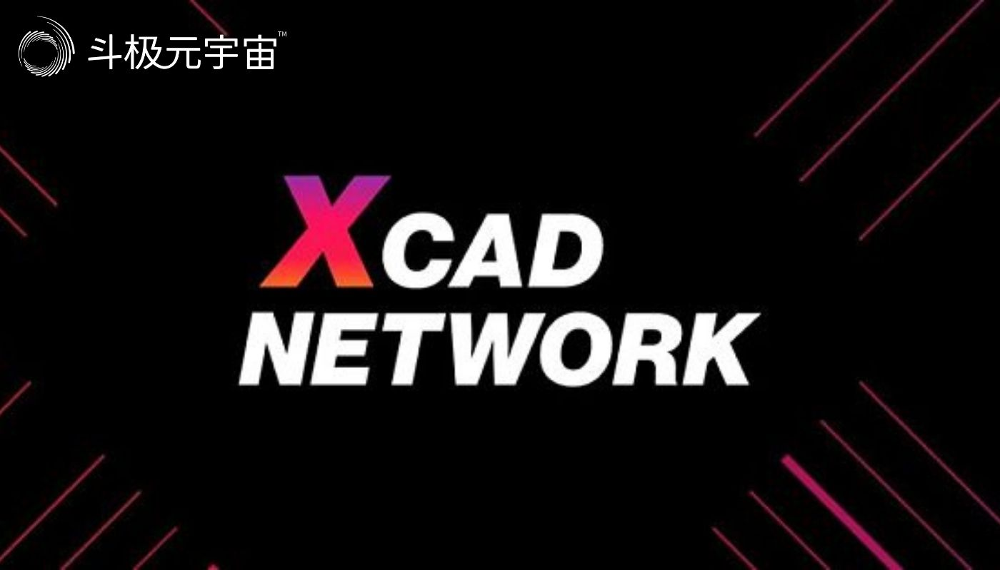

​        创造者经济、新兴的在线趋势和新的加密经济为创造者提供了更多的机会。各种平台、协议和数字市场都在争夺用户的注意和他们提供的创造力。这引领了高度的独立性，尤其是在年轻的数字原生代Z世代之间。加密经济正在塑造下一代创造者经济参与者的未来工作模式。

　　现在有各种各样的“赚”模式影响着用户创造、消费、玩乐、学习、社交和自我定位的方式。尽管所有模型都具有作为新兴经济体背后众所周知的驱动力(3.630, 0.06, 1.68%)的潜在所有权因素，但所有模型的主要目的都是通过将人力投入转化为资本来帮助用户实现货币化。

　　游戏“玩赚”的商业模式已经爆发，这是第一个撼动加密经济的知名的“赚”概念。加密领域中著名的 游戏包括：Axie Infinity、Alien Worlds、RONIN、Splinterlands Hive、Bomb Crypto、Sunflower Farmers、Upland、DeFi Kingdoms等。

　　玩家可以通过参与游戏来“赚取”游戏货币或获得游戏内资产，同时拥有自己的游戏资产的所有权。玩家可以“拥有”和“赚取”在游戏中有价值的东西，如土地、角色、皮肤和游戏内货币。它更像是一种经济而非传统游戏。

　　玩家玩得越多，那么游戏中的资产或代币的使用会获得更多的价值。货币化机会能够激励玩家，无论是原生代币，现有的加密货币，还是正在赚取的NFT都会有激励作用。游戏开发者首次发现了一种与游戏玩家之间的新关系——开发者正在与玩家建立合作关系，因为开发者需要设计能够真正让玩家有兴趣在游戏中投入时间，让他们想要持有有价值的资产并在交易中分配这些资产的“玩赚”经济。

　　开发者可以从游戏中的交易、代币的价值增长，甚至向玩家展示广告中获益。关键因素是注意力。只要玩家投入大量时间，开发者就能够在赋予玩家权利的同时获得利润。

　　在新加密经济中引起轰动的下一个“赚”模式是“动赚”模式，它鼓励人们通过动起来以赚取代币来将他们的健康和体育活动进行货币化。用户可以通过慢跑等体育活动参与来获利，而不是参与游戏来赚钱。这个项目是通过收集数据和身体活动，借助智能手表或智能手机来实现的。

　　可以说，第一款带有激励运动概念的流行游戏是Pokèmon Go，它要求用户必须移动到外面的不同地方，通过GPS追踪和增强现实技术来获取Pokémon。研究表明Pokémon Go让人们平均多走了2000步。

　　通过加密经济，用户能够真正将他们的运动进行货币化。这有点类似于Pokèmon Go以NFT的形式让用户拥有Pokémon的全部所有权，然后他们可以通过交易来获得收益。

　　创立于2018年的Sweat Coin项目是首批利用用户的锻炼向用户支付数字货币的应用程序之一。还有其他流行的加密健身项目也显示出人们对步行、慢跑或跑步赚钱的兴趣日益浓厚。比如Genopets，玩家可以在游戏中收集数字宠物，并在移动过程中获得经验值，这是进一步培养、战斗和进化宠物的必要条件。另一个著名的项目是StepN，许多用户分享了他们的成功案例，比如一天步行可以赚到357美元。

　　Step App是下一个即将推出的健身项目，正在为健身经济创造一个游戏化的元宇宙。FitFi和“move2earn”结合了健身和游戏行业，通过NFT和地理定位（包括用于沉浸的AR），将物理体验与虚拟世界中的数字体验联系起来。Step应用程序会有多个代币，包括FITFI（一个治理代币）和KCAL（获得的游戏内代币）。与STEPN和Sweat Coin不同的是，Step App还宣布计划开发一个软件开发工具包，该工具包为其他人提供在其元宇宙内可以进行构建的工具。

　　总的来说，“动赚”模式通常需要前期投资，即购买一款NFT运动鞋，用于跟踪移动和盈利潜力。用户还可以通过租用NFT运动鞋和与其他玩家分享利润的方式，以更低的成本来利用“动赚”模式。更多关于健康和游戏化的概念仍在发展中，例如冥想赚或睡赚。但究其本质，就是项目能够收集健康数据，并使参与者能够将自己的数据进行货币化。

　　创造者经济正在持续繁荣增长，预计其市场规模为1042亿美元（截至2021年5月）。创作者经济包括内容创作者、策展人、博主、摄像师、视频博主、网红，以及任何其他类型的围绕内容的创作，这些内容通过平台直接或间接地向社区传播。

　　平台的受众和用户，尤其是社交媒体的用户增长迅速，目前全球有超过一半的人（58.4%）使用社交媒体，有46.2亿人使用社交媒体，仅在过去12个月内就有4.24亿新用户上线。这给了创作者更大的机会去接触更多的人，并将他们的内容或创意进行货币化。然而，就像Mario Gabriele所解释的那样，到目前为止平台上还存在着一些不太理想的设置，那就是顶尖的创作者通常不能获得与之匹配的回报。

　　游戏开发者通过为玩家社区创造虚拟体验为像Roblox这样的平台做出贡献，创造者每天在YouTube、Twitter、Instagram、Facebook、Twitch和TikTok上为娱乐社区提供内容——所以许多平台都在利用创造者来吸引用户的注意力，并能够通过广告商将这些用户的关注进行变现。然而，创作者获得的广告收入分成或利润分成很少，他们往往被迫转向赞助，以维持生计。

　　加密经济现在正在为创造者开发激励机制和新机会，以期让创造者可以通过创造性劳动赚取收入。在研究“创赚”模式时，有一种内容特别有趣--口碑内容。这是因为它是一种与品牌相关的用户生成内容（UGC），主要是产品/项目推荐，并让广告商有兴趣直接向使用内容的创作者付费。WOM Protocol 开发了一种代币化的盈利模式，以奖励真实推荐的创作者，并让广告商付费进入该系统。这是通过去中心化的口碑营销活动实现的，它让广告商发现他们的品牌粉丝，用创作者的内容开展活动，或在他们的网站上展示这些推荐以获得社会认可。该协议可以集成到任何网站、平台或应用程序中，目前在BULLZ应用程序中运行，该应用用于处理web3相关的视频。

　　其他激励内容创造的项目，如Audius，用户可以在其中上传音乐曲目，编辑播放列表，赚取AUDIO代币来吸引关注，甚至Reddit也宣布称将会扩大其Community Points加密代币奖励计划参与者，以便他们可以在Reddit应用程序中使用代币来支付会员、小费。

　　当协调更大的去中心化网络时，由于对定性信息的需要，使得评判赚、评价赚和投票赚的盈利模式应运而生。评判任务可以包括策划、风险评估、争议解决、评估、声誉和其他任何主观的任务，在这些任务中，人们充当法官的角色，但集体可以提供相对客观的输出。

　　正如Stephen McKeon所提到的，“我们将会看到主观预言的兴起”，特别是智能合约将需要软信息，而这些信息只能通过人们的判断来传递。

　　包括评判赚/评价赚/投票赚的新兴项目应用：

　　另一个著名的盈利机会是“看赚”模式，即奖励用户的关注，如Xcad Network，当用户赚取了足够的专用代币时便会解锁更多内容，或也可以像Brave那样通过观看广告获得奖励。此外，Coub宣布将重点为其1.05亿用户提供“看赚”奖励。

　　激励人们学习的概念是对传统教育商业模式的一种新的范式转变，传统教育模式主要是“付费学习”，学生必须承担教育成本。然而，领英职场学习（LinkedIn Workplace Learning）最近的一份报告显示，“46%的L&D领导者表示，技能提升或再培训是今年最受关注的领域”，这是由于新的创新和技能推动了对高技能劳动力的需求。

　　越来越多的大公司正在免费提供他们的课程或培训工具。例如谷歌，他们的整套课程可供任何愿意学习的人使用。“免费学习数字技术—是他们宣传课程时用的标语。许多学生学习的动机是为了在就业市场上能更有吸引力，并获得一份有偿的工作。加密行业正在扩大这一概念，通过一种新的“学赚”模式来激励学习，当学生通过学习新东西真正拥有他们所提供的部分价值时，让他们更多地“参与到游戏中”。

　　Seth Godin曾经说过：“互联网是有史以来最伟大的自学资源，但很少有人利用它，因为它没有发动机。”“学赚”模式将通过金钱激励提供这种动力。

　　加密协议愿意直接资助人们的技术学习和入行过程，因为他们需要人才，并证明产品市场适合真正使用他们的协议的用户。RabbitHole是一个帮助用户在完成不同协议/项目的特定任务时获得奖励的项目。通过奖励用户学习新技能，使得他们获得有部分所有权的协议，协议也会通过扩大他们的网络而增加价值，这对双方都是双赢的。现在，就连交易所和价格跟踪服务机构也在考虑通过与加密货币项目（如Coinmarketcap、Coinbase、KuCoin等）合作来促进“学赚”。

　　此外，Animoca Brands还宣布，计划在其价值数十亿美元的NFT和游戏业务中增加教育业务。Siu表示：“随着加密生态系统继续实施赚取奖励的新方法，他希望通过“学赚”或“教赚”模式来推动教师经济，这样教师和学生的时间都可以以代币或现金的形式得到奖励。这也表明他有兴趣找到一种方法来奖励教育者，而不仅仅是学生。

　　随着元宇宙的崛起和实体世界向数字世界的转变，3万亿美元规模的全球时尚产业也不会例外。Gucci、Ray-Ban、Louis Vuitton、Nike、Adidas等许多时尚品牌已经进军NFT领域，推出虚拟可穿戴设备。很快，用户就能在虚拟世界或现实生活中通过增强现实技术来利用数字时尚。

　　在这些环境中穿戴或使用NFT正成为一种即将到来的盈利模式，为NFT提供进一步的用途。每当NFT持有者在虚拟世界或在线游戏中“穿戴”时，他们就会获得奖励。这可能会开启这样一种未来，即品牌将向用户空投虚拟货币，或提供升级道具，或新的限量版本，让用户穿上他们的皮肤或数字收藏品。

　　数字技术与加密经济的结合正在重塑未来的工作。看起来，我们将在零工经济中看到一个多货币的未来，它赋予人们做各种任务和赚钱的能力。是否仍然会有人只为一个组织工作，这可能取决于个人的偏好，但有机会利用多种收入流。

　　我们应该深入研究所有的“赚”模式，并提出以下有效的问题：

　　要有一个明确的价值体系，才能有一个可行的模式。

　　需要有一个明确的“雇主”来拥有一个可持续的模式。

　　有趣的是，“赚”模式是从游戏环境开始的，正如Chris Dixon所写的那样，“下一个大事物开始时看起来像一个玩具。”

（免责声明：本文转载自其它媒体，转载目的在于传递更多信息，并不代表本站赞同其观点和对其真实性负责。请读者仅做参考，并请自行承担全部责任。）