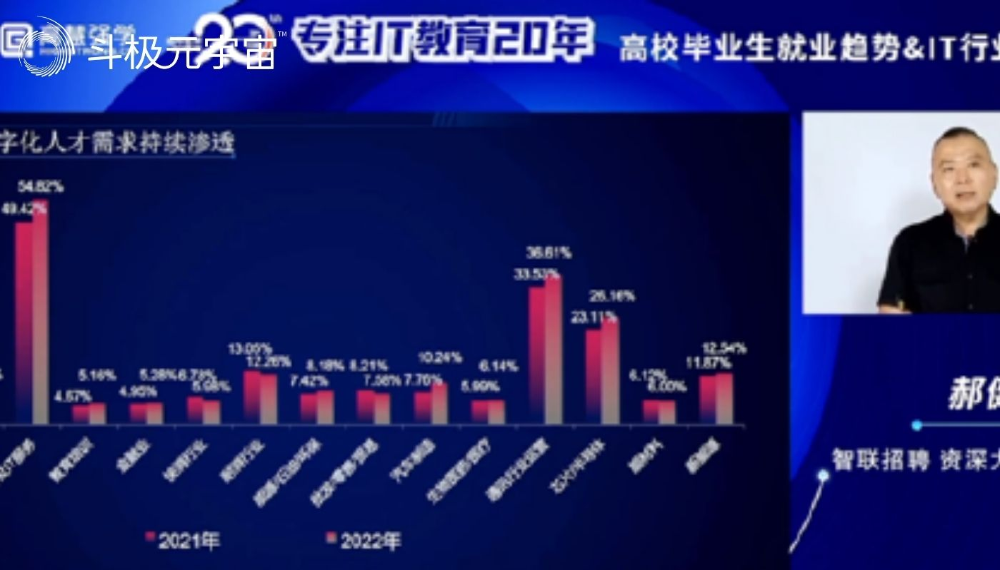
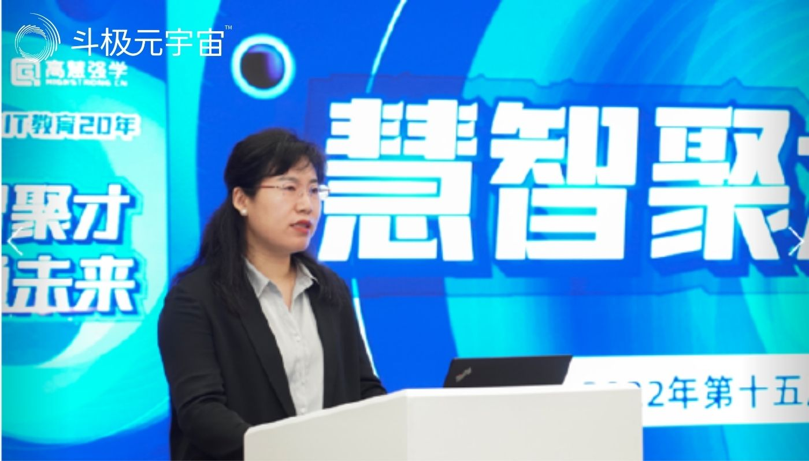
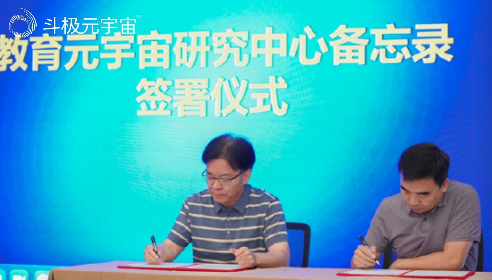
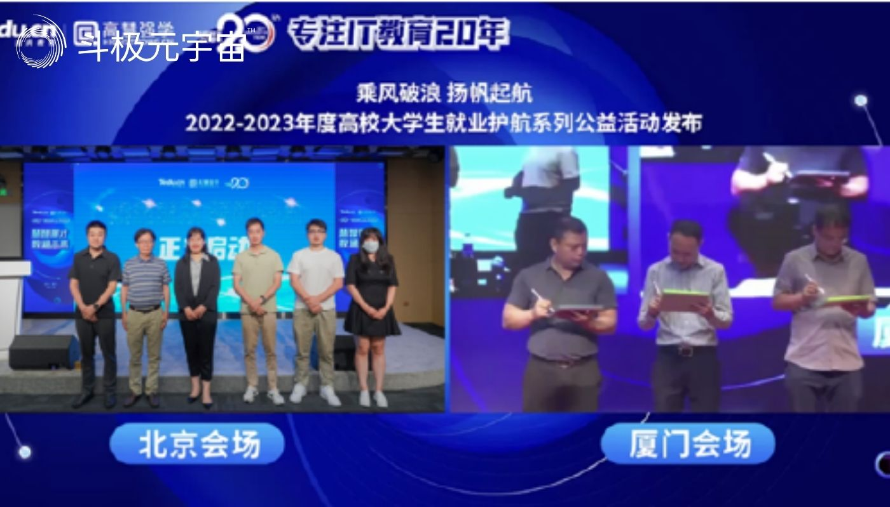

​        “产教融合，是职业教育的最高境界。”

　　8月7日，以“慧智聚才，数通未来”为主题的2022年第十五届达内·高慧强学校企合作高峰论坛在北京举行。本次论坛旨在探索产教融合新模式，构建协同育人新机制，助力高校搭建高质量教育体系，为数字经济时代的高质量发展提供应用型、复合型人才支撑，助力高校育千万人才。论坛上，达内教育发布“元宇宙产业学院”方案，探索产教融合新方向，为高校更多赋能。

　　达内教育集团创始人、董事长韩少云在致辞中表示，人才教育、人才输送、软件开发是达内教育的定位，帮助年轻人找到一份好工作，缔造年轻人的中国梦，是达内教育的使命。

　　**技能/研发类岗位增长快，数字化人才缺口大**

　　在国务院新闻办举行的2022年上半年国民经济运行情况新闻发布会上，国家统计局公布6月份全国城镇调查失业率为 5.5%，环比下降了 0.4 个百分点，但16-24 岁青年群体调查失业率高达 19.3%；智联招聘发布的《2022年二季度高校毕业生就业市场景气报告》显示，2022 年二季度高校毕业生 CIER 指数为 0.53，降至 2020 年以来最低点，并低于全国同期 1.35 的水平……高校毕业生等重点群体的就业问题十分严峻。

　　智联招聘资深大数据分析师郝健介绍，求职难和招聘难并存、招聘需求与薪酬向研发及技能人才倾斜、新兴产业重构人才需求、城市人才战转向城市群争夺是目前高校毕业生就业市场的四大趋势。

　　“互联网领域虽然释放的职位对比往年有所收缩，却依然占据了IT产业招聘市场41.53%的比例。有赖于产业数字经济的持续发展，计算机软硬件及IT服务、通信、芯片/半导体、新能源等领域都亟需数字化技术人才。”

　　郝健介绍称，架构师、算法工程师、语音/视频/图形开发、机器学习、C++是“IT行业招聘典型职位发布年薪”的前五名。

　　谈及数字化人才的缺口问题，中国软件行业协会副秘书长杨菊在致辞中提及，助力产业的持续发展，让数字化人才的精准到位，离不开政府升级就业政策引导、企业更新校园招聘模式、高校强化人才培养和就业服务、平台持续链接企业和高校资源，以及专业培训机构对教学模式的升级。

　　就业是关系国计民生的大事，大学生需要打造“就业核心胜任力”以适应新时代的要求。达内成立了专注服务产教融合的专业机构高慧强学，为高校赋能，帮助高校优化课程体验，共建产业学院，持续探索数字化时代下新技术人才培养之道。

　　“我们比产业更懂教育，比高校更懂企业，将先进技术转化为优质教学资源，构建产学研用生态圈，帮助毕业生和学员实现高质量就业。”达内教育集团校企合作中心总经理高玮表示。

　　成立二十年来，达内教育已经发展成为一家覆盖IT及互联网职业赋能、产教融合、校企合作等多个领域的综合性教育集团。面向学员，达内教育输出一体化培训与服务，面向企业，提供一体化人才综合服务，面向高校，则提供一体化人才定制培训与就业输送。

　　就业，是职业教育的核心目标，促进计算机专业应届生就业，助力非计算机专业应届生“转码”，促进教育公平，帮助毕业生高质量就业是达内教育始终坚持的使命，达内学员毕业三个月就业率80%，毕业六个月就业率90%。

　　据山西农业大学软件学院院长李富忠介绍，2015年至今，山西农业大学软件学院已累计有780名学生，通过达内名企定制实训实现高薪就业，就职于国内、国际知名企业、国企及快速发展企业，其中年薪20万以上占比5%，年薪15-20万占比20%，年薪10-15万占比65%，年薪8万以上占比10%。

　　目前，达内教育已经与1200所高校建立合作关系，与128所高校共建IT专业，与30所大学共建人工智能学院，合作企业数量超过20万，每年至少17000名学员被定制企业录用，连续4年累计19867家企业订单量，定制岗位20万个。

　　除了与高校共建人工智能学院外，近期，达内教育也在紧跟趋势，积极探索元宇宙科技，将元宇宙人才的培养提上日程。

　　**产教融合新方向，达内发布“元宇宙产业学院”方案**

　　当下，元宇宙之风席卷全球，IEEE最高董事会候任董事、IEEE标准协会候任主席、元创盛景联合创始人袁昱以及盛景嘉成管理合伙人、元创盛景联合创始成员王湘云均提及，多家海内外互联网龙头企业已经成为掀起元宇宙革命浪潮的“排头兵”，教育也成为元宇宙初始阶段主要的应用场景之一，高校则是元宇宙的参与和应用者，同时肩负着培养元宇宙人才的责任和使命。

　　达内教育始终关注技术发展趋势，基于20年在IT领域的教研、教学、技术、项目、以及服务的积累，面向高校提出了“元宇宙产业学院”的建设方案，从培养元宇宙人才、建立元宇宙教育中心、元宇宙专业升级等角度，为高校持续赋能，期待与更多高校展开合作。

　　达内教育集团技术研发副总裁兼AI研究院院长郑政介绍表示，元宇宙不仅仅覆盖以技术为基础的计算机、软工等工程学院，同样也覆盖多媒体、网络运营、直播电商等不同领域和学科。自2016年开始，达内教育就开始关注并建设元宇宙相关课程的设计及研发，例如人工智能学院孵化出了各方向的专业解决方案，包括计算机视觉实验室、语音识别实验室、VR/AR实验室等，基于IT学院，达内教育可以提供大数据、云计算、物联网等高校专业共建方案，还有诸如数字媒体和直播电商、电子商务等解决方案。

　　人才的培养需要时刻贴合市场需求，达内教育从产业链出发，聚焦元宇宙技术核心、内容设计、应用服务领域，培养元宇宙人才。经过市场调研，达内教育刻画出了元宇宙不同工作任务下的岗位群，包括算法、系统、开发、场景搭建、营销等，并将这些岗位一一映射到高校的专业。

　　“达内元宇宙产业学院方案是行业唯一，产品是完全解耦的，针对不同院校的需求可以进行高度定制化开发，可大可小、灵活性强。”郑政表示。

　　现场，达内教育集团创始人、董事长韩少云，北京清博智能科技有限公司CEO郎清平与盛景嘉成管理合伙人、元创盛景联合创始成员王湘云共同签署了“教育元宇宙研究中心备忘录”，未来，三方将共享元宇宙领域的科技与人才。

　　在论坛尾声，达内教育还发布了“乘风破浪、扬帆起航——2022-2023年度高校大学生就业护航系列公益活动”，北京与厦门会场同步举行启动仪式，该公益活动致力于通过云端双选会、职前培训、心理辅导、学生创新创业等维度，对接更多优质资源，帮助毕业生实现“就好业”、“能就业”。

　　未来，达内教育集团还将与高校、产业、企业的生态合作伙伴一起，提升人才精准教育程度，共同为中国年轻人的就业构建良性的环境，让数字化的应用型、复合型人才真正融入到数字化产业的发展、进阶中。

（免责声明：本文转载自其它媒体，转载目的在于传递更多信息，并不代表本站赞同其观点和对其真实性负责。请读者仅做参考，并请自行承担全部责任。）