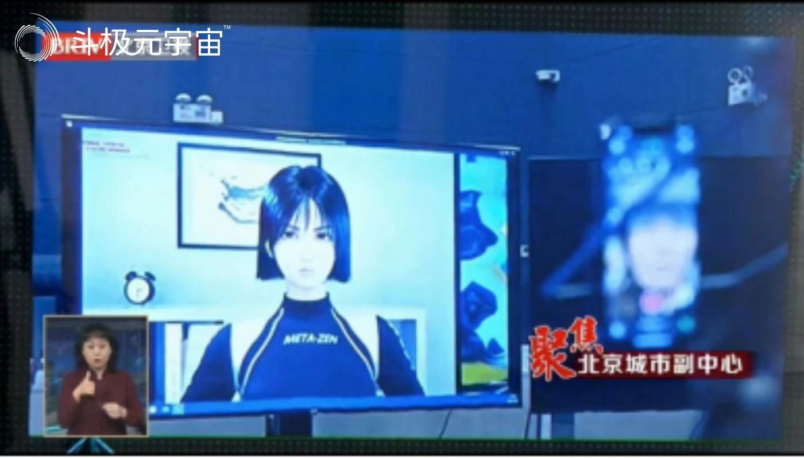

8月9日上午，北京市委书记蔡奇到北京通州区调研走访元宇宙应用创新中心，了解元宇宙产业发展情况。调研过程中，蔡奇书记仔细听取了天娱数科（002354.SZ）旗下元境科技虚拟数字人项目发展情况。蔡奇书记强调，要发挥头部企业带头作用，加强核心技术攻关，投放更多应用场景，推动元宇宙产业聚集发展。

元境科技集中展示了基于Web3.0的虚拟数字人前沿创新技术应用成果，对虚拟人实时互动、虚拟数字人直播应用等技术与场景进行了逐一介绍。

就在近日，北京出台国内首个数字人产业专项支持政策《北京市促进数字人产业创新发展行动计划(2022-2025年)》。计划提出，到2025年，北京市数字人产业规模突破500亿元。

《行动计划》抓住以数字人为代表的互联网3.0创新应用产业机遇，全方位推动数字人技术突破、应用示范和产业聚集，从构建数字人全链条技术体系、培育标杆应用项目、优化数字人产业生态等方面为支持数字人产业发展提供了指引。

作为天娱数科在虚拟数字人领域孵化的技术企业，元境科技汇集了一批计算机图形图像、计算机视觉、机器学习等领域的领军人才，拥有全球顶尖的动态光场扫描、动作捕捉系统以及三维重建算法、无标记点视觉捕捉、AI语音驱动等前沿技术，打造了面向全真互联网的虚拟数字人生成系统与应用平台。致力于突破现有传统虚拟数字人生产制作流程，实现虚拟数字人“低成本、短周期、批量化”生产与“超写实、沉浸式”实时互动，致力于以现实为基础，以数字技术为能力，让互联网更真实。

未来，元境科技将坚持发挥头部企业带头作用，积极探索虚拟数字人技术自主研究，加强底层技术研发攻关，为打造全球领先创新高地汇聚力量。

（免责声明：本文转载自其它媒体，转载目的在于传递更多信息，并不代表本站赞同其观点和对其真实性负责。请读者仅做参考，并请自行承担全部责任。）