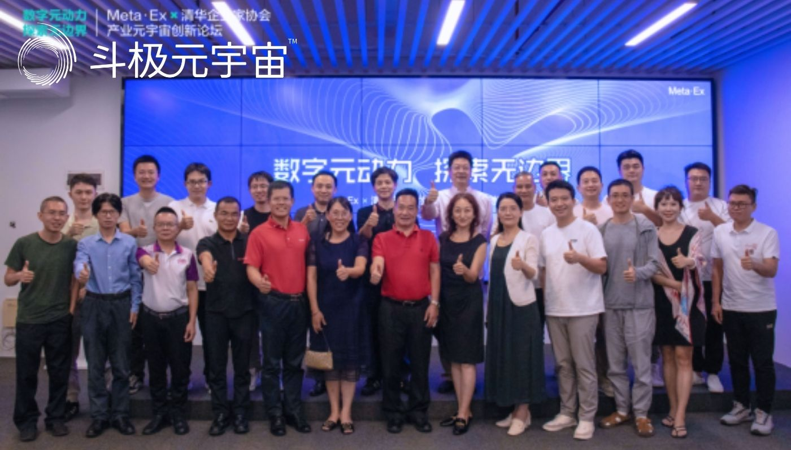
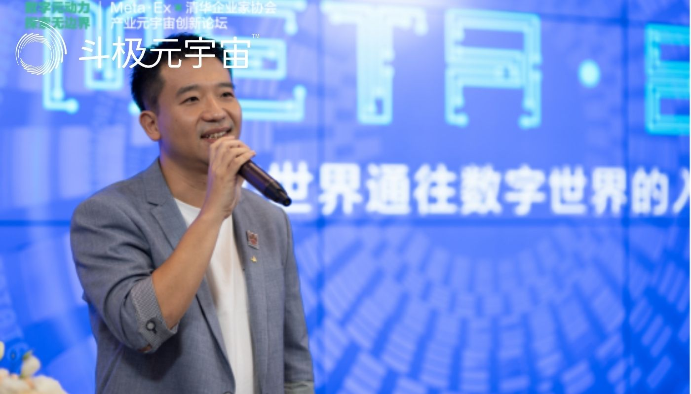

2022年8 月 6 日，由Meta·Ex和清华企业家协会联合举办的“数字元动力，探索无边界”产业元宇宙创新论坛在佛山三龙湾三山科创中心圆满落下帷幕。Meta·Ex品牌共建人孟虎、正东集团董事长周新东、正东产投总经理陈晓可，以及二十多位来自各行各业的清华企业家协会成员企业家荟聚一堂，共同开展了一场关于“产业元宇宙”的风云对话，呈献了一场精彩绝伦的“元宇宙+”思想盛宴。

家协会全球副主席、行业委员会总召集人兼Meta·Ex品牌共建人孟虎总的带领下，清华企业家协会一众企业家嘉宾参观了Meta·Ex的「元宇宙体验中心」。

参观的过程中，嘉宾们体验了元宇宙虚拟现实交织的技术创新魅力，并对其中所展示出的行业应用场景展示出浓厚的兴趣。该体验中心集空间定位体感设备、12K环绕屏、智能中控系统、多屏交互内容融合引擎、数字人定制开发于一体，为观看者创造出一个全新的数字创意“沉浸式”场景。

Meta·Ex持续专注于元宇宙创新技术开发，秉持“做有价值的事业”之初心，旨在通过数字科技赋能中小型企业，为制造业等传统型企业解锁新的营销利器，解决传统企业在终端销售、传播等方面的困境。

清华企业家协会的会员均是活跃于各行业的领军企业创始人、投资人。他们引领TMT、半导体、人工智能、生物医药、区块链、新媒体等高新行业的发展趋势。协会成员企业获得大多数知名VC/PE投资，近100家成员企业成功上市国内外资本市场，其创办或管理的上市公司市值总和超2万亿人民币。

本次活动荟萃Meta·Ex和清华企业家协会两大科创机构的行业菁英，旨在融合双方在高新行业的科技研发创新实力，采用开放、共享的模式，合力构建大湾区元宇宙联合协同创新平台，打造大湾区元宇宙生态系统和创新资源的集聚中心。

论坛一开始，专注于元宇宙和双碳新能源赛道的VC投资人、Meta·Ex品牌主理人陈晓可，向论坛嘉宾讲述了Meta·Ex诞生的背景和故事。

Meta·Ex从“展示”角度切入，力求打破物理边界，将虚拟世界的技术应用在现实世界。通过旗下“元·空间、元·世界、元·宇宙”虚拟现实展厅系列产品，以数字创意为核心，创造一个全新的数智营销新场景，让制造业等传统企业更快、更好、更广泛地“被看见”，从而解锁元宇宙时代的营销新玩法。

紧跟着，Meta·Ex品牌共建人孟虎上台致欢迎词并发表了题为《创业路一场修行》的演讲。作为连续创业者，孟总借用“西游记创业团队”的角度审视了经典创业团队的能力结构和抉择方向。同时也表达出，创业是一种人生状态，创业可以改变世界的执着和情怀。

接下来，上海利驰软件有限公司董事长令永卓作为大咖分享嘉宾，为大家呈上了《2B程序猿创业记》的精彩演讲。讲话从数字革命驱动产业重构和智能化、数据资产模型、创业独门秘籍等精彩视角分享了他从一名程序员到创业者的经历和创想。

本次创新论坛采用线下演讲及互动论坛方式，20+清华企业家协会的行业大咖巅峰对话，畅所欲言，各种观点碰撞，思想灵感的火花四溅。元宇宙新技术、新场景、新应用创造出新模式、新机遇，即将翻起信息技术革命的新一轮浪潮。

论坛上，围绕元宇宙发展阶段嘉宾们分别从「元宇宙起源篇」、「元宇宙万花筒」、「元宇宙我来也」三个话题维度深刻剖析了当前元宇宙的发展现状、特点以及应用前景;深入探讨当下元宇宙如何突破游戏和社交的需求圈层，进一步赋能产业升级，优化新型基础设施等问题;并针对元宇宙新营销场景、新商业及消费模式等热点展开热烈讨论，同时都纷纷对元宇宙的各领域应用前景充满了信心。

通过本次创新论坛激发出的元宇宙数字技术及产业维新破局思维，我们可以预见元宇宙在社会建设、产业跃迁、消费模式等方面的巨大价值：元宇宙带来了新型基础设施优化升级的历史性机遇;产业元宇宙将成为传统产业升级的新引擎;而元宇宙的创新应用必将催生出全新业态!

（免责声明：本文转载自其它媒体，转载目的在于传递更多信息，并不代表本站赞同其观点和对其真实性负责。请读者仅做参考，并请自行承担全部责任。）