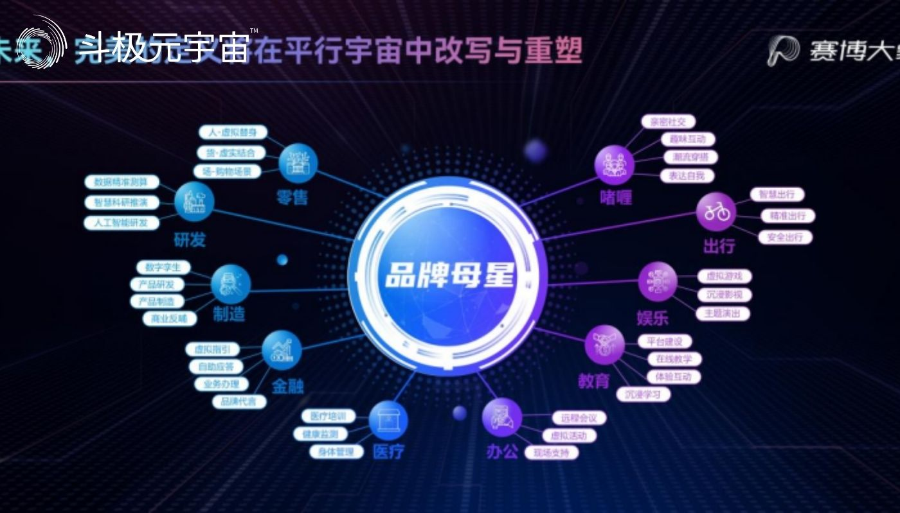

​        2022年中国广告论坛于8月3日在“冰城”哈尔滨开幕，与会嘉宾围绕新形态下的数智广告，元宇宙的实践与探索等重点内容进行深入探讨。一点资讯作为主要企业代表受邀参加主论坛演讲，并分享了集团在元宇宙领域的创新探索经验成果。

　　基于人类现实世界的无限智展，元宇宙穹顶之下，无数平行宇宙的价值展现正在为我们打开更多想象力的盒子——不同的虚拟平行宇宙中，人类将实现社交、娱乐、出行、医疗、教育、办公、金融、制造、研发、零售等各个现实社会领域的科技加持和商业版图延展。

　　对此，一点资讯CEO金治发表《Meta Imagination－下一个宇宙的想象》主题演讲。他表示，一点资讯在战略升级为赛博大象集团后开始积极探索为各行业品牌提供人与数字世界场景交互的“赛博星云”全景服务解决方案通路，通过对当下热门社交产品“啫喱”的核心技术与服务能力输出和空间拓展，打造“平行宇宙”商业版图的超级智造工场。

　　**不止啫喱，在元宇宙开拓一片“赛博星云”**

　　在虚拟空间里，人类可以“梦想成真”。这样的产品，你是否愿意将它带到现实世界中？

　　实际上，它已经被创造并应用于社交领域。

　　作为赛博大象集团在元宇宙社交领域的“探索号”，啫喱定位于“你和密友们的虚拟线上公寓”的全新超熟人社交产品，打造与好朋友的“秘密基地”，在啫喱展示真实的自己。包括人民日报等权威媒体，肯定了啫喱在元宇宙领域的探索，社交形态的创新的努力，并给予很高期待。援引人民日报文章内容，“啫喱能够一炮打响，与其产品有个性、很时尚，定位准确有关，也与其善于借力打力、找到精准突破口有关，故而能深度‘俘获’用户。”

　　金治在现场展示了啫喱的产品功能及亮点，他透露，产品在今年上线之初就在国内掀起了一阵关注风潮，不到三周便登顶 App Store榜单第1位。在当前年轻人心目中，啫喱已经成为潮流的代名词，纷纷进行二次创造和主动传播。“以‘重新定义自己，打造全新的数字世界’为愿景，啫喱在社交元宇宙的征途已正式起航。”

　　金治透露，除了日臻成熟的本土产品打磨，啫喱还在加速全球化市场拓展进程，目前已在北美组建了数百人的研发中心，同时，欧洲及日韩等新兴市场也在积极拓展中。

　　“作为一家汇聚信息流、社交场景、娱乐场景、内容生产等多方位矩阵力量为一体，以技术驱动的互联网科技公司，赛博大象集团的使命是致力于创造多样、丰富、有价值的生活”，金治介绍，目前集团麾下已成熟的产品在各自的行业领域均有所建树：一点资讯作为一款高度智能的强媒体属性内容分发平台，致力于持续不断输出品质内容；龙图游戏作为中国业内领先的游戏集团，打造的多款游戏丰富了更多用户的生活……依托于“赛博星云”，赛博大象正在以科技的力量重新定义自由的想象。

　　而未来远不止于此，在元宇宙，完美画面正在徐徐展开，其定义将在平行宇宙中完成改写与重塑。

　　**赛博大象：挖掘元宇宙万亿市场价值空间**

　　霍金在《时间简史》中描述，宇宙不应该也不会只有一个，多个平行宇宙的叠加与并进，才能承载人类乃至于这个世界的想象力。对此，金治认为，在元宇宙的空间之中，我们将开创一种全新的驱动模式，在此基础上，价值将在交互中被重新定义，全新的数字世界和经济系统中的价值将被无限激发。

　　数据正在印证这一预判。

　　近日，Facebook母公司Meta委托国际经济咨询公司Analysis Group编写的元宇宙白皮书预测，到2031年，元宇宙将会为人类社会带来超过3万亿美元的GDP增长，其中三分之一来自亚太地区。

　　金治认为，元宇宙概念与广告业的深度融合优势正在逐渐展现，而“表达营销”将成为未来品牌传播的一个新趋势。“数字世界是物理世界的映射，在元宇宙里，包括但不限于人物的服饰妆容、品牌的动静态展示等特征都有机会在场景中被更为直观地表达。在为客户量身打造的3D虚拟场景中，可以展现出更加多元的营销要点”。

　　通过在元宇宙社交领域的涉足实践，赛博大象也捕捉到了更多元宇宙商业市场需求亟待满足的强烈信号。从宏观角度来看，市场参与者都需要进行数字化转型，需要相关服务；在趋势表达方面，需要对现有的商业场景、交互场景进行数字化升级，创造新的转化路径及技术逻辑支撑服务。而最为现实需求是，将落后时代的商业场景进行元宇宙概念的转型和呈现，需要有相关服务。

　　对此，金治解释，集团通过产研、交互、运营、转化的一系列链路打通，能够为更多行业领域的合作伙伴提供诸如智慧城市、数字文旅、虚拟社交、互动游戏、数字藏品、服贸展示、汽车智造等不同场景的定制化虚拟空间的搭建服务，同时，通过交互玩法升级增强用户黏性，通过社群化运营完成关系沉淀，通过经济体系构建达成资产流通，搭建为用户带来沉浸消费体验的一站式元宇宙数字转型解决方案。

　　金治总结，未来，随着更多的品牌、企业和个人进入元宇宙世界，集团也将围绕赛博大象“品牌母星”，通过对啫喱核心交互技术的实践与全景方案优化，扩大社交、娱乐、出行、医疗、教育、办公、金融、制造、研发、零售等各个现实领域的商业服务版图，通过全景定制，拉升品牌的认知度、美誉度和忠诚度以及用户互动体验观感和用户活性，也为企业的数字资产商业变现提供了更多可能。

（免责声明：本文转载自其它媒体，转载目的在于传递更多信息，并不代表本站赞同其观点和对其真实性负责。请读者仅做参考，并请自行承担全部责任。）