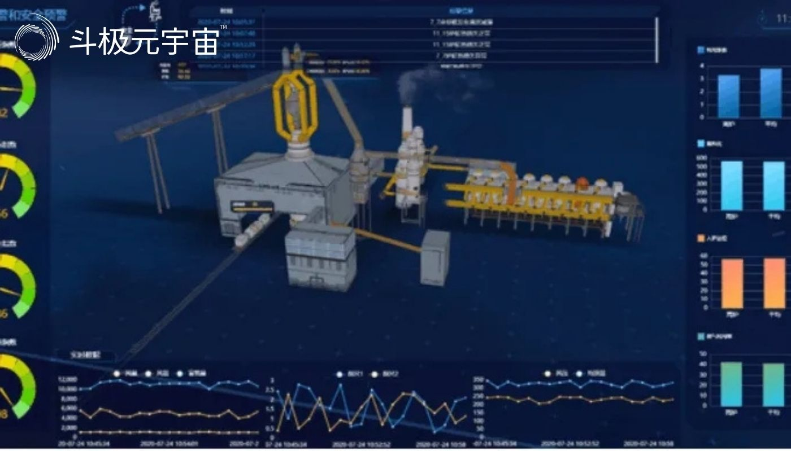

工业元宇宙是将虚拟融合进现实，覆盖工业生产研发、生产、营销售后等全流程，最终实现形成全新的制造和服务体系，达到提质增效的效果。8月11日，央视财经频道“正点财经”栏目聚焦工业元宇宙，探秘杭州灵伴科技AR智能头盔在宁德核电的应用场景。

作为全球首座AR智能核电站，宁德核电站使用工业AI+AR智能解决方案服务商杭州灵伴科技自主研发的一体式工业 AR 头环Rokid X-Craft配合企业工作流服务平台及专家协作服务平台，充分赋能检修作业，打造“现场工程师+远程专家”协同的智慧检修模式，有效提升了设备维检水平和工作效率。

中广核福建宁德核电有限公司董事长田辉宇说道：“AR智能头盔使我们单项工作的人力成本降低了50%，现场综合工作时长降低了35%，另外，因为可以实时地收集工作全过程的数据上传到数据库，对未来维修管理的策略方面有很大的帮助。”

相关数据显示，到2025年，工业元宇宙将催动全球智能制造市场规模突破5400亿美元，2021至2025年复合成长率将高达15.35%。

杭州灵伴科技联合创始人向文杰对央视记者表示：“工业元宇宙目前已经应用到电力、石油化工、汽车、医疗等众多行业，因为每个行业的应用场景不同，所以在技术上也有不同的要求，比如危化品行业作业环境极其危险，所以需要产品设备具备防爆、防水、防腐蚀等多个工业防护功能；医疗行业作业因为环境复杂，不能给医护人员增加负担，所以会在产品轻量化上有更多的考量；还有不同场景比如说透光度的选择，语音交互噪音环境的考虑等等，这些都是需要解决的问题。”

杭州灵伴科技本着“leave nobody behind”的初心，坚持元宇宙技术本质是服务于人类的，工业元宇宙的应用突破了工人在工业领域个人能力的天花板，同时降低入门门槛，打造“超级工人”，这是一项非常有社会意义的事，对此，杭州灵伴科技一直深信不疑。

（免责声明：本文转载自其它媒体，转载目的在于传递更多信息，并不代表本站赞同其观点和对其真实性负责。请读者仅做参考，并请自行承担全部责任。）