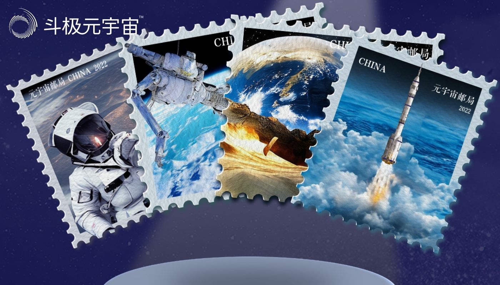

数字化时代,中国邮政为邮票收藏爱好者开拓了全新的集邮方式。7月30日,中国邮政在线上宣布成立全球首个元宇宙邮局,并发布基于百度文心大模型打造的首套AI“航天主题”邮政数字藏品。

元宇宙邮局是中国邮政北京市邮政电子商务局成立的数字化虚拟邮局,并且通过数字艺术创作、产品数字化等融合发行邮政数字藏品。元宇宙邮局成立后,将推出邮政特色数字化服务,比如此次通过百度文心大模型等AI技术为中国邮政系统发行的“数字邮票”。

“数字邮票”与航天主题的结合,意义深远。人类对地球外领域的探索之路在创新与坚持中不断前行,百度AI技术也在宇宙探索支持上持续加码。2021年,百度成为“中国探月与航天工程人工智能全球战略合作伙伴”;不久前,百度携手中国航天发布全球首个航天领域大模型——航天-百度·文心大模型。同为科技赋能,此次利用创新AI技术围绕“航天主题”展开内容创作,是向中国航天科学家的致敬。

以百度文心大模型为技术支撑,中国邮政元宇宙邮局打造了全球首套8款AI“航天主题”邮政数字藏品,图案名称分别为《火箭腾飞》、《太空机械臂》、《地外探寻》、《太空漫步》、《实验飞船》、《卫星入轨》、《深空探索》、《火箭发射塔》,呈现航天领域典型场景。

中国邮政元宇宙邮局是AIGC与邮政特色数字化服务美妙结合的一个典型案例。未来,基于中国邮政元宇宙邮局,百度和中国邮政将围绕AIGC、数字人和元宇宙技术等方面开展持续合作,持续打造优质丰富的数字内容,为数字经济贡献更多AI力量。

（免责声明：本文转载自其它媒体，转载目的在于传递更多信息，并不代表本站赞同其观点和对其真实性负责。请读者仅做参考，并请自行承担全部责任。）