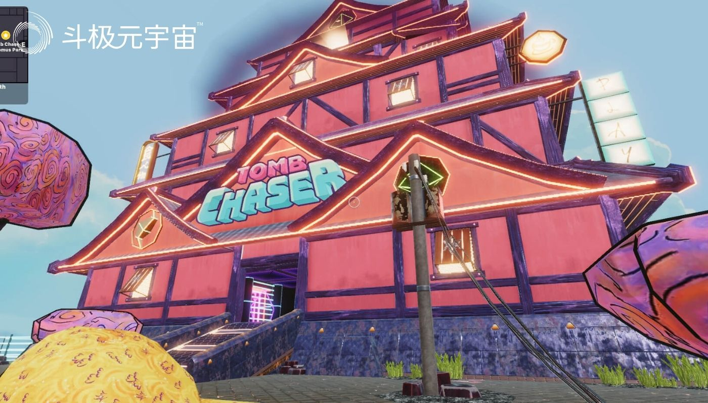

曾经炙手可热、如日中天的元宇宙“虚拟地产”，正遭遇“人人喊打”的尴尬局面。

这不，美国亿万富翁、NBA达拉斯小牛队的老板马克·库班（MarkCuban），前两天就跳出来，把虚拟地产大肆批判了一番，引起国外虚拟投资界的一片哗然。

库班宣称：**“最糟糕的是，人们在这些地方（虚拟地产平台）购买房地产，这是有史以来最愚蠢的事情。”**

图 | 热衷NFT投资，但反对“虚拟地产”的马克·库班

值得注意的是，早年靠互联网浪潮白手起家的库班，并非是那些对元宇宙这种新鲜事物看不惯的“老派”。恰恰相反，**他本人对加密货币、NFT和Web3都极为追捧。鼎鼎大名的“无聊猿”系列，背后的投资者之一就是库班。**

“无聊猿”背后的团队YugaLabs此前成功拍卖了元宇宙Otherside中超过5.5万个虚拟地块NFT，包括库班在内的一众投资者也因此赚的盆满钵满。但库班并没有因此而肯定虚拟地产的价值：“尽管他们（YugaLabs）赚了很多钱，**但我认为这很愚蠢，你们称之为虚拟地产的事物其实只是一种访问权。**在物理世界中，房地产是有价值的，因为土地是一种稀缺资源。然而，这种稀缺性并不一定适用于元宇宙，毕竟在这些虚拟世界中，你可以创造无限量的房产。”

虽然马克·库班的话在“虚拟房产”一路下行的态势中颇有“马后炮”的嫌疑，但看衰“虚拟地产”的也绝非他一人。早在去年，“红衣教主”周鸿祎就曾放言称元宇宙不值得炒作，也不值得投资。

科幻作品《雪崩》给业界送来了“元宇宙”概念。但作为“底层建筑”之一的“虚拟地产”，却似乎正像如期作品名一样，正处在前所未有的危机之中。

一、虚拟地产，究竟是个啥？

对不少国内的投资者来说，“虚拟地产”仍然是个新鲜事——尽管在大洋彼岸，不少投资者已经因其而感受到了人生的大起大落。

**如果从技术角度来说，“虚拟地产”实际上可以与非同质化代币(NFT)划等号。**目前主流的六大“虚拟地产”平台（Decentraland、TheSandbox、Voxels、SomniumSpace、NFTWorlds和SuperWorld），均依靠以太坊生成。通常平台中的每个地块都是一个NFT，而地块的价格则由平台的原生代币计算。

图 | “虚拟地产”平台Decentraland

作为最朴素的元宇宙价值观，把现实世界的一切复制到虚拟世界，是最基础也是最重要的任务。因此，虚拟地产/房产可以简单理解为虚拟世界中的数字地块和建筑，主要用于品牌展示、娱乐和举办会议等用途。

**值得注意的是，尽管不同的平台所拥有“地块”的数量并不相同，但大多数平台都强调“稀缺性”的确存在。**像Decentraland平台的创始人Sugarman就曾就对外界表示：

> "因为Decentraland是一个岛，或者说是一个社区，如果要开放新的地产，必须通过所有的货币持有者以及所有的地产持有者投票，表示他们同意这样做。社区不会希望我们损害我们的价值、我们的地产和货币，所以我相信这种情况基本不会发生，除非有使我们都能受益的绝佳理由。"

**但是，至少从技术角度来看，一个无可争议的事实是“虚拟地产/房产”本身并不具备稀缺性——因为元宇宙并无边界，虚拟土地可以无限制的扩展，因此存在无数的虚拟房产。**

也成因为如此，“虚拟地产”的价值走向与现实世界中的地产价值取向并不完全相同，而是更多受到投资者的主观判断影响。信心，成为了影响市场走向最关键的一环。

二、大起大落，虚拟地产迎来“至暗时刻”

2021年，元宇宙的飓风汹涌而来，也带火了“虚拟地产”。以Decentraland和TheSandbox为首的六大平台迎来了海量关注，从大厂到明星，从投资者到投机者，无不希望在这场盛宴中分一杯羹。一时间“地王”频出，大量的购买需求推升了“虚拟地产”的整体市场价值。

像香港房地产巨头郑志刚就豪掷500万美元拿下了The Sandbox其中的“一片地”；华纳音乐、阿迪达斯、Gucci和汇丰银行等商业巨头企业也纷纷入局，巴巴多斯甚至还在Decentraland开设了世界上第一个元宇宙大使馆。

就连歌手林俊杰，也忍不住投资了12.3万美元（约合人民币78.3万元）在Decentraland置办了3块“地”。

**但伴随着比特币自去年11月以来的一路向下，“虚拟地产”也开始风光不再。**记者注意到，尤其在Luna币于今年年中“暴雷”后，整个加密市场信心遭遇重创，连带着“虚拟地产”一起迎来跳水。

据分析机构WEMETA的数据分析显示，六大虚拟地产交易平台无论从平均价格、交易频次还是交易总量上都迎来暴跌：从去年11月至今年8月初，六大平台的交易量从10亿美元滑落到1.57亿美元，下降比例为84.3%；从今年1月到8月，平均交易价格从17000美元/每块，下降到2500美元/每块，下降了85%。**就连去年层出不穷的“地王”，其记录仍然停留在今年2月份戛然而止。**

结合单价下跌和加密货币的不景气，林俊杰此前投资的三块“地”价值已回落至3.75ETH、3.71ETH和2.5ETH，总计约1.6万美元，浮亏高达86.5%。相比常说的腰斩，这已经算是斩到脚踝了。

三、元宇宙信心还在，虚拟地产的故事仍有望还在延续

尽管如此，但元宇宙整体向上的态势，还是让一些研究机构表示了对未来的乐观估计。

Brandessence research认为，结合过往的优异表现和NFT未来的发展前景，“虚拟地产”市场在2022~2028年这段时间内，其复合年增长率有望超过31.2%。

**值得注意的是，在投机者伴随着“退潮”逐渐离开“虚拟地产”后，真正的价值也变得逐渐清晰。**记者注意到，目前“虚拟地产”也正不断受到艺术家这个群体的欢迎。用来举办画展和销售加密艺术品的“加密画廊”，正逐渐成为平台中数量最多的场馆。而像游戏、商业和展会等功能，也正慢慢“出圈”，从小众逐渐走向大众。

不破不立，元宇宙第一波浪潮已日益平稳，大量抱着投机心态的玩家也开始退出。可以确认的是，只要元宇宙的逻辑仍然被认可，那么“虚拟地产”的故事总会有人愿意聆听。

（免责声明：本文转载自其它媒体，转载目的在于传递更多信息，并不代表本站赞同其观点和对其真实性负责。请读者仅做参考，并请自行承担全部责任。）