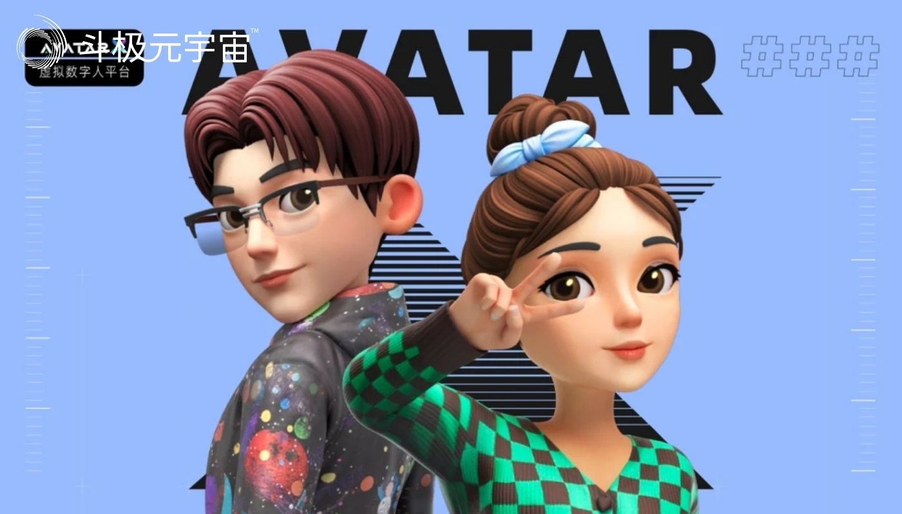

8月10日，2022世界元宇宙生态博览会在广州正式开幕，这场为期3天的数字盛会上，元宇宙相关支撑性技术/产品/基建、虚拟人、3D可视化、数字孪生、虚拟展厅、三维建模、虚拟仿真、智慧城市、虚拟看房、AR头显、云平台技术、智能系统、数字展示技术及设备等备受关注。数字技术引领下的新场景和新应用纷纷亮相，吸引了众多观众到场逛展，共同见证一个个“突破次元壁”的元宇宙新物种诞生。

本次博览会将探索元宇宙产业未来发展趋势、生态建设以及落地应用场景，是打造我国元宇宙资源超级连接器及展贸窗口。同期，2022万人盛典颁奖大会也于8月10日，在广州中国进出口商品交易会展馆B区11.2馆论坛区域举行，奖项覆盖VR/AR/MR/XR、数字创意、数字展陈、数字文旅、数字运动、数字艺术与沉浸式空间场景设计等多个领域。会上，**相芯科技一举揽获三项大奖，分别是“元宇宙VR/AR/MR/XR领军企业奖”、“元宇宙交互技术奖”、“元宇宙产业应用奖”**。

此次世界元宇宙生态博览会上，相芯科技携“AvatarX智能虚拟人平台”亮相，还集中展示了虚拟数字人的行业解决方案——AI虚拟助手解决方案、AI虚拟主播解决方案、虚拟直播带货解决方案和AR视频特效等产品。

相芯科技认为，元宇宙生态的搭建，不能仅依赖VR、XR等某个硬件设备，关键在于“灵魂“——内容。元宇宙世界包含“人”、“物”、“场”，三者产生关联与交互，再通过算法等技术、上下游生态、产业的融合，最终构建出元宇宙的内容能力。

经介绍，此次相芯对外展出的AvatarX智能虚拟人平台是为了解决个性化虚拟人快速生产的问题，相芯把各种虚拟人制作相关的能力封装成标准模块做成了这个能力聚合平台。依托前期客户的多样性，相芯深耕社交、泛娱乐、手机、金融、汽车等领域，通过积累和沉淀，产品逐渐从“单功能虚拟人”朝“多元能力虚拟人“升级。

近年来，相芯自主研发了虚拟数字人引擎和超写实数字物平台，5年多来服务了超过1000家企业。虚拟人相关的产品不仅带给消费者更新颖的社交体验，还给很多行业带来了全新的数字化升级。

目前市场上的虚拟人主要分为两大类：身份型数字人和服务型数字人。这两类数字人相芯都有相关的业务线。

身份型数字人主要是两大类，虚拟化身，对应每个网民在元宇宙的的个人身份；虚拟偶像，对应元宇宙中后期创造的角色，如虚拟网红、明星、KOL等。

虚拟化身主要是为了满足Z世代对于互联网个性化身份的需求，与以往我们使用的头像不同，虚拟化身能够展示人的脸部特征，决定了人类个体在虚拟世界的独一无二，在交互中能够提升真实感。目前，相芯科技的虚拟化身技术在业内收获了大量口碑。相较以前比较复杂的程序，现在仅需一张用户的人脸照片，就能根据用户的形象特征，对配饰资源进行适配，生成与之相似的3D虚拟形象，并且可以驱动它。

同时，相芯虚拟数字人引擎也在为打造超写实的虚拟偶像提供全方位的技术支撑。去年九月，相芯联手次世文化出品了国风虚拟偶像“南梦夏”，无论声音、语言、表情、动作都具备了真人的质感和交互能力，实现了影视级的动态效果，目前已签约瑞丽杂志，跟白象等品牌开展了代言等合作。

身份型数字人，重在社交与表演。其实在真正的落地应用中，To B的具备更多功能服务型数字人也在飞速发展中。

相芯科技提供定制形象和声音的虚拟数字人技术，为用户在元宇宙中与AI的交互提供更沉浸式的体验，同时替代部分真人的工作，成为服务型虚拟人。相对于虚拟偶像着重强调用表演等功能来满足娱乐化需求，服务型虚拟人强调用日常陪伴、业务引导等功能来满足多样化重复性服务需求，成为市场上的“新宠儿”。目前，相芯科技的AI虚拟助手已应用在金融、汽车、营销、党建等各个领域。

针对日益火爆的电商直播市场，相芯科技推出“虚拟直播带货解决方案”，助力品牌依托自有账号矩阵，实现7×24小时不间断直播带货，从而有效实现提升直播间权重，沉淀粉丝，升级账号等级等。轻松配置，操作简单，支持抖音、淘宝、京东、快手、拼多多等多个平台接入，提升全链触达效果，低成本高效率打造电商直播全时全服务，促进直播间购买转化。

相芯科技推出的虚拟主播解决方案在融媒体领域也广受好评，如扬子晚报、郑州晚报、邯郸日报、北京电视台等都是相芯虚拟主播产品的使用者。虚拟主播操作简单，用户只需简单输入文字或音频，即可快速生成具备精确口型、丰富表情和动作的虚拟主播播报视频。该模式不仅赋能媒体节目形式创新，应用场景多样，而且能做到随时随地产出视频，满足各种突发新闻的播报需求。

在数字娱乐、文化教育、智慧营销、新零售、金融、汽车等领域，相芯的虚拟人产品都实现了落地应用。科技自强需长线思维，元宇宙“大航海时代”已经开启，对于有志于做“元宇宙的搭建者”的相芯科技，将持续专注前沿技术的研发和应用，展示更强的自主“飞翔”能力。

（免责声明：本文转载自其它媒体，转载目的在于传递更多信息，并不代表本站赞同其观点和对其真实性负责。请读者仅做参考，并请自行承担全部责任。）