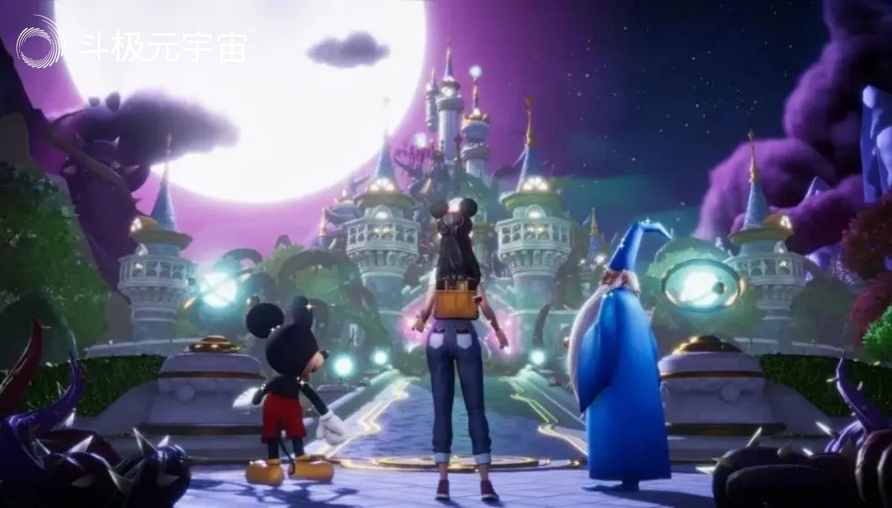

自扎克伯格将公司名称由Facebook改为Meta以来，元宇宙便成为了一个颇受关注且争议极大的词汇，关于元宇宙“一哥”的讨论也频繁出现。

尽管扎克伯格掌管的Meta抢尽了风头，“元宇宙第一股”Roblox也风光一时，但是Meta和Roblox的元宇宙业务对公司业绩不仅没有正向贡献，反而成为了一种拖累。反观迪士尼的财报，多项业务表现超出市场预期。

虽说元宇宙还没有统一明确的定义，但是结合元宇宙的各种要素（现实世界与虚拟世界，线上与线下，数字化、沉浸感、角色、娱乐等）来看，有一家公司的主营业务与之契合度最高，那就是准百年老店迪士尼。

本期财经故事会，我们就来聊一聊，未来元宇宙“一哥”的最佳候选人——迪士尼！

#### 创始人及主创团队：准百年老店的根基

迪士尼的故事，还要从其创始人开始。

1923年，华特·迪士尼与罗伊·迪士尼共同创办了迪士尼兄弟卡通工作室，华特负责公司的创意，而罗伊负责公司的业务，这也是后来的迪士尼工作室。

1926年，华特·迪士尼正式成立“华特迪士尼制作公司”，随后，华特创作出一个风靡全球的卡通形象——米老鼠，就此造就了迪士尼最具代表性的IP形象，并持续为迪士尼带来收益。可以说，华特开创了迪士尼的业务版图，奠定了迪士尼百年老店的基础。

1928年，米老鼠首次在有声动画片《汽船威利》中亮相，可爱的卡通鼠形象反响空前，米奇的形象从此家喻户晓。此后数十年，在华特的带领下迪士尼相继推出了三只小猪、唐老鸭等一系列卡通形象，并且制作出史上第一部长篇动画电影《白雪公主和七个小矮人》，在票房大卖的同时，也奠定了迪士尼在动画行业的核心地位。

回顾迪士尼近百年的发展历程不难发现，迪士尼的核心竞争力是强大的IP塑造能力和IP商业运营能力，而迪士尼优质IP的背后，除了创始人华特·迪士尼之外，管理层及主创团队同样功不可没。

说到这里，不得不提的就是迪士尼两位出色的CEO。

首先是为迪士尼成为巨无霸公司立下汗马功劳的迈克尔·艾斯纳，他在1984年至2005年长达21年的时间里担任迪士尼的CEO，期间代表性的经营运作就是收购了ABC电视台，正式进军媒体领域，通过此次收购，迪士尼获得了电视业务资产和ESPN这一现金“奶牛”。在艾斯纳的领导下，迪士尼实现了业绩的大幅增长，市值更是从20亿美元左右跃升至400亿美元左右。

迪士尼另一位劳苦功高的CEO是罗伯特·艾格，他从2005年开始担任迪士尼的首席执行官，在他的带领下，迪士尼的利润由2005年的25亿美元增长至2018年的125亿美元。

值得一提的是，艾格的经营运作比上一任CEO的动作更大，影响更广，特别是在他的主导下迪士尼完成了四项影响深远的战略并购，分别是：

2006年收购皮克斯，将“玩具总动员”、“赛车总动员”等IP资产收入囊中，2017年叫好又叫座的《寻梦环游记》就是皮克斯的杰作；2009年收购漫威，收获了“钢铁侠”、“美国队长”、“绿巨人”等上千个IP；2012年收购卢卡斯影业，获得了“星球大战”系列IP；2019年完成对福克斯的收购，将“加菲猫”、“阿凡达”等握在手中。

通过自身创作和外部收购相结合的方式，迪士尼成长为一个IP巨人。在专业领域评判的全球十大IP中，大约有一半都来自于迪士尼。最新发布的2022年BrandZ最具价值全球品牌排行榜显示，迪士尼以604亿美元位居第38位，品牌价值超过万宝路、三星、香奈儿等品牌。

此外，迪士尼庞大的“幻想工程师”团队，是其优质内容输出的最大保障。可以认为，迪士尼杰出的创始人、管理层团队和主创团队，是迪士尼成为百年老店的根基。

#### 无边界的娱乐帝国，强大的财富创造力

人类社会有两种生意永不过时：第一种，帮他人解决痛苦，例如医药医疗；第二种，给他人带来快乐，例如娱乐消费。从肥宅快乐水，到网络游戏，再到喜剧电影，能给人们带来快乐的行业具备更强的生命力。

在能够给他人带来快乐的企业中，迪士尼无疑是最具代表性的企业之一，甚至可以称之为一个无边界的娱乐帝国——如果你是一位小朋友，迪士尼有米老鼠、白雪公主；如果你是一位大男孩，迪士尼有钢铁侠、绿巨人；如果你喜欢现实世界，迪士尼乐园里的各种场景满足你的需求；如果你向往虚拟世界，迪士尼电影和流媒体是不错的选择；如果你喜欢陆地，遍布美洲、亚洲和欧洲的迪士尼乐园满足你的欢乐；如果你喜欢海洋，颇具特色的迪士尼邮轮可以带你在广袤的海洋里穿行……

可以认为，从儿童到成人，从银幕到乐园，从陆地到海洋，从童话世界到英雄硬汉，迪士尼带来的欢乐无处不在。迪士尼的边界在哪里，没人能够讲清楚。正如迪士尼官网提到的那样：“华特迪士尼公司的使命是通过无与伦比的讲故事的力量，为全球人民提供娱乐、信息和激励，反映出使我们成为世界首屈一指的娱乐公司的标志性品牌、创造性思维和创新技术。”

从迪士尼业务构成的角度来看，迪士尼的娱乐帝国庞大而稳固。在财务报告中，迪士尼将主营业务分为两大部分，包括媒体和娱乐发行（DMED）和公园、体验和产品（DPEP）。

从内部角度分析，迪士尼的四大业务互相形成协同关系，其媒体业务为公司提供高频的内容制作平台和公司宣传平台；娱乐业务既可以为IP赋能、创造流量，也可以成为IP的变现渠道；乐园业务是IP线下展示和变现的主要渠道；消费品及互动媒体进一步拓宽了IP变现渠道。

在各项业务的推动之下，迪士尼的业绩稳中有增，股价和市值也是在2021年创出新高。尽管2021年二季度以来股价出现明显回调，但是迪士尼的体量依然庞大。

统计数据显示，截至2022年8月10日，迪士尼公司在美股的总市值约为1.38万亿人民币，其美股市值大约相当于2个索尼（SONY.US）、4个任天堂（NTDOY.US）、8个银河娱乐（00027.HK）、55个万达电影（002739.SZ），这足以看出迪士尼的市场价值有多高。

#### 拳打Meta、脚踢Roblox，元宇宙“一哥”的最佳选择

过去100年来，迪士尼已成为首屈一指的标志性品牌；下一个100年，迪士尼的创造性思维和创新技术可能会体现在元宇宙中。

对比来看，扎克伯格高调宣布入局元宇宙以来，Meta除了赚取了些许眼球之外，似乎并没有从元宇宙中占得半点便宜，相反业绩却出现了罕见下滑。Meta于7月28日公布的二季度财报显示，公司营收、净利润、二季度日活用户、二季度广告收入等关键数据表现均低于市场预期，特别是营收首次出现同比下滑。

此前，Meta发布的2022财年第一季度财报显示，其元宇宙业务期内净亏损达到29．6亿美元，同比大增62．01％。当时这份财报一经公布，Meta股价便暴跌了近44％，市值一天蒸发掉了近3800亿美元！

再来看另一家被称为“元宇宙第一股”的Roblox，除了在上市之初股价被炒作以外，在业务方面似乎并未溅起太大的水花。8月10日，Roblox公布的2022年第二季度财报显示，公司业绩表现全面低于预期，更加残酷的是，Roblox的最新股价较高点已跌去了70%左右。

种种迹象显示，扎克伯格的元宇宙梦，目前来看并不美妙；“元宇宙第一股”Roblox，似乎也难以担当大任。

反观迪士尼这边，元宇宙已不再是口号和噱头，甚至已经开始赋能公司运营。8月10日，迪士尼公布的2022财年第三季度业绩显示，迪士尼第三季度营收同比增长26%，超出市场预期；迪士尼公园业务更是大增70%；Disney+订阅用户同比增长31%，远超市场预期。

其实，早在2020年11月，时任迪士尼全球首席技术官的Tilak Mandadi提到：“未来我们将专注于跨越物理与数字之间的界限，打造互联乐园体验，开启新的故事书写方式。”迪士尼CEO更是明确表示，元宇宙是迪士尼的未来。

迪士尼的元宇宙计划不仅仅停留在口号上，而且正在与公司业务相融合。2022年1月，迪士尼的一项关于元宇宙的专利申请获得批准，该专利旨在为游客创造个性化互动场景，促进非头戴式增强现实的使用。这项技术可追踪游客使用手机的情况，在公园的物理空间生成3D投影，增加游客的体验感和互动性。可以想象，未来我们可以跟迪士尼的卡通人物进行沉浸式互动，甚至我们创建自己的迪士尼世界。

尽管元宇宙还没有统一明确的定义，但是综合元宇宙的各种要素（现实世界与虚拟世界，线上与线下，数字化、沉浸感、角色、娱乐等）之后不难发现，迪士尼的主营业务与元宇宙的契合度最高。综合以上因素可以看出，在元宇宙这场竞赛中，迪士尼做到了拳打Meta、脚踢Roblox。

以上这些就够了吗？当然不够全面，迪士尼的竞争力还包括强大的安营扎寨的能力和攻城拔寨的能力，我们可以通过三个例子来体会。

第一个例子是迪士尼乐园的护城河。我们都知道，全球主题乐园竞争愈发激烈，并且有很多企业都在想方设法打败迪士尼，这其中就包括当年如日中天的万达集团王健林。

2016年，王健林在的一档访谈节目中公开表示，要让上海迪士尼在十年到二十年之内盈不了利。然而，上海迪士尼在开园后的首个完整财年就实现了收支平衡，成为全球最快盈利的迪士尼乐园。这充分体现出，迪士尼乐园的护城河比想象中的更加坚固。

第二个例子是“海上迪士尼”——迪士尼邮轮业务。众所周知，以嘉年华邮轮（CCL.US）和皇家加勒比邮轮（RCL.US）等为代表的传统邮轮公司实力突出，但是近几年迪士尼邮轮的发展也毫不逊色。

迪士尼邮轮公司是一家拥有四艘船的度假邮轮公司，在北美和欧洲的港口运营。迪士尼魔幻号和迪士尼奇迹号是大约85000吨875个舱位的船，迪士尼梦想号和迪士尼幻想是大约13万吨的1250个舱位的船。

此外，迪士尼邮轮公司正在增加三艘新船以扩大其邮轮业务。第一艘船，迪士尼愿望号，计划2022年夏季下水，另外两艘舰艇将于2024年和2025年从造船厂交付。每艘新船都可以由液化天然气提供动力，大约有1250个特等舱。迪士尼邮轮上不仅有水上乐园、购物中心，而且还有剧场和露天电影院，游客甚至还能在迪士尼公司租借的私人海岛上，登岛游玩。

第三个例子是迪士尼在流媒体方面的业务拓展能力。长期以来，奈飞（NFLX.US）一直是流媒体行业的龙头，风光无限，但是迪士尼的流媒体发展潜力不可小觑。

然而，8月10日迪士尼公布的财报恐怕会让奈飞“今夜难眠”。财报显示，迪士尼最近一个季度新增了1440万Disney+订户，超过了市场预期的1000万。加上Hulu和ESPN+，迪士尼表示截至该季度末拥有2.211亿流媒体订阅用户，高于Netflix（NFLX.US）的2.207亿流媒体订阅用户。

可以说，迪士尼在拳打Meta、脚踢Roblox的同时，还把奈飞踩在了脚下。当然，展望下一个100年，这一切或许才刚刚开始……

（免责声明：本文转载自其它媒体，转载目的在于传递更多信息，并不代表本站赞同其观点和对其真实性负责。请读者仅做参考，并请自行承担全部责任。）