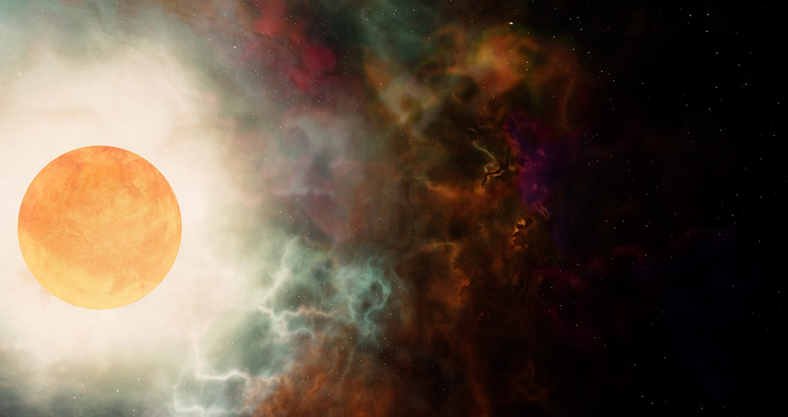

２０２２年８月１８日，５１WORLD在全新开放的２５．５万平元宇宙空间，举办了一场充满科技感、未来感的地球克隆计划５（EC５）元宇宙大会。会上，５１WORLD发布了全新升级的产品矩阵，包括１个平台、２款产品及３大行业应用，引领数字孪生行业进入“L４＋W４”阶段，全面助力Web３．０新时代数字化升级。

５１WORLD创始人兼CEO李熠提到：“面向Web３．０时代，我们必须有足够强的技术能力来赋能合作伙伴，并为行业带来具有全新价值的产品及应用。目前，５１WORLD已形成了从平台到产品再到生态的新一代产品矩阵，帮助企业迭代新需求，解决新问题。”

作为本次大会的重磅环节，李熠现场发布了一个全新迭代的数字孪生PaaS平台WDP；两款升级应用元宇宙应用MS２、自动驾驶仿真平台５１Sim；以及三大行业应用新一代行业仿真算法平台５１ISE、孪生空间运营服务平台TOC和５１CIM城市信息模型平台。

基于新一代产品矩阵，此次发布会可谓亮点频出：AES全要素场景进入L３级别全面量产，百城计划正式启动；元宇宙应用MS２新升级，全面赋能大型会议会展在元宇宙落地；５１Sim继续保持开放＋开源初心，以国产化自研平台数据驱动闭环赋能自动驾驶量产；三大应用方向标杆案例首次对外，行业应用实现纵深发展。

**一、AES实现L３精度自动量产百城计划正式推出**

自２０２１年９月新一代数字孪生PaaS平台WDP４．０发布以来，５１WORLD一直保持着三个月一次的版本迭代速度，致力于为全行业提供“低门槛、高质量”的数字孪生创作平台。截至目前，已有超过２５０００名开发者参与其中，与５１WORLD一起，不断打磨升级全新的数字孪生PaaS平台。

作为PaaS平台的重要底层支撑，AES全要素场景不断升级突破，现已正式投入批量生产，全面进入到L３量产时代！

会上，李熠正式对外发布了“百城计划”，并指出，从２０２２年８月起，截至今年１２月底，５１WORLD将实现１００个城市数字孪生底图升级至L３级精度。

“本次AES重大更新，将实现‘三个更’，效果更好、空间更省、速度更快。”李熠在会上强调。

其中，效果更好层面，AES自动化生成效果将大幅超越L２，模块化生成L３效果可媲美手工建模精度；空间更省方面，存储空间仅为传统L２的三分之一；而速度更快层面，L３模块化生成时间仅为传统L２生成的１／２，效率大幅提升。

除AES全要素场景外，基于WDP平台的DaaS数字资产库、Editor非线性编辑、API及Cloud云原生也实现了同步升级。

**二、MS２升级全新２５．５万平元宇宙空间开放**

Web３．０时代，每个企业都应该拥有一个专属的元宇宙空间，如同Web１．０时代需要一个官网和Web２．０时代需要一个APP一样重要。５１WORLD元宇宙应用则致力于为企业打造元宇宙新时代的人货场。

５１WORLD元宇宙应用具有三大核心亮点：包含身临其境的真实感场景、独一无二的数字化身，及开放便捷的创作工具。

此次升级的MS２是专为会议、会展等大型活动打造的元宇宙应用，包含２５．５万平超大空间。整个场馆呈现五片瓣花造型，每个花瓣均为５．１万平独立展馆。

**除EC５率先开放的A馆外，其他四个展馆将在９月－１２月逐月开放。**

不同于２D视频会议带来的千篇一律的交流感受，元宇宙中具有彰显个性的交互能力，更有着无法预测下一秒会发生什么的乐趣。

**三、５１Sim数据驱动自动驾驶加速闭环**

５１Sim是５１WORLD经５年超亿元研发投入搭建的国产汽车工业仿真软件。目前，５１Sim已形成完善的产品生态，具备自主可控数据驱动闭环云仿真落地，软硬件深度整合高置信度感知仿真，并通过开源开放，实现软硬件一体化全栈仿真。

当前，自动驾驶正处于量产前夜，而５１Sim已针对市场需求，形成了完整的行业生态，并打造了系列标杆案例，包括毫末智行数据驱动云仿真、地平线计算平台感知仿真、上机检多车互动等。未来５１Sim也将紧贴市场需求，以行业深度整合、国产开源可控及数据驱动闭环助力中国自动驾驶量产更快实现落地。

**四、三大行业应用　助力数字孪生全面进入L４＋W４阶段**

精度等级和应用维度是描述数字孪生行业应用的两大关键词，其中场景精度可划分为L１－L５五个等级，应用阶段则包含W１－W５五个阶段。李熠在演讲中表示：“当前，行业应用已进化至L４＋W４阶段，面向新趋势，我们将带来三大行业应用的标杆案例首秀。”

**１．新一代行业仿真算法平台５１ISE**

W４作为数字孪生不断纵深进化的新阶段，亟需一个跨行业的仿真平台来支撑。５１ISE应运而生，集行业算法仿真、工程系统仿真、自然环境仿真、社会活动仿真及应急模拟仿真于一体，目前已应用在工业、能源、水利、轨道、交通等领域，目前已有众多案例落地。

以智慧工厂为例，５１ISE可将每一个机械臂、每一个零件、每一个工艺都处理为同真实世界一模一样。这种先进的制造方式，可高效率且低成本构建数字孪生工厂，并应用于早期工厂设计、中期工厂建设、以及后期工厂运营的模拟仿真全生命周期。

在中铁盾构机智慧工厂建设中，５１WORLD以ISE平台为基础，以数字孪生技术为核心，帮助工厂在生产流程优化、生产质量把控、生产设备运维、能源双碳管理等方面实现辅助决策，助力工厂数字化转型。

**２．孪生空间运营服务平台TOC**

区别于传统IOC产品，TOC平台兼具真实感场景、时空化计算、开放性编辑、全流程仿真、临场感服务、多终端互动六大核心能力。

率先集成５１WORLD　TOC平台能力的海南省重点三亚崖洲湾科技城，以数字孪生赋能园区管理，全面反映各项发展态势，助力数字化建设提速。

此外，TOC低碳智慧社区也实现二次升级，以全域碳监测、碳规划模拟及碳排放预测，为管理者提供更多基于绿能建设与投资智能化的决策支持。

**３．新一代数字孪生城市信息模型平台５１CIM**

李熠认为，“一座城市要发展，首先得建设基础设施。同样，要发展数字经济，也需要构建数字经济的基础设施。毫无疑问，城市级L４正是未来数字化城市的基础设施之一。”

５１CIM从数据使用路径、场景使用路径、场景精度与交互深度等方面出发，打造了进一步推进智慧城市建设的基础设施底座。

它具备多源数据融合、多精度场景操作、高性能计算、维护高效开放、数据要素复用五大特性，能够满足系统建设项目范围广、周期体量大、数据安全要求高以及成果数据复用性等要求。

**五、八位行业专家　解析元宇宙时代行业发展**

下午的元宇宙论坛中，５１WORLD邀请了来自政府、科技、金融、消费各领域的专家学者进行分享。

北京商务中心区管理委员会常务副主任牛海龙作为政府代表，带来了“北京CBD加快建设具有全球影响力的数字CBD标杆区”主题分享，以５１WORLD为北京CBD打造的数字孪生平台及全球数字会客厅等系列数字化应用为例，讲解了北京CBD建设具有全球影响力的数字CBD标杆区历程。

科技领域代表希捷科技全球高级副总裁暨中国区总裁孙丹、摩尔线程摩尔学院院长李丰、京东科技IoT园区总监陈一丹，以及数美科技副总裁周秋野分别从数据安全、元计算、企业服务、内容监管等角度进行了深入分析。

金融领域代表中信证券研究部董事总经理＆首席科技产业分析师许英博、东吴证券研究所联席所长／董事总经理／TMT团队负责人张良卫则从元宇宙行业发展以及投资视角进行了专业解读。

此外，还有来自医疗领域的代表好心情COO徐锋在大会现场就虚拟现实技术在精神心理领域应用现状及未来发展方向进行了专业讲解。

**六、解读产业元宇宙首批生态伙伴入驻元宇宙**

７月２２日，５１WORLD正式发布了联合业内１０余位专家学者共同撰写的《产业元宇宙》一书。

书中详细解读了体验元宇宙与产业元宇宙的区别，明确了产业元宇宙的价值和意义，并从城市、交通、工业、能源．．．七大领域不同视角深刻剖析了落地实践及未来发展问题。

EC５上，书籍主要作者５１WORLD副总裁吴亚光带来了“以虚强实，产业元宇宙如何赋能实体生态实现新一轮增长”新书解读。

大三生集团董事长＆元宇宙三十人论坛发起人徐远重从产业元宇宙面临的机遇与挑战方面对元宇宙技术在不同产业的应用及市场需求进行了系统性分析。

作为Web３．０时代实现数字化升级的关键技术，元宇宙能解决社会上的什么问题，赋能到哪些产业，是《产业元宇宙》这本书希望引起大家探讨的主要问题。

《产业元宇宙》的出版，对于元宇宙从概念到落地具有重要的指导意义，从理论角度明确了产业元宇宙的价值和意义，从应用层面，以各行业视角分析了具体落地实践，为行业发展带来参考价值。

发布会最后，５１WORLD大客户总经理李振邀请了首批入驻元宇宙空间的２５家企业上台，举行了元宇宙空间入驻仪式。

**本次入驻５１WORLD元宇宙空间的２５家企业包括：**

前瞻生态伙伴：贵州华泰智远大数据服务有限公司、元宇宙三十人论坛、苏州清华汽车研究院、中宇联云计算服务（上海）有限公司、上海双瀛航空科技有限公司、上海百昌网络拍卖科技有限公司、易维派思教育科技（上海）有限公司、北京欢宇时空科技有限公司、苏州创博会展览有限责任公司

行业战略领导力品牌企业：希捷科技、北京亿欧网盟科技有限公司、欣旺达电子股份有限公司、欧莱雅（中国）有限公司、清华经管高管教育、东吴证券股份有限公司、上海新兴信息通信技术应用研究院、中译出版社

元宇宙空间战略合作伙伴：上海城建数字产业集团有限公司、浙江数智交院科技股份有限公司、京东科技集团、北京商务中心区国际招商服务有限公司、天翼云科技有限公司、贵州高速集团－贵州中南交通科技有限公司、讯飞智元信息科技有限公司等

５１WORLD通过平台、产品以及行业应用形成了完整的技术和生态架构，在实现地球克隆愿景的同时，为各行各业的合作伙伴赋能，为全面实现数字化提供能力支撑。

目前，５１WORLD的平台及产品已经走在了全面开放的路上，在开放的过程中，也与广大开发者、合作伙伴、生态伙伴形成了更紧密的互助关系。

未来，５１WORLD将与更多生态合作伙伴携手同行，一起构建一个真实完整且恒久的数字孪生世界！