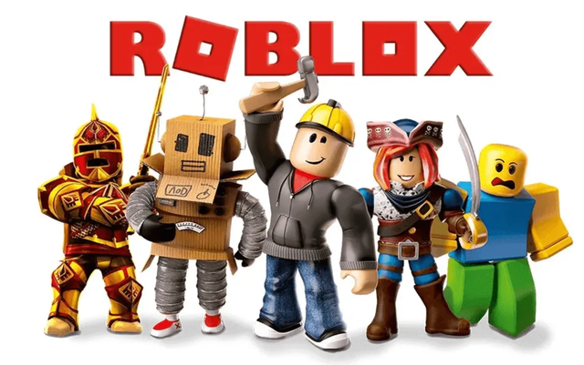
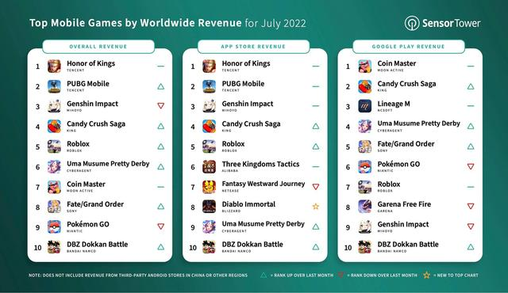
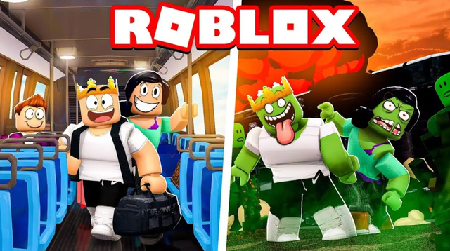
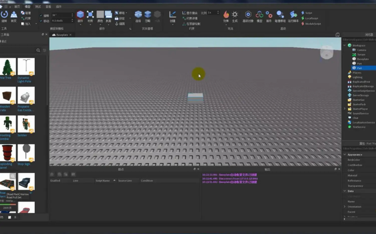
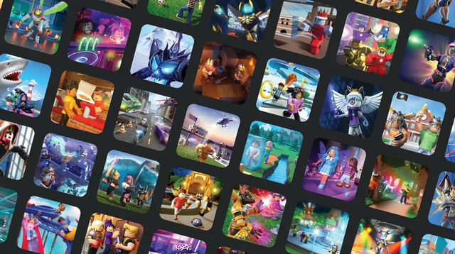
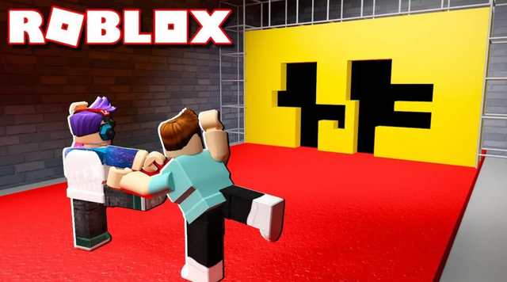

很多人都知道一款游戏《我的世界》，一款像素沙盒类游戏，玩家可以在里面肆意的建造很多东西，在游戏世界复刻很多现实生活里的世界奇观，甚至，你可以在《我的世界》利用红石系统制造计算机，然后玩《我的世界》。

网上统计，《我的世界》全球用户已经达到12亿。

而接下来要说的风靡欧美的元宇宙手游，它的玩法与《我的世界》非常相像，我希望通过大家对《我的世界》的熟悉，来了解《Roblox》。

7月，移动应用数据分析公司Sensor Tower，公布了今年6月份美国市场收入最高的前十款手机游戏，第一名是《糖果粉碎传奇》，第二名就是本文的主角《Roblox》，哪怕是放眼全球，《Roblox》也是高居全球手游收入排行榜的第五位，无论iOS平台和安卓平台，《Roblox》都有不错的营收业绩和用户群体。

我们熟知的《王者荣耀》，7月份收入大约是2.25亿美元，《Roblox》的7月收入是2.05亿美元。

在美国16岁以下的青少年群体中，有几乎一半都沉浸在《Roblox》的游戏世界当中。2020年年底，Roblox举办了一场虚拟演唱会，观看人数超过3千万人。

而这款游戏，就是如今全世界元宇宙产业真正的龙头，但由于《Roblox》在国内市场声量太低，导致国内消费者对他了解并不多，但这并不妨碍国内众多号称元宇宙的科技公司，去追随、借鉴、复制《Roblox》。

Roblox，这个公司早在2004年就已经成立，这家公司的创始人David Baszucki曾早1989年左右创办过一家教育公司，开发了一款仿真的用来帮助老师教授质量、速度等物理知识的软件程序，而这个基于真实世界物理定律的游戏引擎，直接影响了后来的Roblox。

但是，Roblox并不认为自己是一家游戏引擎公司，而是一个游戏平台。

2020年，一位20岁的年轻开发者，在《Roblox》上架了两款游戏，仅仅一个月，她的游戏就获得了很多玩家关注，帮她实现了50万美元的月收入。

除了她之外，还有一位美国大学生，通过在《Roblox》出售自己开发的游戏，赚来了自己的学费还额外买了一辆车。

随着赚钱效应的持续，更多的专业游戏开发机构开始入驻《Roblox》，并在它的基础上开发游戏，也会出售《Roblox》的游戏开发教程和工具。在《Roblox》你能玩到前阵子大火的“鱿鱼游戏”、看到玩家们拍摄的自制剧。

上述这些构成了，元宇宙的第一要素：自由自在创造创意、展示创意、出售创意。

但真正让《Roblox》能够成为元宇宙第一概念的，还是它与区块链技术的联动。2007年Roblox上架自己的货币交易系统Robux，为玩家和创作者们提供经济服务，而独立的经济体系和原生代币，就是构成元宇宙世界的基础元素之一，

元宇宙概念大火之后，Roblox创始人在去年年底表示，Roblox早在20年前就预判了元宇宙的兴起。

目前，Roblox正在积极招揽Web3.0的开发人员，将为《Roblox》引入NFT，会进一步增加创意的保护能力和创意的价值。前不久，Roblox还挖走了Meta的一位亚太高管。

相比之下，今年7月份，《我的世界》公开表示拒绝NFT和区块链，虽然这个决定被不少网友赞许，但同时，这也将使得《我的世界》无法实现创意游戏的经济价值。

最后，正是因为《Roblox》的现象级成功，才会出现众多的国内追随者和模仿者，但实事求是地说，国内很多元宇宙游戏都不能与《Roblox》相媲美，其中一个主要原因就是Roblox具备更强的物理游戏引擎开发能力。

而国内游戏引擎有多落后，发展有多困难，就是另外一件事情了。