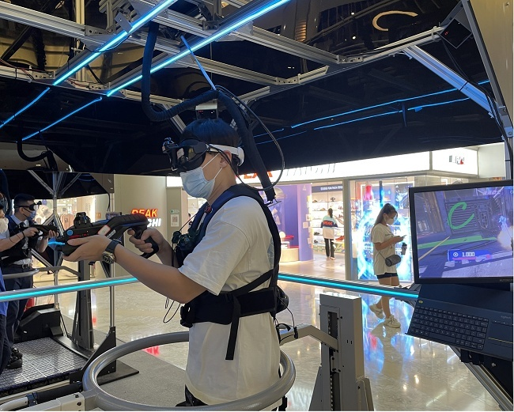

# STEPVR国承1号快闪店首秀 元宇宙登入门限时免费开放

​        一场元宇宙世界里的激烈对抗战正在上演，2V2的游戏模式，人们不再是对着手机屏幕，控制游戏里的角色，而是戴上VR头显、触觉马甲和手套，踩上一台可以360度移动的万向跑步机“底盘”，就可以身临其境地进入到虚拟世界里，去游戏、娱乐和运动。 

　　这一幕发生在北京西单大悦城里，2022年8月17日，推出全球首款元宇宙登入门“国承1号”的STEPVR，将快闪店的第一站落户到了这里，消费者可以免费体验，7天限时，一直持续到8月23日。

　　 

　　对普通消费者来说，大火的元宇宙概念熟悉又陌生，是一个看不见摸不着的东西，既吊足了胃口，又让大众保持了足够的好奇心。元宇宙究竟为何物？入口仅仅是一款VR头显设备吗？空降到北京西单大悦城的元宇宙登入门的快闪店，给出了答案。 

　　STEPVR的元宇宙登入门是一款“五感”互联网终端，不同于单一的VR头显、一体机设备，“国承1号”可以帮助消费者在游戏、社交、运动健身、教育、医疗康复等虚拟场景中恢复“五感”，包括视觉、听觉、触觉、嗅觉及平衡感觉，带来接近100%的真实沉浸感。 

　　这种足够沉浸的感受，为现场体验的消费者带来了巨大的震撼感，也让元宇宙本身有了更多烟火气。有工作人员介绍，这是STEPVR国承1号开设快闪店的第一站，也是首次面向社会公众开放，火爆程度也是之前没有预期到的。

　　 

　　一位刚刚体验完的消费者难掩兴奋，“这与过去只戴着VR头显的感受完全不一样，有了脚底下的万向跑步机，在虚拟世界里可以自由地跑动起来，可以任意方向移动。过去只能玩《节奏光剑》这样的静止不动的游戏，或者在大空间的VR电竞门店里体验，万向跑步机实现了运动平衡感恢复后，能够支持PVP、MOBA、FPS等各类游戏大作，虚拟世界变得更真实，更具沉浸感。” 

　　相比国外的Meta、微软等推出的入口级产品，STEPVR认为，五感才是一款元宇宙终端的正确打开方式。而实现这一点，则需要在核心技术上突破。有了激光定位、动作捕捉、力反馈和全向运动系统的核心技术加持，“国承1号”就能像电影《头号玩家》里的那台机器一样，让消费者真正能在“绿洲”世界里尽情肆意地放飞自我。 

　　据了解，这款元宇宙登入门产品已经进入新加坡、韩国市场，并陆续入驻国内的社区、商场、健身房、体育馆等场所，让元宇宙变得触手可及。